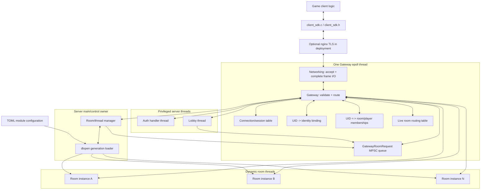
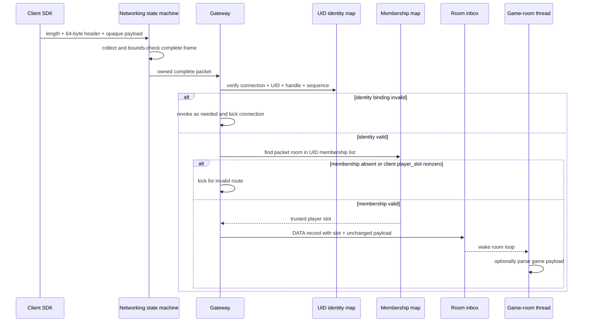
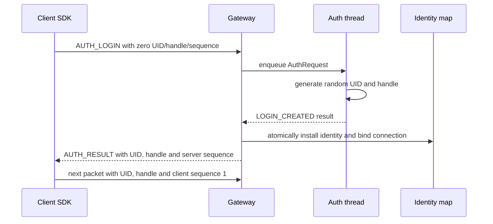
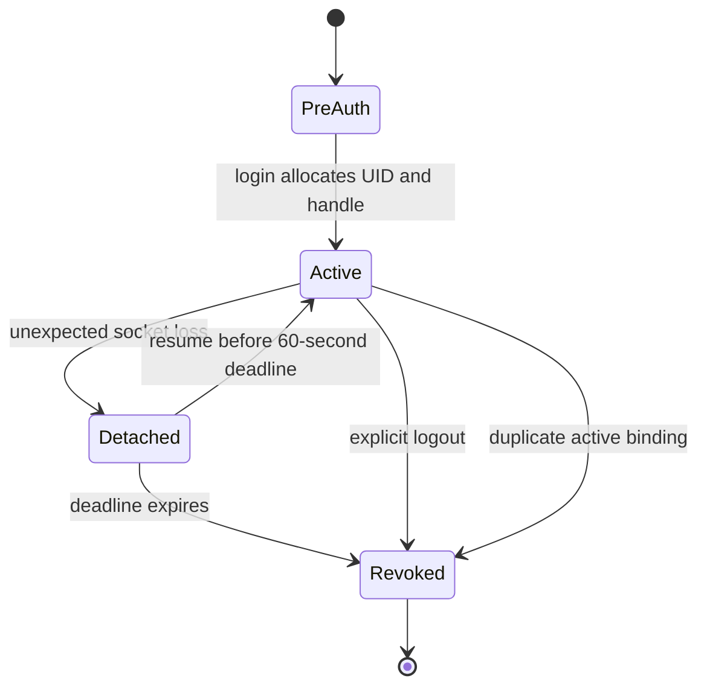
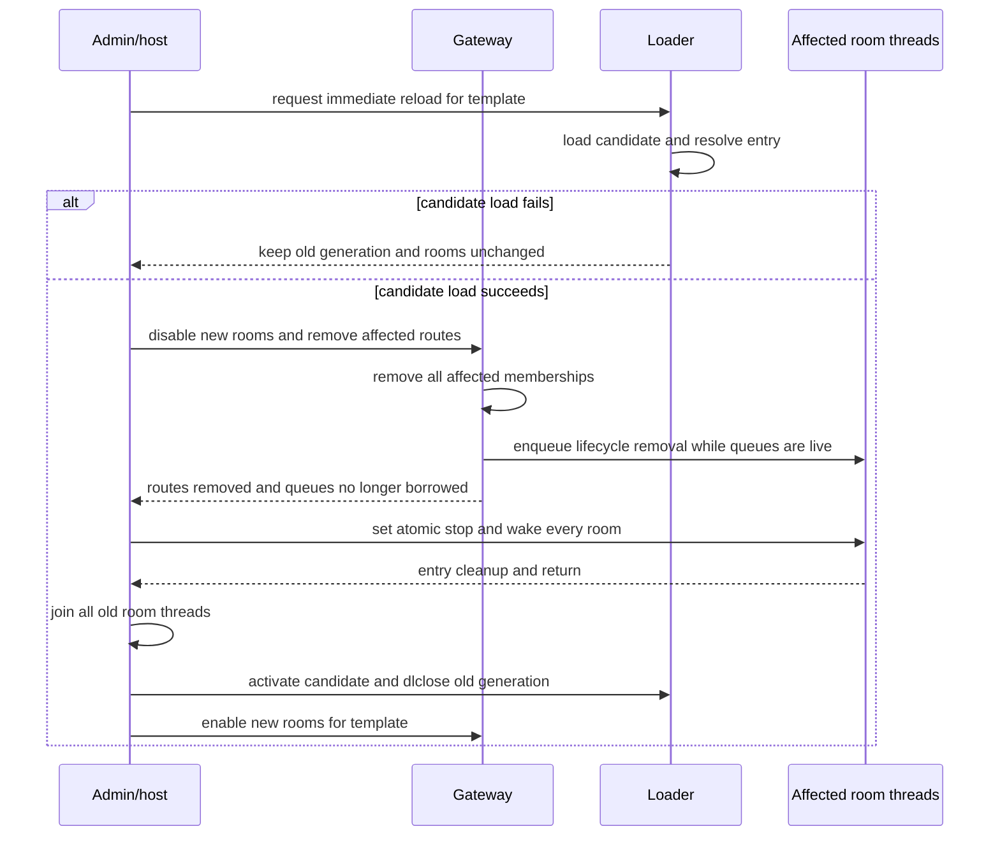

# Server/Client Architecture and Protocol

Status: v1 design baseline. This document freezes module boundaries, thread
entry points, primary data structures, and SDK contracts. A minimal vertical
slice now exists in [`online/`](../../online/): the 64-byte codec, owned
queues/credits, one Gateway `epoll` thread, Auth/Lobby/room threads, a `dlopen`
echo room, demo client, and loopback integration tests. Resume/logout,
create/list/leave, multiple live rooms, reload/drain, and the final nonblocking
Client SDK remain later phases of this design.

Design inputs:

- [Server_Client _arch_draft_new.md](<Server_Client _arch_draft_new.md>)
- [arch_sketch.png](arch_sketch.png)
- [Chinese version](server_arch_and_proto.md)

## 1. Confirmed v1 decisions

1. Networking and Gateway are modules in the same `epoll` thread. The current
   priority is reducing complexity.
2. Every authenticated packet carries a UID. Gateway checks the connection,
   UID, identity handle, and sequence mapping for every packet. Any mismatch
   disconnects the client.
3. A UID may have only one active connection. A duplicate active binding
   revokes the UID and disconnects both connections.
4. A UID may join multiple game rooms. The demo uses only one.
5. Lobby never borrows Gateway mapping pointers. It uses the unified
   `GatewayRoomRequest` API to list, create, join, and leave rooms. Lobby and
   main/control share one dedicated MPSC request queue and its one mutex.
6. Room input contains `JOIN/LOST/RESUMED/REMOVED` lifecycle kinds. Game logic
   may use or ignore them.
7. Game-module reload has two modes. Immediate reload removes users only from
   affected rooms, returns them to Lobby, ends those rooms, and reloads. Drain
   reload rejects room creation and joining old-generation rooms, waits without
   a deadline for all existing rooms to exit naturally, and then reloads.
8. The demo client SDK and server use raw TCP without TLS. Deployment must add
   TLS outside this boundary.
9. Demo identity uses a random identity handle plus independent client-to-server
   and server-to-client sequences. It does not use timestamps or HMAC.
10. The public SDK header is a fixed 64-byte, big-endian layout decoded through
    fixed offsets, not a general parser.
11. Auth is an in-process thread without a database or account validation.
    Login allocates a random UID and 128-bit identity handle. An unexpectedly
    disconnected client may resume the same UID/handle within 60 seconds;
    success rotates the handle. Timeout or logout invalidates the UID.
12. Each room instance initially has one thread. The room entry owns its loop,
    update cadence, and game state.
13. A game room is a dynamic library with one long-lived exported entry point.
    Game payloads are completely opaque to Gateway.
14. Cross-thread changes to UID-room membership, live-room routes, or template
    acceptance state are represented by `GatewayRoomRequest`. Gateway remains
    the only executor and mapping writer.

### 1.1 Demo security boundary

v1 uses neither TLS nor HMAC. The 128-bit random identity handle is a bearer
capability, not a signature. Per-packet binding checks prevent a client that
does not know the handle from simply declaring another UID, but cannot protect
against an attacker that can observe or modify raw TCP.

Consequently:

- raw TCP is only appropriate for localhost, an isolated development network,
  or a demo that explicitly accepts the risk;
- public deployment must enable TLS between the client and nginx;
- nginx-to-Gateway traffic may use loopback raw TCP under the chosen trust
  model;
- if nginx later becomes untrusted, end-to-end authentication/MAC is a separate
  addition and does not change the game-room payload protocol.

## 2. Overall architecture



Without nginx, `ClientSdk <--> Edge <--> Network` collapses to a direct raw-TCP
connection from Client SDK to the Gateway listener.

### 2.1 Thread entries

The host has four principal thread entry points:

```c
void *gateway_thread_main(void *userdata);
void *auth_thread_main(void *userdata);
void *lobby_thread_main(void *userdata);
void *server_room_thread_main(void *userdata);
```

Process `main` is the control owner. It loads TOML, starts and stops threads,
owns module generations, and processes reload/shutdown. It performs neither fd
I/O nor game logic, and no separate room-manager worker is required.

```c
typedef struct ServerHost {
    ServerChannels channels;
    GatewayServer gateway;
    ServerRoomManager room_manager;
    AuthHandler auth;
    LobbyHandler lobby;
    pthread_t gateway_thread;
    pthread_t auth_thread;
    pthread_t lobby_thread;
    _Atomic bool stop_requested;
} ServerHost;

int server_host_init(ServerHost *host, const ServerConfig *config);
int server_host_run_control_loop(ServerHost *host);
void server_host_request_shutdown(ServerHost *host);
void server_host_cleanup(ServerHost *host);
```

`server_room_thread_main` is a host trampoline that installs thread-local host
context and invokes the dynamic library's only entry point:

```c
SERVER_ROOM_EXPORT int server_room_entry(ServerRoomContext *context);
```

| Thread | Exclusively owned state | Cross-thread communication |
| --- | --- | --- |
| main/control | Module handles/generations, room pthread create/join, reload/shutdown | Unified room request queue + Gateway-to-main command queue |
| Gateway | fds, epoll, frame I/O, every mapping, live-room routes | Bounded Auth/Lobby/room/control queues |
| Auth | Random UID/handle generation and temporary Auth state | Auth inbox/result queues |
| Lobby | Lobby protocol and room scheduling policy | Lobby inbox/outbox + unified room request API |
| Room | All game state and loop state for one room | That room's inbox/outbox |

Gateway is the only writer of mappings. Auth, Lobby, and rooms never receive a
raw mapping pointer and never close client fds directly.

The main/control loop has this shape:

```c
int server_host_run_control_loop(ServerHost *host)
{
    while (!atomic_load(&host->stop_requested)) {
        server_room_manager_wait(&host->room_manager);
        server_room_manager_apply_gateway_commands(&host->room_manager);
        server_room_manager_reap_finished(&host->room_manager);
        server_room_manager_advance_reload(&host->room_manager);
        server_host_apply_admin_requests(host);
    }
    return server_host_shutdown_ordered(host);
}
```

`wait` returns without holding a queue mutex. `dlopen`, module entry startup,
and `pthread_join` all run outside queue locks and cannot prevent Gateway from
acquiring a communication-queue mutex.

## 3. Fixed 64-byte wire header

### 3.1 Frame layout

The TCP stream uses a four-byte length prefix:

```text
u32_be frame_length
SdkWireHeaderV1 header     # exactly 64 bytes
uint8_t payload[]          # exactly header.payload_length bytes
```

`frame_length` excludes itself and must equal `64 + payload_length`. v1 has no
HMAC trailer. Networking collects and bounds-checks a complete frame before
passing it to Gateway. Upper layers never see TCP fragments or borrowed slices
into a connection scratch buffer.

### 3.2 Header offsets

| Offset | Size | Wire field | Meaning |
| ---: | ---: | --- | --- |
| 0 | 4 | `magic` | ASCII `DG01` |
| 4 | 2 | `version` | 1 in v1 |
| 6 | 2 | `flags` | Request/response/internal flags |
| 8 | 2 | `route` | Auth, Lobby, or Game |
| 10 | 2 | `kind` | Route operation or room lifecycle kind |
| 12 | 4 | `payload_length` | Payload size in bytes |
| 16 | 8 | `uid` | Zero before login; carried by every later packet |
| 24 | 16 | `identity_handle` | 128-bit opaque random bytes |
| 40 | 8 | `room_id` | Used by Game; zero on other routes |
| 48 | 8 | `sequence` | Strictly increasing independently in each direction |
| 56 | 4 | `player_slot` | Must be zero from clients; trusted internally |
| 60 | 4 | `code` | Stable result/leave/complaint code |

Total: `4 + 2 + 2 + 2 + 2 + 4 + 8 + 16 + 8 + 8 + 4 + 4 = 64`.

`identity_handle` is a byte array and is not endian-converted. Every other
multi-byte integer is big-endian. A fixed layout does not mean sending a C
struct: compiler padding, alignment, and host endian are not wire ABI.

```c
int sdk_wire_header_decode(
    const uint8_t wire[SDK_WIRE_HEADER_SIZE],
    SdkWireHeader *out_header);

void sdk_wire_header_encode(
    uint8_t wire[SDK_WIRE_HEADER_SIZE],
    const SdkWireHeader *header);

int sdk_wire_frame_size(
    const SdkWireHeader *header,
    uint32_t *out_frame_length);
```

Decode is a fixed-offset load/validation routine, not a JSON/protobuf/TLV
parser. Auth/Lobby control payloads also use a small number of fixed records:

- `AUTH_LOGIN/AUTH_LOGOUT/AUTH_RESUME`: no demo payload; identity is in header;
- `LOBBY_LIST`: empty request and count + fixed-size room records response;
- `LOBBY_CREATE`: one `u64_be room_template_id`;
- `LOBBY_JOIN/LOBBY_LEAVE`: target in `header.room_id`, empty payload;
- every result uses `header.code`; any additional result is a fixed record.

Each control kind has one exact payload length. A mismatch is rejected. Game
payload remains opaque and is defined by the game room.

### 3.3 Header enums

```c
typedef enum SdkRoute {
    SDK_ROUTE_AUTH = 1,
    SDK_ROUTE_LOBBY = 2,
    SDK_ROUTE_GAME = 3
} SdkRoute;
```

Public kinds:

```text
AUTH_LOGIN
AUTH_RESUME
AUTH_LOGOUT
AUTH_RESULT

LOBBY_LIST
LOBBY_CREATE
LOBBY_JOIN
LOBBY_LEAVE
LOBBY_RESULT

GAME_DATA
GAME_RESULT
```

Room lifecycle kinds use the header `kind`, but only Gateway may synthesize
them; receipt from a client is a protocol violation:

```text
ROOM_PLAYER_JOIN
ROOM_CONNECTION_LOST
ROOM_CONNECTION_RESUMED
ROOM_PLAYER_REMOVED
ROOM_STOP
```

Game logic may ignore lifecycle kinds other than `ROOM_STOP`. Stop is also
represented by an atomic context flag, so a full inbox or ignored packet cannot
prevent shutdown.

## 4. Primary Gateway data structures

Names below are an implementation plan, not a requirement that every spelling
remain unchanged.

### 4.1 `GatewayServer`

```c
typedef struct GatewayServer {
    int listen_fd;
    int epoll_fd;
    _Atomic bool stop_requested;

    GatewayConnectionTable connections;
    GatewayIdentityTable identities;
    GatewayMembershipTable memberships;
    GatewayRoomRoutingTable room_routes;
    ServerChannels *channels;
} GatewayServer;
```

Except for explicit queues/eventfds behind `channels`, every field is accessed
only by `gateway_thread_main`. Other threads cannot use `ServerChannels` to
reach Gateway's tables.

```c
typedef struct ServerChannels {
    AuthChannel auth;
    LobbyChannel lobby;
    GatewayRoomRequestQueue room_requests;
    GatewayToRoomManagerQueue room_manager_commands;
    int gateway_wakeup_fd;
    int control_wakeup_fd;
} ServerChannels;
```

### 4.2 `GatewayConnection`

```c
typedef enum GatewayConnectionState {
    GATEWAY_CONNECTION_PREAUTH,
    GATEWAY_CONNECTION_AUTH_PENDING,
    GATEWAY_CONNECTION_ACTIVE,
    GATEWAY_CONNECTION_CLOSING
} GatewayConnectionState;

typedef struct GatewayConnection {
    int fd;
    uint64_t generation;
    GatewayConnectionState state;

    FrameReader reader;
    FrameWriter writer;
    PacketQueue outbound;

    uint64_t bound_uid;
    int64_t last_activity_ns;
} GatewayConnection;
```

An fd belongs to one `GatewayConnection` generation. Every asynchronous result
carries `{fd slot, generation}` and is discarded on generation mismatch, which
prevents delivery to an fd reused by the OS.

### 4.3 `GatewayIdentity`

```c
typedef enum GatewayIdentityState {
    GATEWAY_IDENTITY_ATTACHED,
    GATEWAY_IDENTITY_DETACHED,
    GATEWAY_IDENTITY_REVOKED
} GatewayIdentityState;

typedef struct GatewayIdentity {
    uint64_t uid;
    uint8_t identity_handle[16];
    GatewayIdentityState state;
    GatewayConnectionRef connection;
    uint64_t expected_client_sequence;
    uint64_t next_server_sequence;
    int64_t disconnect_deadline_ns;
    GatewayMembershipList memberships;
} GatewayIdentity;
```

Every authenticated packet must satisfy all of the following:

```text
connection.state == ACTIVE
connection.bound_uid == packet.uid
identity uid/handle == packet uid/handle
identity.connection == current connection generation
packet.sequence == expected client-to-server sequence
```

Any failure invokes the protocol-violation revoke/close policy and never
delivers the packet upward. Both directions start at sequence 1. Gateway
increments the expected client sequence after identity validation and before
routing. A server sequence is consumed when a frame enters the connection
writer queue. Sequence never wraps; login/resume must rotate the handle before
`UINT64_MAX`.

### 4.4 Multi-room membership

```c
typedef struct GatewayMembership {
    uint64_t uid;
    uint64_t room_id;
    uint32_t player_slot;
    GatewayMembershipState state;
} GatewayMembership;
```

Two indexes are required:

```text
uid -> list of { room_id, player_slot, state }
(room_id, player_slot) -> uid
```

A UID may join multiple rooms but has only one slot in a particular room. Game
packets carry their target `room_id`. Gateway resolves a trusted slot from the
UID membership list and overwrites the client header's required-zero
`player_slot`. The demo UI may expose one active room, but server membership is
not a scalar.

### 4.5 Gateway route view and `ServerRoomManager`

Gateway stores only the lightweight state needed for routing:

```c
typedef enum GatewayRoomState {
    GATEWAY_ROOM_STARTING,
    GATEWAY_ROOM_RUNNING,
    GATEWAY_ROOM_DRAINING,
    GATEWAY_ROOM_STOPPING,
    GATEWAY_ROOM_FINISHED
} GatewayRoomState;

typedef struct GatewayRoomRoute {
    uint64_t room_id;
    uint64_t room_instance_generation;
    GatewayRoomState state;
    ServerPacketQueue *inbox;
    ServerPacketQueue *outbox;
} GatewayRoomRoute;
```

main/control owns the pthread, context, and `.so` generation:

```c
typedef struct ServerRoomInstance {
    uint64_t room_id;
    uint64_t module_generation_id;
    GatewayRoomState state;
    pthread_t thread;
    ServerRoomContext context;
    ServerPacketQueue inbox;
    ServerPacketQueue outbox;
} ServerRoomInstance;

typedef struct GatewayModuleGeneration {
    uint64_t generation_id;
    char *canonical_path;
    char *loaded_copy_path;
    void *dl_handle;
    ServerRoomEntryFn entry;
    size_t active_room_count;
    GatewayModuleReloadState reload_state;
} GatewayModuleGeneration;

typedef struct ServerRoomManager {
    ServerRoomTemplateTable templates;
    ServerRoomInstanceTable instances;
    GatewayModuleGenerationTable generations;
    ServerChannels *channels;
} ServerRoomManager;
```

One generation may execute in several room threads. A game module must not use
unsynchronized writable globals for per-room state; instance state belongs to
the entry stack/heap.

Gateway borrows inbox/outbox pointers stored in `ServerRoomInstance`. Removal
uses an explicit lifetime handshake:

1. main/control asks Gateway to disable/remove the route;
2. Gateway stops accessing queues, removes memberships, and acknowledges route
   removal;
3. main/control sets stop, joins the room, and frees queues/context;
4. only after the generation has no other instances may it call `dlclose`.

Installation runs in reverse: allocate, start, receive `mark_ready`, then ask
Gateway to install the route. Lobby cannot join users before Gateway's ack.

```c
typedef enum GatewayToRoomManagerKind {
    GATEWAY_TO_ROOM_MANAGER_CREATE,
    GATEWAY_TO_ROOM_MANAGER_ROUTE_REMOVED_ACK,
    GATEWAY_TO_ROOM_MANAGER_SHUTDOWN_ACK
} GatewayToRoomManagerKind;
```

Names may change during implementation, but the queue/buffer lifetime handshake
is mandatory.

## 5. Gateway loop and important functions

### 5.1 Main loop

```c
void *gateway_thread_main(void *userdata)
{
    GatewayServer *server = userdata;

    while (!server->stop_requested) {
        gateway_epoll_wait(server);
        gateway_accept_ready(server);
        gateway_read_ready_connections(server);
        gateway_apply_auth_results(server);
        gateway_apply_lobby_results(server);
        gateway_apply_room_requests(server);
        gateway_drain_room_outputs(server);
        gateway_expire_disconnected_identities(server);
        gateway_flush_ready_connections(server);
    }

    gateway_shutdown_all(server);
    return NULL;
}
```

The implementation may dispatch individual epoll events directly; the listing
shows ownership and the required categories of work.

### 5.2 Important Gateway functions

```c
int gateway_accept_connection(GatewayServer *server, int client_fd);
int gateway_consume_connection_bytes(
    GatewayServer *server,
    GatewayConnection *connection);

int gateway_validate_packet_identity(
    GatewayServer *server,
    GatewayConnection *connection,
    const SdkWireHeader *header);

int gateway_route_complete_packet(
    GatewayServer *server,
    GatewayConnection *connection,
    ServerPacket *packet);

int gateway_route_auth_packet(...);
int gateway_route_lobby_packet(...);
int gateway_route_game_packet(...);
int gateway_apply_room_request(
    GatewayServer *server,
    GatewayRoomRequest *request);
void gateway_apply_room_requests(GatewayServer *server);

int gateway_send_to_uid(...);
int gateway_broadcast_room(...);
void gateway_kick_connection(...);
void gateway_revoke_uid(...);
void gateway_detach_identity(...);
void gateway_expire_identity(...);
```

`gateway_route_complete_packet` accepts only an owned, complete packet that has
passed frame bounds checks. It never invokes a game parser.

### 5.3 Incoming game packet



### 5.4 Duplicate UID

- A new login normally receives a new UID.
- Resume is allowed only while the target identity is `DETACHED`.
- A second resume/bind for an active identity revokes its UID/handle, closes
  both connections, and removes that UID from every room.
- A new connection never silently replaces an old one because the server cannot
  know which side is impersonating the other.

Knowledge of a bearer handle can therefore be used for denial of service;
public deployment still requires TLS.

## 6. Auth thread

### 6.1 v1 behavior

Auth does not query a database or validate account fields:

- `AUTH_LOGIN` generates a unique nonzero `uint64_t uid` and a random 128-bit
  identity handle;
- `AUTH_RESUME` handles a request that Gateway has already verified against a
  `DETACHED` old UID/handle and produces a rotated handle;
- `AUTH_LOGOUT` asks Gateway to revoke the UID;
- Gateway installs the mapping before sending login/resume success to a client.

Random data comes from an OS CSPRNG or OpenSSL `RAND_bytes`, never `rand()`.
Gateway performs the final uniqueness check during identity installation. A
collision retries the new login and never replaces or revokes an existing
identity.

Login/resume success is server sequence 1 under the new handle; the next server
sequence is 2. The client starts its sequence at 1 after receiving success.
Resume rotates the handle, so old directional sequences do not continue.

An unexpected disconnect preserves identity and membership for 60 seconds.
Explicit logout or grace expiry permanently invalidates UID and handle. Leaving
one room does not log out a UID because a UID may have other memberships.

### 6.2 Auth channel

```c
typedef struct AuthRequest {
    uint64_t request_id;
    GatewayConnectionRef connection;
    SdkWireHeader header;
    OwnedBytes payload;
} AuthRequest;

typedef enum AuthResultKind {
    AUTH_RESULT_LOGIN_CREATED,
    AUTH_RESULT_RESUME_APPROVED,
    AUTH_RESULT_LOGOUT_APPROVED,
    AUTH_RESULT_REJECTED
} AuthResultKind;

typedef struct AuthResult {
    uint64_t request_id;
    GatewayConnectionRef connection;
    AuthResultKind kind;
    uint64_t uid;
    uint8_t identity_handle[16];
    uint32_t code;
} AuthResult;
```

Gateway is the only mapping writer; Auth only produces results.



## 7. Unified `GatewayRoomRequest` queue

### 7.1 Purpose and boundary

Cross-thread UID-room, live-route, and template-acceptance changes are no longer
exposed as many individual functions. Lobby and main/control construct one
request type and submit it to one dedicated MPSC queue. Gateway is the sole
consumer and applies requests in order.

Disconnect expiry, duplicate UID, and protocol kicks discovered inside Gateway
do not enqueue back to Gateway. They invoke the same internal application
routine directly and cannot self-block on the queue.

### 7.2 Request structure

```c
typedef enum GatewayRoomRequestOrigin {
    GATEWAY_ROOM_ORIGIN_LOBBY,
    GATEWAY_ROOM_ORIGIN_MAIN_CONTROL
} GatewayRoomRequestOrigin;

typedef enum GatewayRoomRequestKind {
    GATEWAY_ROOM_LIST_TEMPLATES,
    GATEWAY_ROOM_LIST_LIVE,
    GATEWAY_ROOM_CREATE,
    GATEWAY_ROOM_JOIN_UID,
    GATEWAY_ROOM_LEAVE_UID,
    GATEWAY_ROOM_REMOVE_UID_ALL,
    GATEWAY_ROOM_REMOVE_ALL_MEMBERS,
    GATEWAY_ROOM_INSTALL_ROUTE,
    GATEWAY_ROOM_REMOVE_ROUTE,
    GATEWAY_ROOM_INSTANCE_START_FAILED,
    GATEWAY_ROOM_SET_TEMPLATE_ACTIVE,
    GATEWAY_ROOM_SET_TEMPLATE_DRAINING,
    GATEWAY_ROOM_SET_TEMPLATE_DISABLED
} GatewayRoomRequestKind;

typedef struct GatewayRoomRequest {
    GatewayRoomRequestOrigin origin;
    GatewayRoomRequestKind kind;
    uint64_t request_id;
    uint64_t parent_request_id;

    uint64_t uid;
    uint64_t room_id;
    uint64_t room_template_id;
    uint64_t room_instance_generation;
    uint32_t player_slot;
    uint32_t flags;
    uint32_t code;

    OwnedBytes payload;
} GatewayRoomRequest;
```

Unused fields are zero. `payload` is limited to bounded room config or fixed
control data. Successful submit transfers ownership to the queue; failed submit
leaves ownership with the caller.

### 7.3 One MPSC queue and one lock

```c
typedef struct GatewayRoomInflightCredit {
    GatewayRoomRequestOrigin origin;
    uint64_t request_id;
    bool occupied;
} GatewayRoomInflightCredit;

typedef struct GatewayRoomRequestQueue {
    ServerOwnedQueue queue;

    GatewayRoomInflightCredit *credits;
    size_t credit_capacity;
    size_t lobby_inflight;
    size_t lobby_inflight_limit;
    size_t main_inflight;
    size_t main_inflight_limit;
} GatewayRoomRequestQueue;
```

`queue.mutex` protects ring metadata, byte budget, both origin counts, and the
fixed-capacity credit table. There is no second room-request lock. The table is
allocated once at init to the sum of both limits; submit/complete allocates
nothing while holding the lock. Lobby and main/control are producers; Gateway
is the only consumer.

```c
int gateway_room_request_submit(
    GatewayRoomRequestQueue *queue,
    GatewayRoomRequest *request);

int gateway_room_request_try_pop(
    GatewayRoomRequestQueue *queue,
    GatewayRoomRequest *out_request);

void gateway_room_request_complete_after_result_pop(
    GatewayRoomRequestQueue *queue,
    GatewayRoomRequestOrigin origin,
    uint64_t request_id);
```

Submit checks capacity and origin credit in the same critical section and then
increments in-flight. Popping the request does not return credit. The origin
consumer returns it only after popping the final result and after releasing the
reply-queue mutex. A two-stage create occupies one Lobby credit from submit
until Lobby pops its final result.

Every accepted request has exactly one completion. `request_id` is unique among
in-flight requests for one origin; debug/test builds reject unknown or duplicate
completion.

### 7.4 Result routing and reserved capacity

```c
typedef struct GatewayRoomResult {
    GatewayRoomRequestOrigin origin;
    GatewayRoomRequestKind request_kind;
    uint64_t request_id;
    uint64_t uid;
    uint64_t room_id;
    uint32_t player_slot;
    uint32_t code;
    OwnedBytes payload;
} GatewayRoomResult;
```

- Lobby-origin results enter `channels.lobby.inbox`; Lobby converts them to
  client-facing responses in its outbox.
- main/control-origin results enter `channels.room_manager_commands`.
- Requests carry neither reply-queue pointers nor callbacks, avoiding stale
  addresses across owners or reloads.
- Each reply queue reserves at least one record per origin in-flight credit and
  at least `limit * max_result_record_bytes`, with checked arithmetic at init.
- List uses explicit cursor/page input; each request produces exactly one
  bounded result.

Gateway never waits on reply `not_full`. As long as a request acquired credit,
its result has a reserved location. Credit remains consumed until result pop;
returning it immediately after push would allow old results and new requests to
overcommit the reserve. If a reply queue is closed during shutdown, Gateway
drops the result, returns its credit directly, and continues shutdown.

Gateway applies a request outside the room-request mutex, then independently
locks/pushes/unlocks the reply queue. Lobby/main pops and unlocks the reply queue
before independently locking the room-request queue to return credit. No path
holds two mutexes.

### 7.5 Lobby API

Lobby receives only a request API, not connection, UID, membership, or route
tables:

```c
typedef struct ServerLobbyApi {
    int (*list_room_templates)(void *userdata, uint64_t request_id);
    int (*list_live_rooms)(void *userdata, uint64_t request_id);
    int (*create_room)(
        void *userdata,
        uint64_t request_id,
        uint64_t uid,
        uint64_t room_template_id,
        const void *config,
        size_t config_len);
    int (*join_room)(
        void *userdata,
        uint64_t request_id,
        uint64_t uid,
        uint64_t room_id);
    int (*leave_room)(
        void *userdata,
        uint64_t request_id,
        uint64_t uid,
        uint64_t room_id);
} ServerLobbyApi;
```

Calls submit asynchronously and return `QUEUED/FULL/CLOSED/INVALID`; they never
wait for Gateway. Lobby continues processing its inbox, pops the matching
internal result, returns credit, and then responds to the client.

### 7.6 Main request flows

- `JOIN_UID`: validate accepting route/template, ensure the UID is absent from
  that room, allocate a slot, atomically update both membership indexes, then
  send `PLAYER_JOIN` to the room.
- `LEAVE_UID`: remove only the requested membership.
- `REMOVE_UID_ALL`: used by logout, resume timeout, and duplicate UID.
- `REMOVE_ALL_MEMBERS`: used by immediate reload for the target room/template;
  connections remain active and return to Lobby.
- `SET_TEMPLATE_DRAINING`: reject create and join while existing rooms/members
  continue.
- `SET_TEMPLATE_DISABLED`: reject all new operations during immediate reload or
  shutdown.
- `INSTALL_ROUTE/REMOVE_ROUTE`: establish or end Gateway's borrowed queue
  pointers.

Create is a two-stage asynchronous transaction:

1. Lobby submits `CREATE`.
2. Gateway validates it, records a Gateway-owned pending create, and sends a
   create command to main/control.
3. main/control loads/starts the room and submits `INSTALL_ROUTE` after ready or
   `INSTANCE_START_FAILED` on failure. Both carry the original Lobby
   `parent_request_id`.
4. Gateway installs the route, optionally joins the creator, and replies to
   Lobby. Lobby returns the original credit only after popping that final result.

Joining a second room never implicitly leaves the first.

## 8. Game-room server SDK

### 8.1 Dynamic ABI boundary

`server_room_sdk.h` declares every cross-`.so` type. A module exports only:

```c
#define SERVER_ROOM_ABI_VERSION 1u

SERVER_ROOM_EXPORT int server_room_entry(ServerRoomContext *context);
```

The entry covers the entire room lifetime: initialize private state, mark ready,
run its loop, process input/timers, produce output, clean up, and return. There
are no separate init/update/cleanup exports.

### 8.2 Room record

Room buffers contain host ABI records rather than the public 64-byte header:

```c
typedef enum ServerRoomRecordKind {
    SERVER_ROOM_RECORD_DATA,
    SERVER_ROOM_RECORD_PLAYER_JOIN,
    SERVER_ROOM_RECORD_CONNECTION_LOST,
    SERVER_ROOM_RECORD_CONNECTION_RESUMED,
    SERVER_ROOM_RECORD_PLAYER_REMOVED,
    SERVER_ROOM_RECORD_STOP
} ServerRoomRecordKind;

typedef struct ServerRoomInput {
    ServerRoomRecordKind kind;
    uint32_t player_slot;
    uint32_t code;
    const uint8_t *payload;
    size_t payload_len;
} ServerRoomInput;
```

For `DATA`, Gateway adds only the trusted slot; payload remains byte-for-byte
unchanged. Other kinds are Gateway-synthesized lifecycle records and may be
ignored by game logic.

Stop never depends on an ignorable record:

```c
bool server_room_stop_requested(const ServerRoomContext *context);
```

The host sets an atomic flag and wakes the room; entry must observe it, clean up,
and return.

### 8.3 Room output

```c
typedef enum ServerRoomRecipientKind {
    SERVER_ROOM_RECIPIENT_ONE,
    SERVER_ROOM_RECIPIENT_ALL,
    SERVER_ROOM_RECIPIENT_MANY
} ServerRoomRecipientKind;

typedef struct ServerRoomOutput {
    ServerRoomRecipientKind recipients;
    uint32_t player_slot;
    const uint32_t *player_slots;
    size_t player_slot_count;
    const uint8_t *payload;
    size_t payload_len;
} ServerRoomOutput;
```

Gateway routes `(room_id, player_slot) -> uid -> active connection`. A room
never knows UID, fd, or identity handle.

### 8.4 `ServerRoomContext` and API

```c
typedef struct ServerRoomApi {
    int (*wait)(void *userdata, int timeout_ms);
    int (*read)(void *userdata, ServerRoomInput *out_input);
    int (*write)(void *userdata, const ServerRoomOutput *output);
    bool (*stop_requested)(void *userdata);
    int (*complain)(
        void *userdata,
        uint32_t player_slot,
        uint32_t reason,
        uint32_t severity);
    int (*mark_ready)(void *userdata);
    int64_t (*monotonic_now_ns)(void *userdata);
} ServerRoomApi;

typedef struct ServerRoomContext {
    uint32_t abi_version;
    uint64_t room_id;
    const uint8_t *config;
    size_t config_len;
    void *userdata;
    ServerRoomApi api;
} ServerRoomContext;
```

Contract:

- context, API table, and userdata remain valid until entry returns;
- config is immutable borrowed data for the entry lifetime;
- input payload is borrowed until the next `read`; retaining it requires copy;
- `write` copies payload/slot-list before return;
- `wait` accepts a timeout so the room owns its update cadence;
- `stop_requested` reads the host atomic flag and must end entry promptly once
  true;
- `complain` submits a request; Gateway chooses whether to ignore, throttle,
  remove from room, revoke, or disconnect;
- `mark_ready` succeeds once; startup fails if ready is not reached in time;
- APIs are called only from that room's entry thread.

```c
SERVER_ROOM_EXPORT int server_room_entry(ServerRoomContext *context)
{
    RoomState room;
    if (room_init(&room, context->config, context->config_len) != 0) {
        return SERVER_ROOM_ERROR;
    }
    if (context->api.mark_ready(context->userdata) != 0) {
        room_cleanup(&room);
        return SERVER_ROOM_ERROR;
    }

    while (!server_room_stop_requested(context)) {
        context->api.wait(context->userdata, room_next_timeout_ms(&room));

        ServerRoomInput input;
        while (context->api.read(context->userdata, &input) == SERVER_ROOM_OK) {
            room_handle_input(&room, context, &input);
        }
        room_update_due_tasks(&room, context);
    }

    room_cleanup(&room);
    return SERVER_ROOM_OK;
}
```

### 8.5 Buffers and locks

Each room has two bounded queues:

```text
Gateway thread --inbox--> Room thread
Gateway thread <--outbox-- Room thread
```

Locks protect only queue metadata, payload ownership, and condition wakeup. A
queue lock is never held while invoking the module, accessing Gateway mappings,
or touching another queue.

- Inbox full: Gateway stops/throttles reads for that connection and eventually
  disconnects persistent overload.
- Outbox full: `write` returns `SERVER_ROOM_FULL` for later retry.
- Lifecycle records have independent record/byte reserve sufficient for one
  maximum-membership `PLAYER_REMOVED` burst.
- Stop uses atomic flag + wake and does not require enqueueing `STOP` into a full
  inbox.

## 9. Complete synchronization and lock plan

### 9.1 Generic owned queue

All cross-thread requests, results, inboxes, and outboxes use one bounded owned
queue foundation:

```c
typedef struct ServerOwnedQueue {
    pthread_mutex_t mutex;
    pthread_cond_t not_empty;
    pthread_cond_t not_full;

    ServerOwnedRecord *records;
    size_t record_capacity;
    size_t record_count;
    size_t head;
    size_t tail;

    size_t byte_capacity;
    size_t bytes_used;
    size_t reserved_control_records;
    size_t reserved_control_bytes;
    bool closed;
} ServerOwnedQueue;
```

Only synchronized operations are public; callers never modify mutex/head/tail:

```c
int server_owned_queue_try_push(ServerOwnedQueue *queue, ServerOwnedRecord *record);
int server_owned_queue_push_wait(
    ServerOwnedQueue *queue,
    ServerOwnedRecord *record,
    const _Atomic bool *stop_requested);
int server_owned_queue_try_pop(ServerOwnedQueue *queue, ServerOwnedRecord *out_record);
int server_owned_queue_pop_wait(
    ServerOwnedQueue *queue,
    ServerOwnedRecord *out_record,
    const _Atomic bool *stop_requested,
    int timeout_ms);
void server_owned_queue_close(ServerOwnedQueue *queue);
void server_owned_queue_destroy(ServerOwnedQueue *queue);
```

The queue slot owns its payload. Successful push transfers ownership in; pop
transfers it to the consumer. On push failure the caller still owns the record;
on pop failure the output is unchanged. Results distinguish
`CLOSED/FULL/EMPTY/STOPPED/TIMED_OUT`.

Successful push signals `not_empty` before unlock; pop signals `not_full`.
Waits use a `while (!closed && !stop && !predicate)` loop and return unlocked.
Room `read` moves its popped record to per-instance `current_input` storage so
borrowed payload survives until the next read or entry cleanup.

### 9.2 Every mutex and condition variable

| Synchronization object | Count | Protected state | Producer | Consumer / permitted waiter |
| --- | ---: | --- | --- | --- |
| `room.inbox.mutex` | One per room | Gateway-to-room records, budgets, closed | Gateway | Room waits for `not_empty` |
| `room.outbox.mutex` | One per room | Room-to-Gateway output/complaint, budgets, closed | Room | Gateway only try-pops |
| `auth.requests.mutex` | 1 | Auth request queue | Gateway | Auth may wait for `not_empty` |
| `auth.results.mutex` | 1 | Auth result queue | Auth | Gateway only try-pops |
| `lobby.inbox.mutex` | 1 | Client Lobby packets and `GatewayRoomResult` | Gateway | Lobby may wait for `not_empty` |
| `lobby.outbox.mutex` | 1 | Client-facing Lobby result packets | Lobby | Gateway only try-pops |
| `room_requests.queue.mutex` | 1 | All Lobby/main UID-room/route/template requests, budgets, origin credits | Lobby and main/control | Gateway only try-pops |
| `room_manager.commands.mutex` | 1 | Gateway-to-main requests/acks | Gateway | main/control try-pops after `control_wakeup_fd` |
| `room.lifecycle_mutex` | One per room | ready, finished, entry result | Room trampoline/main | main/control may wait for lifecycle change |

Every queue initializes `not_empty/not_full`. Gateway never waits for
`not_full`; it uses short try-push/try-pop critical sections and applies
backpressure, rejection, or close on FULL.

Auth/Lobby may wait on ordinary output `not_full`, but predicates also inspect
queue `closed` and global stop. `GatewayRoomRequest` submit by Lobby/main never
waits; FULL means retry asynchronously or return busy. Room write/complain is
also nonblocking and returns `SERVER_ROOM_FULL`.

Apart from lifecycle ready/finished waits, main/control blocks only on
`control_wakeup_fd`, then try-pops commands. It does not wait again on a queue
condition. Reserved room-result areas of `lobby.inbox` and
`room_manager.commands` cannot be used by ordinary records. A room request's
origin credit remains consumed until its result is popped.

`room_manager.commands` also reserves the worst case for create commands caused
by Lobby. Record upper bound is
`lobby_inflight_limit + main_inflight_limit`; byte limits multiply each class by
its maximum record size with overflow checks.

v1 uses no rwlock, spinlock, semaphore, barrier, or recursive mutex. The table's
queue and lifecycle mutexes are the complete host lock set. Any new shared
subsystem must update this section and the lock-order contract.

### 9.3 Room lifecycle mutex

```c
typedef struct ServerRoomLifecycle {
    pthread_mutex_t mutex;
    pthread_cond_t changed;
    bool ready;
    bool finished;
    int entry_result;
    _Atomic bool stop_requested;
} ServerRoomLifecycle;
```

- `mark_ready`: room locks, verifies not ready/finished, sets ready, broadcasts,
  unlocks.
- Entry return: trampoline locks, stores finished/result, broadcasts, unlocks.
- main/control waits in `while (!predicate)` with cond wait/timed wait.
- Stop: main/control stores the atomic stop flag and wakes the room inbox.
- Instance state, generation count, and module handle remain main-owned and are
  not protected by this mutex.

### 9.4 Atomics and `eventfd`

| Object | Type | Writer/readers |
| --- | --- | --- |
| `ServerHost.stop_requested` | `_Atomic bool` | main/control writes; all host threads read |
| `GatewayServer.stop_requested` | `_Atomic bool` | main/control writes; Gateway reads |
| `room.lifecycle.stop_requested` | `_Atomic bool` | main/control writes; corresponding room reads |

Atomics express stop intent only; they do not protect compound mappings,
registries, or queue metadata.

`gateway_wakeup_fd = eventfd(0, EFD_NONBLOCK | EFD_CLOEXEC)` belongs to Gateway's
epoll set. Auth, Lobby outbox, room outbox, and room-request producers write it
after successful enqueue. Gateway drains the eventfd, then drains all inbound
queues. Notifications carry no message or ownership.

`control_wakeup_fd` wakes main/control when Gateway adds a room-manager command,
a room trampoline finishes, or an admin signal arrives. Directions are fixed.
Notifications may coalesce; an eventfd count is not a message count. `EAGAIN`
means a wake is already pending. Other eventfd errors initiate shutdown.

Gateway signals queue conditions after pushing to Auth/Lobby/room. Room stop:

1. atomic store stop;
2. lock `room.inbox.mutex`;
3. broadcast `room.inbox.not_empty`;
4. unlock;
5. room wakes and rechecks the atomic stop predicate.

A signal handler invokes no mutex, allocator, loader, or room API. It only sets
`sig_atomic_t` and performs async-signal-safe `write` to `control_wakeup_fd`.

### 9.5 Explicitly lock-free owned state

Single-thread ownership removes locks from:

- Gateway connection, identity, membership, and live-route tables;
- each connection's reader, writer, and network outbound queue;
- Auth private temporary state;
- Lobby private state;
- main/control config, generations, and room-instance tables;
- each room's game state;
- the complete `ClientSdk` state.

`ClientSdk` is not thread-safe. One caller thread serializes
`service/get/send/login/...`; applications needing cross-thread use serialize
outside the SDK.

Synchronization of dynamic-module process-global writable state is the module's
responsibility. The SDK guarantees one thread per room entry, not mutual
exclusion among rooms loaded from the same `.so`.

### 9.6 Global lock-order and critical-section rules

The v1 lock order is deliberately simple: **a thread holds at most one project
queue or lifecycle mutex at any instant.**

Mutexes are non-recursive. Debug builds may use `PTHREAD_MUTEX_ERRORCHECK`.
Timed conditions use `CLOCK_MONOTONIC`; stop atomics use release-store and
acquire-load.

1. Allocate/copy payload before locking a queue.
2. Push locks only for capacity/closed checks, ownership movement, and metadata.
3. Pop locks only to move ownership to local/current storage and update counts.
4. Unlock before mapping lookup, encode, fd I/O, log, module callback, or another
   queue push.
5. Never hold a queue mutex while invoking room, Auth, or Lobby business code.
6. Never hold inbox and outbox simultaneously; pop, unlock, then push.
7. Never hold lifecycle and queue mutexes simultaneously.
8. Every condition wait uses a predicate loop.
9. Do not use `pthread_cancel`; closed/stop predicates drive cooperative exit.

### 9.7 Close, destruction, and memory order

Queue close locks, sets `closed`, broadcasts both conditions, and unlocks. Push
then fails, but consumers may drain existing records. Destroy requires:

- no producer can access it;
- consumer exited or Gateway acknowledged route removal;
- all remaining owned records were released;
- no condition waiter remains.

Destruction order is: release records, destroy condvars, destroy mutex, free
storage. TSan tests cover normal shutdown, immediate/drain reload, startup
failure, and stop with full queues.

### 9.8 Deadlock audit

If implemented under this contract, the host wait-for graph has no cycle and no
known mutex/condition-variable deadlock path:

| Potential wait edge | Why it cannot form a cycle |
| --- | --- |
| Auth/Lobby/room waits on inbox `not_empty` | `pthread_cond_wait` releases that mutex; predicate includes `closed/stop` |
| Auth/Lobby waits on ordinary outbox `not_full` | Gateway never waits for queue capacity and can drain it |
| Gateway produces room result/create command | Credit plus dedicated reserve makes push nonblocking |
| main/control waits for room ready/finished | Lifecycle wait releases its mutex; room can read stop/inbox without it |
| main/control waits for route-removal ack | Gateway needs no main-held lock; main holds none while waiting |
| Room stop with full inbox | Atomic flag + condition wake does not enqueue another record |

The conclusion depends on three invariants: at most one host mutex at a time;
Gateway never waits for capacity; every accepted request returns credit exactly
once. Holding one lock while pushing another queue, invoking module/callback
code under a lock, or making Gateway wait for reply capacity reintroduces risk.

Several indefinite waits are not lock cycles but remain operational risks:

- Drain has no deadline. One old room that never exits keeps the template in
  `DRAINING` indefinitely. An administrator may explicitly request immediate
  reload; the host never escalates automatically.
- An uncooperative room can ignore stop or block forever, hanging immediate
  reload/shutdown in `pthread_join`. v1 neither cancels the thread nor unloads
  code that is still running. It reports a stuck generation and retains its
  module handle. Forced termination requires process isolation.
- Saturation produces backpressure/busy. A credit leak causes starvation, but
  cannot form a host mutex deadlock while Gateway remains nonblocking and
  control reserve is protected.
- Private locks created by a dynamic module are outside the host guarantee. A
  module must not hold one across host ABI calls in a way that intersects
  cleanup/stop.
- `.so` constructors/destructors and `dlopen/dlclose` execute outside project
  locks and cannot create a host lock cycle, but bad module code can still hang
  the loader. v1 modules should avoid side-effecting constructors/destructors
  and never re-enter host API from them.

## 10. Disconnect and resume



1. Socket loss closes the fd immediately and invalidates the old connection
   generation.
2. Identity enters `DETACHED` while retaining UID, handle, both sequences, and
   every membership.
3. Gateway sends `CONNECTION_LOST` to every corresponding room.
4. During grace, the client sends `AUTH_RESUME` with UID, old handle, and the
   correct old client sequence.
5. Auth approves and produces a new handle. Gateway binds the new connection,
   resets both directions, and sends `CONNECTION_RESUMED` to every room.
6. After 60 seconds Gateway revokes UID, removes all memberships, and sends
   `PLAYER_REMOVED` to every room.

Resume while the same UID is still `ATTACHED` closes both connections and
revokes the identity; it never follows the recovery path.

## 11. Module loading and the two reload modes

### 11.1 TOML configuration

```toml
[gateway]
listen = "127.0.0.1:4100"
disconnect_grace_seconds = 60
max_frame_bytes = 65536

[auth]
mode = "random_uid_demo"

[[room_template]]
id = 1
name = "example"
module = "./plugins/example_room.so"
config = "./config/example_room.toml"
inbox_records = 1024
inbox_bytes = 1048576
outbox_records = 1024
outbox_bytes = 1048576
```

Lobby may create only a registered template; a client never supplies an
arbitrary `.so` path.

### 11.2 Loader functions

```c
int server_module_load_candidate(...);
int server_module_activate_generation(...);
int server_room_start(...);
int server_room_request_stop(...);
int server_room_join(...);
int server_module_reload_immediate(...);
int server_module_reload_drain(...);
void server_module_unload_generation(...);
```

Loading copies the canonical `.so` to a generation-unique temporary path and
calls `dlopen(RTLD_NOW | RTLD_LOCAL)`, resolving only `server_room_entry`. A
generation may be `dlclose`d only after its active-room count is zero and every
thread is joined.

### 11.3 Immediate reload



Immediate reload removes memberships only from rooms of the target template,
returns those UIDs to Lobby, and preserves their connections, identities, and
memberships in other templates/rooms. Reloading one module never closes the
entire client connection. Old room state is neither saved nor restored.

### 11.4 Drain reload

1. Load/resolve the candidate first; failure leaves current state unchanged.
2. Mark the template `DRAINING`; Lobby create returns temporarily unavailable.
3. Existing rooms keep running and existing members keep exchanging data.
4. Reject every new join to an old-generation room.
5. A game ends naturally and returns from `server_room_entry`; main/control asks
   Gateway to remove the route.
6. Gateway clears memberships and acks; main/control joins, frees buffers, and
   decrements the generation count.
7. After the final old room exits, activate the candidate, unload the old
   generation, and mark the template active.
8. There is no drain deadline. Only a new explicit immediate-reload request
   changes mode; the host never upgrades automatically.

There is no in-place room code replacement and no snapshot/restore ABI.

## 12. Client SDK boundary

### 12.1 `ClientSdk` data

```c
typedef enum ClientSdkState {
    CLIENT_SDK_DISCONNECTED,
    CLIENT_SDK_PREAUTH,
    CLIENT_SDK_LOGIN_PENDING,
    CLIENT_SDK_ACTIVE,
    CLIENT_SDK_DETACHED,
    CLIENT_SDK_CLOSING
} ClientSdkState;

typedef struct ClientSdk {
    int fd;
    ClientSdkState state;
    uint64_t uid;
    uint8_t identity_handle[16];
    uint64_t next_client_sequence;
    uint64_t expected_server_sequence;
    FrameReader reader;
    FrameWriter writer;
    PacketQueue received;
    PacketQueue outbound;
} ClientSdk;
```

`client_sdk.c/.h` is compiled into the application. It creates no thread, owns
no poll/epoll loop, invokes no game callback, and parses no game payload.

### 12.2 Main API

```c
int client_sdk_init(ClientSdk *client, const ClientSdkOptions *options);
void client_sdk_cleanup(ClientSdk *client);

int client_sdk_connect(ClientSdk *client, const char *host, uint16_t port);
int client_sdk_fd(const ClientSdk *client);
unsigned client_sdk_wanted_events(const ClientSdk *client);
int client_sdk_service(ClientSdk *client, unsigned ready_events);

int client_sdk_login(ClientSdk *client, const void *details, size_t details_len);
int client_sdk_resume(ClientSdk *client);
int client_sdk_logout(ClientSdk *client);

int client_sdk_lobby_list(ClientSdk *client);
int client_sdk_lobby_create(ClientSdk *client, uint64_t room_template_id);
int client_sdk_lobby_join(ClientSdk *client, uint64_t room_id);
int client_sdk_lobby_leave(ClientSdk *client, uint64_t room_id);

int client_sdk_send(
    ClientSdk *client,
    uint64_t room_id,
    const void *payload,
    size_t payload_len);

int client_sdk_get(ClientSdk *client, ClientSdkEvent *out_event);
void client_sdk_event_release(ClientSdk *client, ClientSdkEvent *event);
```

Contract:

- all I/O is nonblocking; `service` advances only fd states that are ready;
- `send` copies into a bounded SDK queue before success returns;
- `get` returns only complete events; game payload is byte-for-byte identical to
  room output;
- event payload remains valid until `event_release`;
- v1 login details may be empty, but a bytes field remains for future Auth;
- SDK fills UID, handle, room ID, and client sequence; game code does not build
  the 64-byte header;
- SDK validates server UID, handle, and server sequence and closes on failure;
- status distinguishes `OK/WOULD_BLOCK/FULL/DISCONNECTED/PROTOCOL_ERROR/INVALID`.

### 12.3 Raw-TCP limitation

v1 `client_sdk_connect` creates a nonblocking TCP socket without a TLS
handshake. Compatible future choices are an encrypted tunnel outside the SDK,
or an internal stream adapter replacing recv/send while public service/get/send
semantics stay unchanged. v1 does not add an OpenSSL client dependency.

### 12.4 draw_app integration

The draw_app `App` host owns `ClientSdk`; a page plugin never owns the fd. The
host writes complete `ClientSdkEvent` values to the page bus and converts page
output `{room_id, opaque payload}` into `client_sdk_send`. Page hot reload does
not unload network/session state. The existing four dynamic page entries remain
unchanged; a future page ABI adds only bus kinds.

## 13. Server shutdown

1. Gateway stops accepting and Lobby rejects create/join.
2. main/control asks Gateway to remove every room route/membership and waits for
   ack.
3. Set each room stop, wake it, wait for entry return, and join.
4. Close/drain/destroy room queues; unload generations only at count zero.
5. Close Auth/Lobby inbox/outbox, broadcast waiters, stop and join both threads.
   Close unified `room_requests` only after Lobby/main no longer submit.
6. Gateway drains final input, drops results for closed consumers while
   returning credit, then releases connections, identities, memberships, and
   route tables.
7. Set Gateway stop, write its eventfd, and join Gateway.
8. Close/destroy `room_manager_commands` and remaining channels, then close
   eventfds, epoll, and listener.

Never unload a `.so` while its entry runs, and never process Auth/Lobby results
after Gateway mappings have been destroyed.

## 14. Test plan

### 14.1 Wire codec

- Golden 64-byte fixture and each fixed big-endian offset.
- Encode/decode identity.
- Invalid magic/version/route/kind/flags/code.
- Frame/header length mismatch, integer overflow, and maximum payload.
- Client nonzero player slot and client-sent lifecycle kind.
- Fuzz fixed header/frame decode; rejection never reaches Gateway routing.

### 14.2 Identity and membership

- Any UID/handle/connection-generation/sequence mismatch disconnects.
- Independent client/server sequences.
- Duplicate, skipped, and old-handle-after-resume packets.
- Second active connection closes both and revokes UID.
- One UID in multiple rooms with different slots.
- Leaving one room preserves other memberships.
- Disconnect/resume/60-second expiry under a fake monotonic clock.

### 14.3 `GatewayRoomRequest` and locks

- Concurrent Lobby/main MPSC producers and one Gateway consumer.
- Record/byte capacity, per-origin credits, and FULL/CLOSED ownership.
- Exactly one completion per accepted request; reject unknown/duplicate IDs;
  retain credit until result pop.
- Reserved reply slots/bytes cannot be consumed by ordinary records.
- Two-stage create retains Lobby credit through ready/failure.
- Stress full queues, disconnect expiry, duplicate UID, immediate reload, and
  shutdown simultaneously.
- TSan/instrumentation verifies no thread holds two host mutexes.

### 14.4 Room ABI and buffers

- DATA payload remains byte-for-byte identical.
- Trusted lifecycle kind/slot; ignoring lifecycle does not break SDK safety.
- Bounded record/byte limits and full-inbox stop wakeup.
- Borrowed read and copied write lifetimes.
- Complaint cannot reference a slot in another room.
- Multiple rooms in one generation, ready timeout, exceptional entry return.
- Queue condition predicates, spurious wakeup, close, and stop.
- Gateway never waits on `not_full`; module callbacks and loader/join execute
  outside all queue locks.

### 14.5 Reload

- Candidate failure leaves old rooms unchanged.
- Immediate removes membership before stop/join and unloads last.
- Immediate affects only target-template rooms and preserves other memberships.
- Drain rejects create/join while existing rooms/members continue.
- Generation switches only after final room return.
- A non-exiting fake room stays `DRAINING`; no timer upgrades it.
- Shutdown, candidate changes, and explicit immediate during drain.
- External watchdog observes an uncooperative stuck generation while the host
  neither cancels nor unloads it.

### 14.6 Client SDK

- One-byte partial I/O, EAGAIN, EINTR, and peer close with fake/raw socket.
- Send copy, get/release, and bounded queue full.
- Random login, resume handle rotation, and logout invalidation.
- Opaque game-payload round trip.
- SDK creates no thread, calls no game callback, and parses no game payload.

Use ASan/UBSan/TSan. Add fuzz targets for the frame codec, Networking reader,
and fixed control-record decoder.

## 15. Implementation phases

### Phase 0: Headers and wire fixture

- Add `sdk_wire.h` with offsets, enums, host header, and codec.
- Add `server_room_sdk.h` with one-entry ABI, context, records, output, statuses.
- Add `client_sdk.h` with state/service/get/send/Auth/Lobby API.
- Freeze `ServerOwnedQueue`, `GatewayRoomRequest/Result`, origin credits, reply
  reserves, lifecycle, atomics/eventfds, and no-nested-lock rule.
- Add TOML example and 64-byte golden fixture.
- Compile interface/codec tests without starting a server.

### Phase 1: One Gateway thread

- Consolidate corestack reader/writer into one complete-frame state machine.
- Add listen/accept/epoll, connection generations, and outbound queues.
- Add identity, directional sequences, and multi-membership indexes.
- Validate routing with static fake Auth/Lobby/room queues.

### Phase 2: Auth and Lobby threads

- Add random UID/handle Auth and login/resume/logout.
- Add Lobby's asynchronous `GatewayRoomRequest` API, MPSC queue, and bounded
  room-registry pages.
- Add multi-room join/leave and lifecycle records.
- Add 60-second disconnect grace and duplicate-UID revoke-both behavior.

### Phase 3: Room loader and SDK

- Add bounded room buffers and host trampoline.
- Add TOML template, generation copy, `dlopen`, ready/stop/join.
- Add minimal `example_room.so` as an SDK template.
- Add immediate/drain reload state machines.

### Phase 4: Client SDK

- Add raw nonblocking connect/service/get/send.
- Add fixed header, Auth/Lobby controls, and opaque Game route.
- Add fake-socket and server integration tests.
- Connect draw_app host bus without exposing fd to page plugins.

### Phase 5: End-to-end and hardening

- Use an echo game for payload transparency, multi-room, and complaint tests.
- Test reload, shutdown, saturation, and malicious headers.
- Add logs, metrics, and resource limits.
- Before deployment, add client-to-nginx TLS and reassess bearer-handle risk.

## 16. Frozen related v1 contracts

- Immediate reload removes a UID only from affected rooms and returns it to
  Lobby; connection and other memberships remain intact.
- Drain rejects creation and old-generation joins, has no deadline, and never
  upgrades automatically.
- Demo identity is 128-bit random handle + directional sequences, without
  timestamp or HMAC.
- `AUTH_RESUME` remains: recover the same UID within 60 seconds, rotate handle
  and reset sequences on success, invalidate after timeout/logout.
- Every cross-thread UID-room/route/template change uses the
  `GatewayRoomRequest` MPSC queue.
- Under the host lock contract there is no known lock cycle. Indefinite drain
  and an uncooperative module are known persistent-wait risks, not mutex
  deadlocks.
