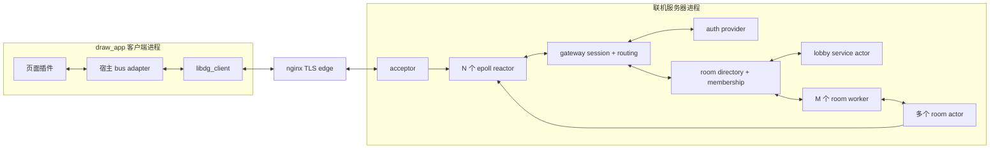
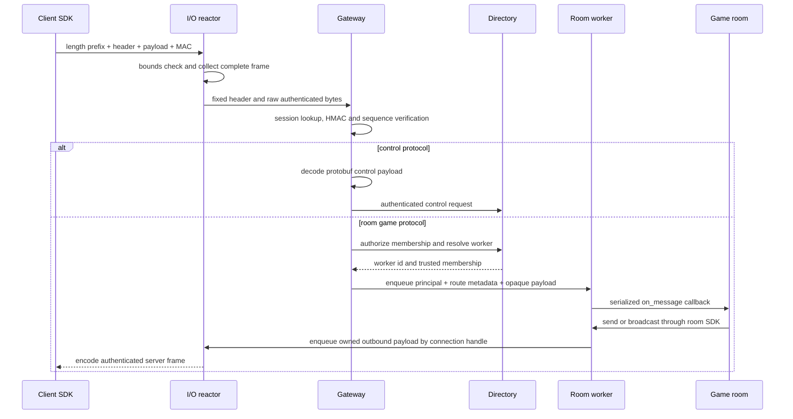
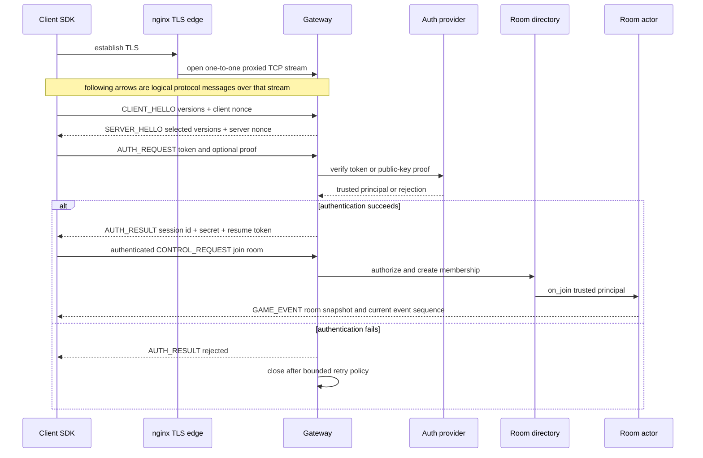
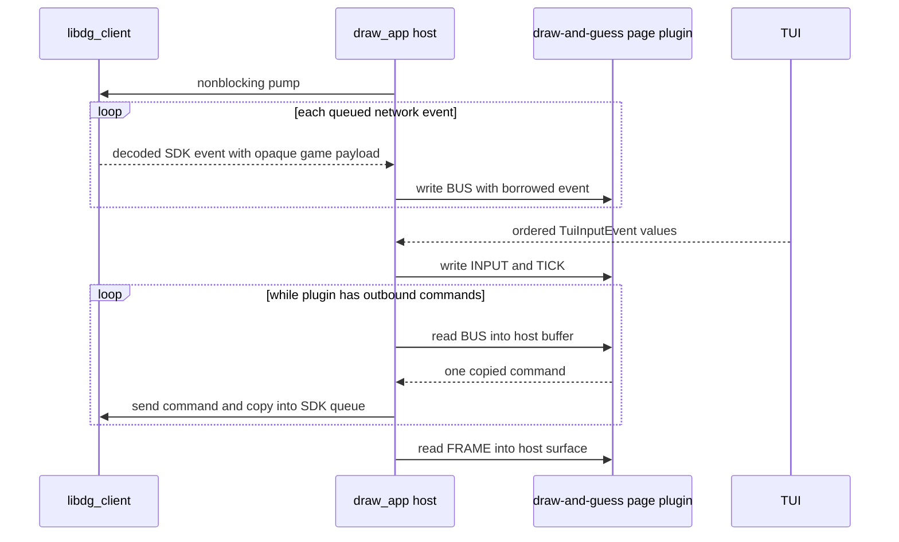

# Draw-and-guess 联机协议、服务器与 SDK 设计草案

状态：proposed，尚未冻结为兼容性契约。

本文把原笔记中的方向收敛为一套可分阶段实现的 v1 方案。核心原则保持不变：

- fd/连接不是用户身份；只有认证成功后生成的可信 principal 才能映射到 uid；
- 传输与网关层不解释具体游戏 payload，游戏语义只存在于 game-room 模块；
- TLS 由 nginx 等边缘代理终止；应用层不重复加密 payload；
- 跨层只传明确拥有权的消息，不让 socket、fd 或可变房间状态跨线程共享；
- 服务端是最终权威，客户端的 uid、房间成员身份、画板 revision 都不能直接信任。

## 1. 先修正原始数据流

原笔记中的入站顺序是：

```text
fd -> epoll -> buffer -> protobuf decode -> key verification -> route -> room
```

建议改为：

```text
fd -> epoll -> length/header bounds check -> session lookup -> HMAC verify
   -> sequence check -> control decode or opaque game routing
   -> membership authorization -> room mailbox
```

原因是 protobuf 及游戏 payload 都属于未认证输入。除了解出固定长度头中定位 session
所必需的字段外，不应在校验 MAC 和大小限制前解析复杂结构。

另外有三处需要明确调整：

1. 普通数据帧不需要 timestamp 参与防重放。新鲜的 session id、分方向单调 sequence
   和密钥轮换已经足够；timestamp 会引入客户端时钟漂移问题。时间只用于 token 过期、
   日志和遥测。
2. 不建议永久采用“一房间一线程”。房间应是单线程 actor，但多个 room actor 固定分片到
   有限数量的 room worker；小规模部署可以先只启动一个 worker。
3. `uid -> room` 不是单值映射。应保存 session、principal、membership 三层关系，以支持
   同一用户重连、多设备以及以后可能加入的旁观者。

## 2. 范围和非目标

v1 要解决：

- 原生 C 客户端通过 TLS TCP 长连接认证、进大厅、加入房间和收发游戏消息；
- 非阻塞服务端能承受慢连接、半包、粘包、断线和插件热重载；
- 网关验证身份并路由，但把游戏 payload 当作 opaque bytes；
- 房间逻辑通过一个与 socket、TLS、HMAC、epoll 无关的 C SDK 实现；
- 客户端 SDK 与 `draw_app` 宿主集成，网络连接不归某个可热重载页面所有；
- 断线重连后通过事件重放或快照恢复当前房间视图。

v1 暂不解决：

- 跨进程房间迁移、跨机器一致性和无停机升级；
- 服务端 game-room 动态热重载及房间状态迁移；
- UDP、QUIC、语音和大文件传输；
- 在应用层再次加密游戏 payload；
- 崩溃后恢复进行中的临时房间，除非后续确认这是需求。

## 3. 信任模型和术语

| 名称 | 含义 | 不能替代什么 |
| --- | --- | --- |
| connection | 一个 TCP 流及 reactor 内状态 | 不是 uid，也不是 membership |
| connection handle | `{reactor_id, slot, generation}` | 不能只保存 fd，避免 fd 复用误投递 |
| principal | 认证层产生的可信 uid/角色集合 | 不能从游戏 payload 读取 |
| session | 每次认证或恢复生成的新 session id、密钥和双向 sequence | 不等于永久账号 |
| membership | principal/session 获准参与某 room 的记录 | 不能由客户端自行声明 |
| room | 单 worker 串行执行的游戏 actor | 不拥有 fd，不直接调用 socket |
| game payload | `protocol_id` 指定的 opaque bytes | 网关不解析其游戏字段 |

nginx 终止 TLS 意味着 nginx 能看到明文和认证阶段发放的 session secret。因此 v1 的
HMAC 可以提供帧完整性、session 绑定和防重放，但不能防御恶意或已失陷的 TLS 代理。
如果威胁模型要求 nginx 也看不到 session secret，就必须改成 TLS passthrough，或者在
应用协议内增加 X25519/HKDF 一类的端到端密钥协商。

边缘代理必须为每个客户端保留独立、长生命周期、有序的 upstream byte stream，不能把多个
客户端复用到同一应用层流。可选的 PROXY protocol v2 地址只用于审计和限流，绝不能作为 uid。

HMAC 也不能代替授权。合法客户端知道自己的 session key，仍可能发送恶意但 MAC 正确的
命令；房间必须校验“当前阶段、当前 drawer、坐标范围、速率和 payload 上限”。

## 4. 总体架构



### 4.1 线程和所有权

| 组件 | 数量 | 独占状态 | 与其他线程交换的内容 |
| --- | --- | --- | --- |
| acceptor | 1 | listen fd | 新 connection handle/fd，移交后不再访问 |
| I/O reactor | CPU/负载配置 | client fd、读写状态、session MAC/seq、连接发送队列 | 已验证入站消息、房间产生的出站消息 |
| auth worker/provider | 1 或小池 | token/key 查询上下文 | auth request/result，不接触 fd |
| directory shard | 1 起步 | room 到 worker、principal/session 到 membership | join/leave/route request |
| room worker | 固定 M 个 | 分配给自己的全部 room actor | 有界 mailbox 中的 owned message |
| room actor | 每房间一个对象 | 游戏状态、参与者、事件序号、重放窗口 | 只在所属 worker 回调中访问 |

关键约束：

- fd 只能由所属 reactor 访问；room 发消息时使用带 generation 的 connection handle；
- room state 只能由所属 worker 访问，因此房间逻辑通常不需要 mutex；
- 每次跨线程 enqueue 都明确转移 payload ownership，队列失败时由发送方释放；
- reactor 和 worker 之间使用 bounded MPSC mailbox，并用 `eventfd` 唤醒；
- 不在每层重复拼接和复制 header。进程内使用 metadata + owned byte span，只有写入公网
  wire 时才编码 envelope。

“每房间一线程”在少量房间时容易实现，但会让线程数、栈内存、调度开销和关闭流程随房间
数量增长。actor-per-room + fixed worker pool 保留相同的串行逻辑模型，又不把线程作为 SDK
契约暴露。

### 4.2 入站消息生命周期



## 5. 公网 wire protocol v1

### 5.1 分帧

TCP 流上的每帧以一个四字节 big-endian `frame_len` 开始。`frame_len` 不包含自身，v1
继续沿用 corestack 当前不超过约 64 KiB 的上限：

```text
u32-be frame_len
64-byte DgWireHeaderV1
payload[payload_len]
HMAC-SHA256 tag[32]    # 认证完成后的帧必须存在
```

认证前只允许固定白名单中的 handshake/control kind，并且没有 HMAC tag。connection 一旦
进入 authenticated 状态，任何无 tag 帧、handshake kind 或错误 session id 都是协议错误。

`frame_len` 必须精确等于 `header_len + payload_len + tag_len`。在分配 payload 内存前先检查：

- `frame_len`、`header_len`、`payload_len` 的上下界和加法溢出；
- v1 的 `header_len == 64`；
- 当前连接状态是否允许该 kind/flag/tag；
- 单连接当前已分配入站字节和帧数是否超过预算。

### 5.2 固定头

所有整数都使用 big-endian。v1 头恰好 64 字节：

| Offset | 类型 | 字段 | 说明 |
| ---: | --- | --- | --- |
| 0 | `byte[4]` | magic | ASCII `DG01` |
| 4 | `u16` | version | wire major version，v1 为 1 |
| 6 | `u16` | header_len | v1 为 64，给未来扩展留边界 |
| 8 | `u16` | kind | handshake/control/game/event/error/heartbeat |
| 10 | `u16` | flags | authenticated、response 等标志 |
| 12 | `u32` | protocol_id | 0 表示 gateway control；非零由游戏协议注册 |
| 16 | `u32` | payload_len | 不含 header 和 tag |
| 20 | `u32` | reserved | v1 必须为 0 |
| 24 | `u64` | session_id_hi | 认证前为 0 |
| 32 | `u64` | session_id_lo | 认证前为 0 |
| 40 | `u64` | sequence | 每个方向从 1 严格递增 |
| 48 | `u64` | request_id | 请求响应关联；0 表示无关联 server event |
| 56 | `u64` | route_id | room id；gateway/auth/lobby 控制消息为 0 |

实现必须逐字段 encode/decode，不能把本机 C struct 直接 `send` 或 `memcpy` 到 wire；否则会把
padding、alignment 和 host endian 变成协议的一部分。

HMAC 输入是线上的原始：

```text
u32-be frame_len || header bytes || payload bytes
```

不要先 decode protobuf 再重新 serialize 后验签；protobuf 字段顺序和 unknown fields 不应
进入验签正确性的假设。tag 使用常量时间比较。

每个 session secret 通过 HKDF 至少派生两个方向不同的 key：

```text
K_c2s = HKDF(session_secret, "draw-and-guess/c2s/v1")
K_s2c = HKDF(session_secret, "draw-and-guess/s2c/v1")
```

同一个 key 不得跨 session 或双向复用。TCP 中 sequence 应严格等于上一个值加一；断线恢复
创建新 session id/key 并重新从 1 开始，不尝试延续旧 connection 的 sequence。

### 5.3 kind 与路由约束

建议至少区分：

| kind | payload | route_id | 网关行为 |
| --- | --- | ---: | --- |
| `CLIENT_HELLO` / `SERVER_HELLO` | control protobuf | 0 | 版本与能力协商，只能认证前使用 |
| `AUTH_REQUEST` / `AUTH_RESULT` | control protobuf | 0 | 交给 auth provider |
| `CONTROL_REQUEST` / `CONTROL_RESPONSE` | control protobuf | 0 | lobby、create/join/leave/resume |
| `GAME_COMMAND` | opaque game bytes | room id | 先查 membership，再投递 room |
| `GAME_EVENT` | opaque game bytes | room id | 仅服务端发出 |
| `ERROR` | control protobuf | 对应上下文 | 可恢复的语义错误；协议损坏通常直接关闭 |
| `HEARTBEAT` | 空或 control protobuf | 0 | 活性和 RTT，不更新游戏状态 |

客户端 payload 中即使存在 uid 字段也不能成为授权依据。网关投递给 room 的内部消息会附加
可信 `DgPrincipal` 和 membership；游戏 SDK 不向 room 暴露未经验证的 identity header。

## 6. 认证、session 与重连

推荐的 MVP 握手：

1. TLS 建立后，client 发送支持的 wire/control/game protocol 版本和随机 nonce；
2. server 选择共同版本并返回 server nonce；
3. client 提交短期签名 access token；auth provider 验签并产生 principal；
4. server 生成全新的 128-bit session id 和至少 256-bit 随机 session secret，在 TLS 内返回；
5. 双方派生方向 key，从 sequence 1 开始发送 authenticated frame；
6. server 另发一个短期、服务端签名且可撤销的 resume token。

这里仍有一个产品选择：access token 可以只是 bearer token，也可以绑定客户端长期公钥，要求
客户端对握手 transcript 签名。后者能降低 token 被复制后的冒用风险，但需要账号密钥注册、
安全存储和丢失恢复流程。



断线恢复不复用旧 session key：

- client 重新建立 TLS，提交 resume token 和每个 room 的 `last_event_seq`；
- auth 成功后得到新 session id/key 和新的 connection handle；
- directory 把 membership 重新绑定到新 session；
- room 若仍保留连续事件窗口，就从 `last_event_seq + 1` 重放；否则发送完整 snapshot；
- 旧 connection handle 的 generation 失效，迟到的 outbound message 会被 reactor 丢弃；
- 超过 grace period 后，room 才将暂时断线转成最终 leave。

## 7. protobuf 的边界和构建链

推荐 fixed binary envelope + protobuf payload，而不是把整个 envelope 放入 protobuf：

- reactor/gateway 无需分配和复杂解析即可完成大小、版本、session、sequence 和路由检查；
- game payload 仍可独立演进，网关保持 opaque；
- HMAC 直接覆盖原始 wire bytes，不依赖 deterministic protobuf serialization；
- Wireshark/日志工具仍可按 `protocol_id` 选择对应 descriptor 解码 payload。

建议采用 protobuf-c，并把生成的 `.pb-c.c/.pb-c.h` 提交到仓库：

| 构建场景 | 依赖 |
| --- | --- |
| 普通 CMake build | protobuf-c runtime；不要求本机安装 generator |
| 修改 `.proto` 后再生成 | 固定版本的 `protoc` + `protoc-gen-c` |
| CI 协议一致性检查 | 重新生成到临时目录并比较 tracked generated files |

这样普通使用者不会因为缺少 `protoc` 无法构建，但协议生成仍可重复。应固定 generator 版本，
禁止手改 generated files，并在协议兼容测试里保留旧版本 fixture。

control schema 与 game schema 必须分目录、分 `protocol_id`：

```text
proto/control/v1/*.proto
proto/games/draw_guess/v1/*.proto
generated/control/v1/*
generated/games/draw_guess/v1/*
```

兼容规则：不重用 field number；删除字段时 reserve；新增字段只能是 optional/repeated 且旧端可
忽略；破坏性语义变化分配新 protocol id/major version。

## 8. 进程内消息与服务器 SDK

公网 wire struct 不能直接作为进程内 SDK ABI。解码并验证后，gateway 构造类似下面的可信
内部消息：

```c
typedef struct DgConnHandle {
    uint32_t reactor_id;
    uint32_t slot;
    uint64_t generation;
} DgConnHandle;

typedef struct DgPrincipal {
    uint64_t uid;
    uint64_t roles;
} DgPrincipal;

typedef struct DgRoomMessage {
    DgConnHandle connection;
    DgPrincipal principal;
    uint64_t room_id;
    uint64_t request_id;
    uint32_t protocol_id;
    const uint8_t *payload;
    size_t payload_len;
} DgRoomMessage;
```

这是接口形状示例，不是已经冻结的 ABI。传入 room 回调的 payload 在回调结束前 borrowed；
需要留存时必须复制。room 通过 context API 输出，SDK 在返回前复制或接管 payload，不能保存
room 栈地址。

建议的 game-room callback 集合：

```c
room_create(config, out_room)
room_destroy(room)
room_join(room, context, principal, join_info)
room_leave(room, context, principal, reason)
room_message(room, context, message)
room_tick(room, context, monotonic_now)
```

`context` 提供：

```c
send_to(connection_or_principal, protocol_id, payload)
broadcast(room_id, audience_filter, protocol_id, payload)
disconnect(connection, reason)
schedule_timer(room_id, timer_id, deadline)
publish_lobby_summary(room_id, summary)
```

契约：

- 同一 room 的回调永不并发，并按 mailbox 顺序执行；
- callback 不能阻塞等待网络、磁盘或另一个 room；
- room 只接收已经认证并经过 membership 检查的消息，但仍负责游戏授权；
- `send/broadcast` 可能因预算耗尽失败，room 必须能处理失败结果；
- auth 和 lobby 可以复用 actor runtime，但使用独立的受限 service API，不伪装成普通游戏房间；
- v1 静态注册 game module；动态加载与状态迁移以后单独设计。

## 9. 客户端 SDK 与 draw_app 插件

建议拆成三层：

| 库 | 职责 | 不知道什么 |
| --- | --- | --- |
| `libdg_wire` | length/header codec、HMAC/HKDF、sequence、边界检查 | 房间和 UI |
| `libdg_client` | 非阻塞连接、握手、session、重连、control request、事件队列 | `TuiCell` 和具体游戏消息 |
| `libdg_draw_guess` | typed protobuf command/event、snapshot/replay helper | fd、TLS、epoll |

底层客户端 API 应是 caller-driven/nonblocking：暴露 socket interest 或 `pump`，并通过有界事件
队列返回结果。可以以后提供后台线程 adapter，但后台线程绝不能直接调用页面 `.so` 中的函数，
否则 `dlclose` 时无法安全同步。

网络连接应由 `App` 宿主持有，而不是 Canvas 页面持有。这样切页和热重载不会断开 session。
联机功能需要把当前 page ABI 升到 v2，但仍保持四个导出符号：

- 新增 `DRAW_PLUGIN_WRITE_BUS`：宿主在主线程把 borrowed、typed bus event 写入页面；
- 新增 `DRAW_PLUGIN_READ_BUS`：宿主提供有容量的输出 buffer，页面复制一条待发 command；
- 宿主每帧先 pump SDK、分发 inbound bus，再处理 UI input/tick，最后 drain outbound bus；
- payload 不直接交换 `CanvasDocument`、链表指针或 native `TuiCell` 内存布局；
- reload 时宿主暂停该 slot 的 bus 投递，装入新实例后请求 room snapshot，再恢复事件流。

使用 host-provided mutable buffer 的 `READ_BUS`，可以避免跨 `.so` 传递 allocator ownership 或
保存指向即将卸载模块的 release function。具体 bus struct 与队列上限应在 ABI v2 设计时冻结。



## 10. Draw-and-guess 游戏协议

### 10.1 服务端权威状态

每个 room 至少维护：

- `room_epoch`：房间重建后变化，避免把旧事件接到新房间；
- `event_seq`：所有权威 game event 的单调序号，用于重连重放；
- participants、连接状态、角色、分数；
- phase：waiting、countdown、drawing、round-result、game-result；
- 当前 drawer、仅对 drawer 可见的 secret word；
- 权威 canvas operation 列表与 `canvas_revision`；
- 最近一段 event ring，用于短时断线重放；
- 每个 principal 最近处理的 command id，用于幂等去重。

客户端发送 command，服务端校验并产生 event；客户端不能直接宣布“画布已变更”“猜对了”或
“分数增加”。

### 10.2 建议消息

| 方向 | 消息 | 关键字段/行为 |
| --- | --- | --- |
| client -> room | `SetReady` | command id、ready flag |
| client -> room | `SubmitStroke` | command id、base revision、cell、有限 point 列表 |
| client -> room | `UndoStroke` | command id、期望 revision；只有当前 drawer 可用 |
| client -> room | `SubmitGuess` | command id、受限 UTF-8 文本 |
| server -> one | `DrawerSecret` | room/round epoch、secret；绝不广播 |
| server -> room | `RoomSnapshot` | phase、participants、scores、canvas、当前 event seq |
| server -> room | `StrokeApplied` | event seq、新 canvas revision、规范化 stroke |
| server -> room | `CanvasReset` | 新 round/epoch 和 revision |
| server -> room | `GuessObserved` | 脱敏结果；正确答案不提前泄露 |
| server -> room | `RoundChanged` | phase、drawer、deadline、公开提示 |
| server -> room | `ParticipantChanged` | join、temporary disconnect、resume、leave |
| server -> room | `CommandRejected` | request/command id、稳定错误码、当前 revision |

坐标沿用 Canvas 现有的中心相对 world coordinate，避免携带终端 viewport 坐标。wire 中的 cell
显式编码 UTF-8 bytes/长度、fg、bg、style，不直接 memcpy `TuiCell`，因为它是本机插件 ABI
结构，包含 padding、enum/整数布局和 UI 语义。

联机 snapshot 也不直接序列化 `CanvasDocument` 链表。它应使用数组从最旧已接受 operation 到
最新 operation 编码，或者发送压平后的最终 cell map。数组天然无 `prev/next` 环；decode 时仍要
检查 operation 数、sample 数、坐标和累计分配上限。`canvas_revision` 保持在 `INT64_MAX` 以内，
与现有 JSON/Canvas 约束一致。

为了降低输入频率，页面把一次连续鼠标 stroke 按点数或约 20--30 Hz 批量发送；server 可以
规范化插值并广播权威 `StrokeApplied`。不能无声丢弃已经接受的权威 stroke event，否则各客户端
revision 会分叉。

## 11. 背压、限制与失败语义

所有队列都必须有明确的帧数和字节预算：

| 位置 | 达到上限时的 v1 策略 |
| --- | --- |
| connection inbound | 暂停 `EPOLLIN`；持续超限或超时则断开 |
| room mailbox | 对该 room 返回 busy/rate-limited；不能无限分配 |
| connection outbound | 先停止读入该 client；慢消费者超时后断开 |
| transient presence/typing | 可合并或丢弃，并记录 metric |
| accepted authoritative game event | 不可静默丢弃；排队失败必须触发断开或 snapshot resync |

还需要固定：最大 frame、每秒 frame/byte、每 stroke point 数、guess UTF-8 长度、每 room 人数、
每 principal 并发 session 数、auth 失败次数、heartbeat 和 idle timeout。

协议级错误，例如错误长度、MAC、sequence、reserved 位或不允许的 kind，默认不回显细节并关闭
连接。业务级拒绝，例如不是 drawer、revision 冲突或房间已满，返回稳定 error code 并保持连接。

## 12. 对现有 corestack 的复用判断

可复用的基础：

- `wire.h` 的四字节 big-endian primitive 和 frame 上限；
- `network/reader.c`、`network/writer.c` 处理 nonblocking partial I/O 的状态机思路；
- OpenSSL 依赖、随机数、HMAC 和常量时间比较能力；
- 现有 TUI 主循环、页面 ABI 与 Canvas world-coordinate/history 设计。

不建议直接同时叠加现有两套 I/O abstraction：

- `server/client_io.c` 是最多五帧的 stack 状态机，主要服务旧握手/logger；
- `network/reader.c` 与 `writer.c` 是较新的 queue 方向，但 ownership/error contract 还未完整；
- 两套代码都没有覆盖新 envelope、session、背压、reactor mailbox 和 reconnect。

实现前应选定并收敛为一套 `DgConnectionIo`。推荐以 queue 型 reader/writer 为基础重构，因为它更
适合长期双向连接；旧 `ClientIo` 留给旧协议，待迁移完成后再移除。当前 queue 实现至少要补：

- queued reader frame 在 shutdown/free 时逐项释放；
- reader/writer frame budget 的初始化和每轮重置契约；
- writer queue 的 owned-buffer 规则和 enqueue API；
- socketpair 半包/EAGAIN/peer-close 测试；
- frame/byte high-water mark，而不只是 frame count；
- 去掉与新 connection state 重复的状态和隐式 ownership。

## 13. 建议的代码边界

通用 transport/actor 能力适合留在 corestack，具体游戏协议和 UI adapter 留在 draw_app：

```text
corestack/
  include/dg/wire.h             # public frame codec types
  include/dg/client.h           # game-agnostic client SDK
  include/dg/room.h             # server game-room callback SDK
  src/dg/wire/                  # bounds, codec, HMAC, sequence
  src/dg/client/                # nonblocking client state machine
  src/dg/server/                # reactor, gateway, directory, actor runtime

draw_app/
  proto/control/v1/
  proto/games/draw_guess/v1/
  generated/
  games/draw_guess/             # authoritative room implementation
  plugins/draw_guess/           # TUI page and Canvas adapter
  server/                       # executable wiring/config only
```

依赖方向保持单向：wire 不依赖 protobuf；client/gateway 组合 wire 与 generated control codec；
game-room/page adapter 组合 SDK 与 generated game codec。`corestack` 不能 include draw_app 的
Canvas 或 plugin header；draw_app 可以通过公开 SDK 组合它们。

## 14. 测试计划

### 14.1 Wire/crypto

- 每个整数边界和 golden byte fixture；
- frame length/header/payload/tag 相互不一致；
- HMAC 任意 bit 翻转、错误方向 key、错误 session、重复/跳号 sequence；
- 所有加法/乘法溢出、最大 frame 和零长度；
- fuzz frame decoder，保证失败不泄漏、不越界、不进入 protobuf/game decoder；
- 旧 protocol fixture 在新增字段后仍能解码。

### 14.2 I/O 与并发

- `socketpair` 强制一字节读写、EINTR/EAGAIN、half-close；
- 慢 reader/writer、满 inbound/outbound/mailbox 和正常恢复；
- fd 复用时旧 generation 的消息不能投到新连接；
- 多 reactor 到单 room 的消息仍由 room worker 串行；
- shutdown 时每个 owned payload 恰好释放一次，ASan/LSan/TSan 分别运行。

### 14.3 Game/SDK

- room 以纯消息序列做 deterministic test，不启动 socket；
- 非 drawer 画图、旧 revision、重复 command、答案泄漏、重连重放窗口；
- snapshot + 后续 event 得到与服务端完全一致的 canvas；
- Canvas operation 按最旧到最新应用，超限/非法数据整体拒绝；
- client SDK 与 fake server 的握手、join、disconnect/resume；
- 页面热重载期间网络事件有界缓存，reload 后 snapshot resync，不回调已卸载 `.so`。

## 15. 分阶段实现规划

### Phase 0：冻结威胁模型与 ADR

- 确认 nginx 是可信边界还是需要端到端密钥协商；
- 确认 bearer token 或 public-key proof-of-possession；
- 确认 protobuf-c 和 generated-source 策略；
- 固定 v1 header、上限、错误码、版本兼容与 reconnect grace period；
- 为 wire、control、game protocol 分配稳定 id。

退出标准：协议文档和 golden fixture 可由独立 codec 实现，不再依赖自然语言猜测。

### Phase 1：wire codec 与 connection I/O

- 实现独立 `libdg_wire`，不依赖 game/protobuf；
- 收敛 corestack reader/writer，加入 owned queue 和字节背压；
- socketpair、fuzz、ASan/UBSan 测试；
- 建立单进程单 reactor echo harness。

退出标准：任意分片输入都只产生完整、验证过的 frame，非法输入不会进入上层。

### Phase 2：认证 session 与 gateway

- 实现 hello/version/auth 状态机、HKDF/HMAC/sequence；
- 实现 connection handle generation、principal/session directory；
- 加入 heartbeat、timeout、rate limit 和稳定 error code；
- nginx TLS 环境下做端到端认证测试。

退出标准：uid 只来自 auth provider，伪造 uid/route/session/sequence 均无法通过。

### Phase 3：room actor runtime 与 server SDK

- fixed room worker pool、bounded mailbox、eventfd wakeup；
- directory/membership、join/leave、lobby service；
- 冻结 game-room callback/ownership contract；
- 用无业务含义的 echo room 做并发、背压和关闭测试。

退出标准：room 代码不知道 fd/epoll/HMAC，且同一 room callback 永不并发。

### Phase 4：draw-and-guess 协议与权威 room

- 定义/生成 game protobuf；
- 实现 phase、角色、secret、stroke、guess、score、event ring 和 snapshot；
- 用纯消息 simulation 覆盖完整多轮游戏；
- 加入命令幂等、revision 冲突和权限测试。

退出标准：无客户端 UI 时也能确定性运行游戏并验证状态/event 序列。

### Phase 5：客户端 SDK 与 draw_app 接入

- 实现 `libdg_client` 和 `libdg_draw_guess`；
- `App` 持有连接并 pump SDK；
- 设计并升级 page ABI v2 的 BUS write/read；
- 增加联机页面或扩展 Canvas 页面，完成 stroke/snapshot 映射；
- 验证切页、插件 reload、断线重连和 snapshot resync。

退出标准：热重载页面不关闭 session，客户端最终画布和服务端权威状态一致。

### Phase 6：加固与容量验证

- fuzz control/game decoder、故障注入、慢客户端和 queue saturation；
- 指标：连接数、队列字节、room tick 延迟、drop/disconnect、auth/error code；
- 根据目标房间数和消息率压测并调整 reactor/worker 分片；
- 再决定持久化、跨进程扩展和 room migration 是否进入 v2。

## 16. 需要确认的问题

以下问题不阻塞先写 codec 测试，但会影响 Phase 0 的最终接口：

1. **TLS 信任边界**：nginx 是否完全可信，且 nginx 到 server 的明文内网连接可接受？如果不
   接受，是选择 TLS passthrough、内网 mTLS，还是应用层 X25519？
2. **用户身份形态**：MVP 用服务端签名的短期 bearer token 是否足够，还是一开始就要求每个
   用户持有长期公私钥并做 proof-of-possession？
3. **重连语义**：断线后保留玩家位置多久？建议默认 60 秒；期间 drawer 是否暂停回合计时？
4. **并发模型**：一个用户是否允许多设备、同时加入多个房间或旁观多个房间？
5. **规模目标**：单机预期同时连接、房间数、每房人数和 stroke 更新率是多少？这决定默认
   reactor/worker/queue 上限。
6. **持久化**：进行中的房间在服务器崩溃后可以消失，还是必须从 event log 恢复？
7. **协议工具链**：是否接受 protobuf-c runtime submodule，并把 generated C 提交进仓库？

若暂时不指定，建议 MVP 默认值是：nginx 为可信边界、短期签名 bearer token、60 秒重连窗口、
每 session 一个 active player room、临时房间不做崩溃恢复、protobuf-c generated C 入库。
