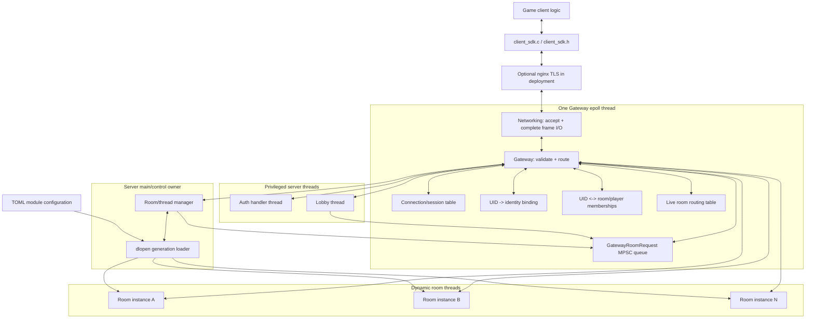
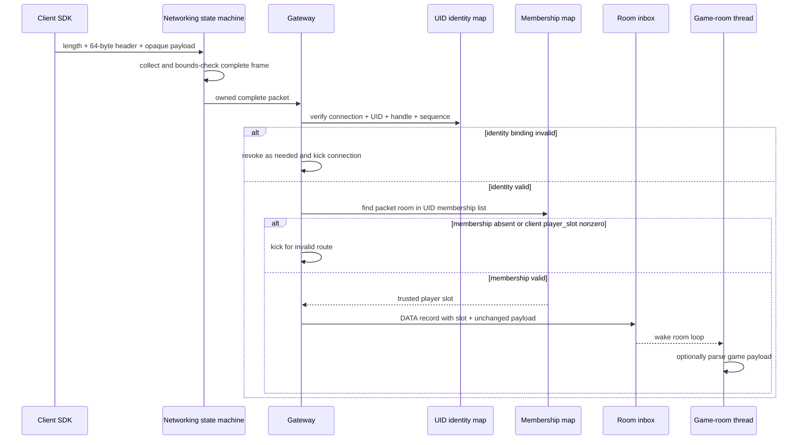
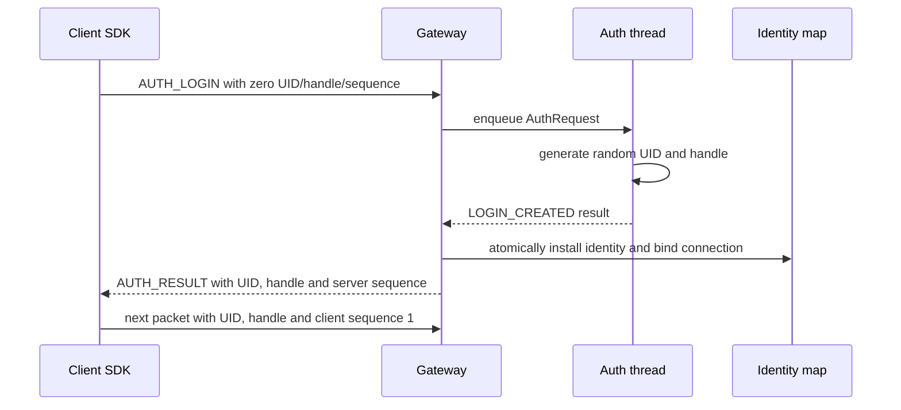
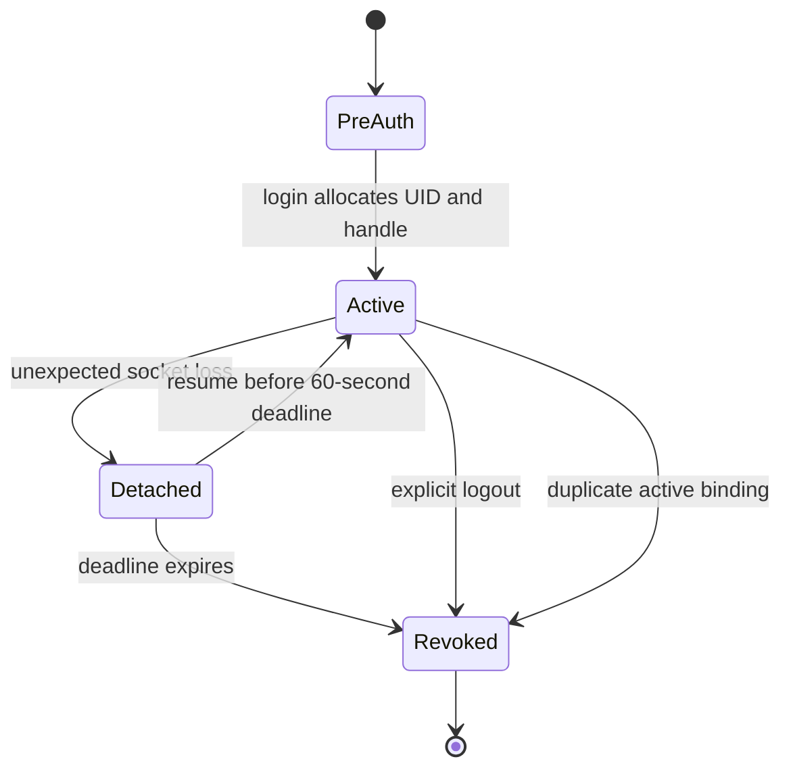
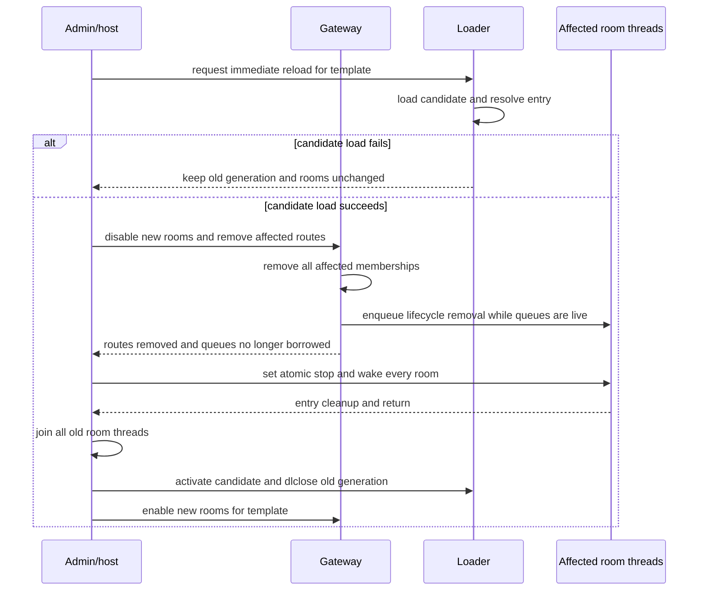

# Server/Client architecture and protocol

状态：v1 设计草案。本文先冻结模块边界、线程入口、主要数据结构和 SDK 契约；实现尚未开始。

设计输入：

- [Server_Client _arch_draft_new.md](<Server_Client _arch_draft_new.md>)
- [arch_sketch.png](arch_sketch.png)

## 1. 已确认的 v1 决策

1. Networking 和 Gateway 是同一个 `epoll` 线程内的两个模块，当前优先降低复杂性。
2. 每个 authenticated packet 都携带 UID；Gateway 每包检查 connection、UID、identity handle
   和 sequence 的映射，任何不一致都直接踢出。
3. 一个 UID 同时只允许绑定一个 active connection。出现重复 active binding 时撤销该 UID，并把
   两个 connection 全部踢掉。
4. 一个 UID 可以同时加入多个 Game room；demo 暂时只使用一个。
5. Lobby 不持有 Gateway mapping 指针，只使用统一的 `GatewayRoomRequest` API 请求列房、创建、
   加入和离开房间。Lobby 与 main/control 共用一条专用 MPSC request queue 和一把 queue mutex。
6. room input header 包含 `JOIN/LOST/RESUMED/REMOVED` 等 lifecycle kind；游戏可以选择使用或
   忽略这些事件。
7. Game module reload 只有两种模式：立即把用户踢出受影响 room、返回 Lobby 并结束这些 room 后
   reload；或者禁止新建及加入旧-generation room，无 deadline 地等待现有房间全部自然退出后
   reload。
8. demo 的 client SDK 和 server 都使用 raw TCP，不实现 TLS。部署时必须在此边界外补 TLS。
9. demo identity 使用随机 identity handle，并维护 client-to-server/server-to-client 两个 sequence；
   不使用 timestamp 或 HMAC。
10. 公网 SDK header 固定 64 字节、整数全部 big-endian，使用固定 offset codec，不引入通用 parser。
11. Auth handler 是同进程 thread，不查数据库、不验证账号；login 直接分配随机 UID 和随机
    identity handle。意外断线后，同 UID/handle 可在 60 秒内 resume；成功后轮换 handle。超时或
    logout 后 UID 失效。
12. 每个 room instance 暂时使用一个线程，room entry 自行维护循环、周期和游戏状态。
13. Game room 是动态库，只导出一个长生命周期入口函数；业务 payload 对 Gateway 完全 opaque。
14. UID-room、live room route 和 template accepting 状态的跨线程变更全部抽象为
    `GatewayRoomRequest`；Gateway 仍是唯一执行者和 mapping 写者。

### 1.1 Demo 安全边界

v1 demo 不使用 TLS，也不使用 HMAC。identity handle 是一个 128-bit 随机 bearer capability，
不是数字签名。Gateway 的逐包绑定检查能阻止不知道 handle 的客户端随意声明另一个 UID，但无法
抵御能监听或修改 raw TCP 的攻击者。

因此：

- raw TCP 只能用于本机、隔离开发网络或明确接受风险的 demo；
- public deployment 必须在 client 与 nginx 之间启用 TLS；
- nginx 到 Gateway 可按既定信任模型使用 loopback raw TCP；
- 若以后需要不信任 nginx，再单独增加端到端认证/MAC，不改变 Game-room payload 协议。

## 2. 总体架构



在 demo 不启用 nginx 时，`ClientSdk <--> Edge <--> Network` 退化为 Client SDK 直接 raw TCP
连接 Gateway listener。

### 2.1 线程入口

建议宿主侧明确只有以下主要 thread entry：

```c
void *gateway_thread_main(void *userdata);
void *auth_thread_main(void *userdata);
void *lobby_thread_main(void *userdata);
void *server_room_thread_main(void *userdata);
```

进程 `main` 本身是 control owner：加载 TOML、创建/关闭上述线程、持有 module generation，并处理
reload/shutdown。它不执行 fd I/O 或游戏逻辑，也不需要额外创建一个 room-manager worker thread。

建议主对象和控制入口：

```c
typedef struct ServerHost {
    ServerChannels channels;
    GatewayServer gateway;
    ServerRoomManager room_manager;
    AuthHandler auth;
    LobbyHandler lobby;
    pthread_t gateway_thread;
    pthread_t auth_thread;
    pthread_t lobby_thread;
    _Atomic bool stop_requested;
} ServerHost;

int server_host_init(ServerHost *host, const ServerConfig *config);
int server_host_run_control_loop(ServerHost *host);
void server_host_request_shutdown(ServerHost *host);
void server_host_cleanup(ServerHost *host);
```

`server_room_thread_main` 是宿主 trampoline：它设置 thread-local 宿主信息，然后调用动态库的唯一
入口：

```c
SERVER_ROOM_EXPORT int server_room_entry(ServerRoomContext *context);
```

线程职责：

| 线程 | 独占状态 | 只通过什么跨线程通信 |
| --- | --- | --- |
| main/control | module handle/generation、room pthread 创建/join、reload/shutdown | 统一 room request queue + Gateway-to-main command queue |
| Gateway | fd、epoll、frame I/O、所有 mapping、live room routing table | Auth/Lobby/room/control 的 bounded queues |
| Auth | 随机 UID/handle 生成流程、Auth request 临时状态 | Auth inbox/result queue |
| Lobby | 大厅协议和房间调度策略 | Lobby inbox/outbox + 统一 room request API |
| Room | 单个 room 的全部游戏状态和循环 | 对应 room inbox/outbox |

Gateway 是所有 mapping 的唯一写者。Auth、Lobby 和 Game room 都不能拿到 mapping 裸指针，也不能
直接关闭 fd。

main/control loop 的形状：

```c
int server_host_run_control_loop(ServerHost *host)
{
    while (!atomic_load(&host->stop_requested)) {
        server_room_manager_wait(&host->room_manager);
        server_room_manager_apply_gateway_commands(&host->room_manager);
        server_room_manager_reap_finished(&host->room_manager);
        server_room_manager_advance_reload(&host->room_manager);
        server_host_apply_admin_requests(host);
    }
    return server_host_shutdown_ordered(host);
}
```

`wait` 返回时不持有 queue mutex；`dlopen`、module entry 启动和 `pthread_join` 都发生在 queue lock
之外，因此不会阻塞 Gateway 获取通信队列的 mutex。

## 3. 固定 64 字节 wire header

### 3.1 Frame layout

TCP stream 使用四字节长度前缀：

```text
u32_be frame_length
SdkWireHeaderV1 header     # exactly 64 bytes
uint8_t payload[]          # exactly header.payload_length bytes
```

`frame_length` 不包含自身，并且必须精确等于 `64 + payload_length`。v1 没有 HMAC trailer。

Networking 必须先收齐整个 frame，再交给 Gateway。Auth、Lobby 和 Game room 永远不会看到 TCP
半包、粘包或指向 connection scratch buffer 的临时 slice。

### 3.2 Header offsets

| Offset | Size | Wire field | 说明 |
| ---: | ---: | --- | --- |
| 0 | 4 | `magic` | ASCII `DG01` |
| 4 | 2 | `version` | v1 为 1 |
| 6 | 2 | `flags` | request/response/internal 等位标志 |
| 8 | 2 | `route` | Auth、Lobby、Game |
| 10 | 2 | `kind` | route 内操作或 room lifecycle kind |
| 12 | 4 | `payload_length` | payload 字节数 |
| 16 | 8 | `uid` | login 前为 0；之后每包携带 |
| 24 | 16 | `identity_handle` | 128-bit opaque random bytes |
| 40 | 8 | `room_id` | Game route 使用；其他 route 为 0 |
| 48 | 8 | `sequence` | 每个方向独立严格递增 |
| 56 | 4 | `player_slot` | client 发包必须为 0；Gateway/room 内部使用 |
| 60 | 4 | `code` | result、leave、complaint 等稳定 code |

总长度：`4 + 2 + 2 + 2 + 2 + 4 + 8 + 16 + 8 + 8 + 4 + 4 = 64`。

`identity_handle` 是 byte array，不做整数 endian 转换；其他多字节整数全部 big-endian。

固定协议不代表直接发送 C struct。编译器 padding、alignment 和 host endian 不能成为 wire ABI。
只提供下面这类固定 offset codec：

```c
int sdk_wire_header_decode(
    const uint8_t wire[SDK_WIRE_HEADER_SIZE],
    SdkWireHeader *out_header);

void sdk_wire_header_encode(
    uint8_t wire[SDK_WIRE_HEADER_SIZE],
    const SdkWireHeader *header);

int sdk_wire_frame_size(
    const SdkWireHeader *header,
    uint32_t *out_frame_length);
```

这里的 decode 只是 64 字节固定 offset load/validation，不是 protobuf/JSON/TLV parser。

Auth/Lobby 的 v1 control payload 也使用少量固定 record，不引入 schema parser：

- `AUTH_LOGIN/AUTH_LOGOUT/AUTH_RESUME`：demo 不需要 payload，身份字段都在 header；
- `LOBBY_LIST`：request 无 payload，response 为 count + 固定大小 room-info records；
- `LOBBY_CREATE`：固定一个 `u64_be room_template_id`；
- `LOBBY_JOIN/LOBBY_LEAVE`：目标使用 header 的 `room_id`，request 无 payload；
- 所有 result 使用 header `code`，需要的额外结果采用对应固定 record。

每种 control kind 必须有唯一且精确的 payload 长度；长度不符直接拒绝。Game payload 不受这些
规则约束，由 Game room 自己定义。

### 3.3 Header enums

建议 route：

```c
typedef enum SdkRoute {
    SDK_ROUTE_AUTH = 1,
    SDK_ROUTE_LOBBY = 2,
    SDK_ROUTE_GAME = 3
} SdkRoute;
```

建议公开 kind：

```text
AUTH_LOGIN
AUTH_RESUME
AUTH_LOGOUT
AUTH_RESULT

LOBBY_LIST
LOBBY_CREATE
LOBBY_JOIN
LOBBY_LEAVE
LOBBY_RESULT

GAME_DATA
GAME_RESULT
```

room lifecycle kind 也使用 header 的 `kind` 表达，但只能由 Gateway 合成，client 发送这些值应视为
协议违规：

```text
ROOM_PLAYER_JOIN
ROOM_CONNECTION_LOST
ROOM_CONNECTION_RESUMED
ROOM_PLAYER_REMOVED
ROOM_STOP
```

业务逻辑可以忽略除 `ROOM_STOP` 外的 lifecycle kind。`ROOM_STOP` 同时由 context 的原子 stop flag
保证，不能因为 inbox 已满或模块忽略某个 packet 而无法退出。

## 4. 主要 Gateway 数据结构

以下是实现规划，不要求字段名逐字不变。

### 4.1 `GatewayServer`

```c
typedef struct GatewayServer {
    int listen_fd;
    int epoll_fd;
    _Atomic bool stop_requested;

    GatewayConnectionTable connections;
    GatewayIdentityTable identities;
    GatewayMembershipTable memberships;
    GatewayRoomRoutingTable room_routes;
    ServerChannels *channels;
} GatewayServer;
```

除 `channels` 指向的显式跨线程 queues/eventfd 外，其余字段只由 `gateway_thread_main` 访问。
其他线程不能通过 `ServerChannels` 反向取得 Gateway 内部表。

```c
typedef struct ServerChannels {
    AuthChannel auth;
    LobbyChannel lobby;
    GatewayRoomRequestQueue room_requests;
    GatewayToRoomManagerQueue room_manager_commands;
    int gateway_wakeup_fd;
    int control_wakeup_fd;
} ServerChannels;
```

### 4.2 `GatewayConnection`

```c
typedef enum GatewayConnectionState {
    GATEWAY_CONNECTION_PREAUTH,
    GATEWAY_CONNECTION_AUTH_PENDING,
    GATEWAY_CONNECTION_ACTIVE,
    GATEWAY_CONNECTION_CLOSING
} GatewayConnectionState;

typedef struct GatewayConnection {
    int fd;
    uint64_t generation;
    GatewayConnectionState state;

    FrameReader reader;
    FrameWriter writer;
    PacketQueue outbound;

    uint64_t bound_uid;
    int64_t last_activity_ns;
} GatewayConnection;
```

一个 fd 只属于一个 `GatewayConnection` generation。任何异步结果要带 `{fd slot, generation}`；
generation 不匹配时丢弃，避免 fd 被 OS 复用后误投递。

### 4.3 `GatewayIdentity`

```c
typedef enum GatewayIdentityState {
    GATEWAY_IDENTITY_ATTACHED,
    GATEWAY_IDENTITY_DETACHED,
    GATEWAY_IDENTITY_REVOKED
} GatewayIdentityState;

typedef struct GatewayIdentity {
    uint64_t uid;
    uint8_t identity_handle[16];
    GatewayIdentityState state;
    GatewayConnectionRef connection;
    uint64_t expected_client_sequence;
    uint64_t next_server_sequence;
    int64_t disconnect_deadline_ns;
    GatewayMembershipList memberships;
} GatewayIdentity;
```

`uid -> GatewayIdentity` 是新草稿中的 UID-key mapping；demo 中所谓 key 就是随机 identity handle。

每个 authenticated packet 必须同时满足：

```text
connection.state == ACTIVE
connection.bound_uid == packet.uid
identity uid/handle == packet uid/handle
identity.connection == current connection generation
packet.sequence == expected client-to-server sequence
```

任意一项失败：撤销/关闭策略按协议违规处理，不把包交给上层。

两个方向的第一个 authenticated sequence 都是 1，并要求精确等于 expected value。Gateway 在身份
检查成功后、route 前递增 client expected sequence；server sequence 在 frame 成功进入 connection
writer queue 时消耗。sequence 不允许 wrap，达到 `UINT64_MAX` 前必须重新 login/resume 轮换 handle。

### 4.4 多房间 membership

```c
typedef struct GatewayMembership {
    uint64_t uid;
    uint64_t room_id;
    uint32_t player_slot;
    GatewayMembershipState state;
} GatewayMembership;
```

需要两个索引：

```text
uid -> list of { room_id, player_slot, state }
(room_id, player_slot) -> uid
```

因此一个 UID 能加入多个 room，但在同一个 room 里只能有一个 slot。client 的 Game packet 必须携带
目标 `room_id`；Gateway 从 UID 的 membership list 中查到对应 slot，并覆盖 client header 中必须
为 0 的 `player_slot`。

demo UI 可以只暴露一个 active room，但 server 数据结构不能把 membership 写成单值。

### 4.5 Gateway routing view 与 `ServerRoomManager`

Gateway 只保存发送/路由所需的轻量 view：

```c
typedef enum GatewayRoomState {
    GATEWAY_ROOM_STARTING,
    GATEWAY_ROOM_RUNNING,
    GATEWAY_ROOM_DRAINING,
    GATEWAY_ROOM_STOPPING,
    GATEWAY_ROOM_FINISHED
} GatewayRoomState;

typedef struct GatewayRoomRoute {
    uint64_t room_id;
    uint64_t room_instance_generation;
    GatewayRoomState state;
    ServerPacketQueue *inbox;
    ServerPacketQueue *outbox;
} GatewayRoomRoute;
```

main/control owner 持有真实 pthread、context 和 `.so` generation：

```c
typedef struct ServerRoomInstance {
    uint64_t room_id;
    uint64_t module_generation_id;
    GatewayRoomState state;
    pthread_t thread;
    ServerRoomContext context;
    ServerPacketQueue inbox;
    ServerPacketQueue outbox;
} ServerRoomInstance;

typedef struct GatewayModuleGeneration {
    uint64_t generation_id;
    char *canonical_path;
    char *loaded_copy_path;
    void *dl_handle;
    ServerRoomEntryFn entry;
    size_t active_room_count;
    GatewayModuleReloadState reload_state;
} GatewayModuleGeneration;

typedef struct ServerRoomManager {
    ServerRoomTemplateTable templates;
    ServerRoomInstanceTable instances;
    GatewayModuleGenerationTable generations;
    ServerChannels *channels;
} ServerRoomManager;
```

同一 generation 可以被多个 room thread 同时执行。Game module 不得用未同步 writable global 保存
单个房间状态；每个 instance 的状态在自己的 entry 栈/堆中。

Gateway route 中的 inbox/outbox 指针借用 `ServerRoomInstance` storage。其释放使用明确 handshake：

1. main/control 请求 Gateway disable/remove route；
2. Gateway 停止访问 queues、清理 memberships，并回复 route-removed ack；
3. main/control 才设置 stop、join room、释放 queues/context；
4. generation 没有其他实例后才可 `dlclose`。

安装则反向进行：main/control 完成 allocation、启动 entry 并收到 `mark_ready`，然后请求 Gateway
install route。Gateway ack 前 Lobby 不能把用户加入该 room。

主要跨 owner 消息：

```c
typedef enum GatewayToRoomManagerKind {
    GATEWAY_TO_ROOM_MANAGER_CREATE,
    GATEWAY_TO_ROOM_MANAGER_ROUTE_REMOVED_ACK,
    GATEWAY_TO_ROOM_MANAGER_SHUTDOWN_ACK
} GatewayToRoomManagerKind;
```

命名可在实现时调整，但 queue/buffer lifetime handshake 不能省略。

## 5. Gateway 主循环和重要函数

### 5.1 主循环

```c
void *gateway_thread_main(void *userdata)
{
    GatewayServer *server = userdata;

    while (!server->stop_requested) {
        gateway_epoll_wait(server);
        gateway_accept_ready(server);
        gateway_read_ready_connections(server);
        gateway_apply_auth_results(server);
        gateway_apply_lobby_results(server);
        gateway_apply_room_requests(server);
        gateway_drain_room_outputs(server);
        gateway_expire_disconnected_identities(server);
        gateway_flush_ready_connections(server);
    }

    gateway_shutdown_all(server);
    return NULL;
}
```

真实实现可以把 readiness 放在一次 epoll event dispatch 中；这里强调操作所有权和大致顺序。

### 5.2 重要 Gateway 函数

```c
int gateway_accept_connection(GatewayServer *server, int client_fd);
int gateway_consume_connection_bytes(
    GatewayServer *server,
    GatewayConnection *connection);

int gateway_validate_packet_identity(
    GatewayServer *server,
    GatewayConnection *connection,
    const SdkWireHeader *header);

int gateway_route_complete_packet(
    GatewayServer *server,
    GatewayConnection *connection,
    ServerPacket *packet);

int gateway_route_auth_packet(...);
int gateway_route_lobby_packet(...);
int gateway_route_game_packet(...);
int gateway_apply_room_request(
    GatewayServer *server,
    GatewayRoomRequest *request);
void gateway_apply_room_requests(GatewayServer *server);

int gateway_send_to_uid(...);
int gateway_broadcast_room(...);
void gateway_kick_connection(...);
void gateway_revoke_uid(...);
void gateway_detach_identity(...);
void gateway_expire_identity(...);
```

`gateway_route_complete_packet` 只接收 Networking 已经收齐且通过 frame bounds check 的 owned
packet。它不调用 Game parser。

### 5.3 入站 Game packet



### 5.4 重复 UID

一个 UID 只允许一个 active connection：

- 新 login 永远产生新 UID，因此正常情况下不会重复；
- resume 只允许目标 identity 当前处于 `DETACHED`；
- 如果一个 active identity 收到第二个 connection 的 resume/bind，Gateway 撤销 UID/handle，关闭
  新旧两个 connection，并从所有 room 删除该 UID；
- 不采用“新连接抢占旧连接”，避免无法判断哪一边是冒用者。

这个策略可能被知道 bearer handle 的攻击者用于 DoS，因此 public deployment 仍必须使用 TLS。

## 6. Auth thread

### 6.1 v1 行为

Auth 不查 DB，不验证账号字段：

- `AUTH_LOGIN`：生成唯一非零随机 `uint64_t uid` 和 128-bit random identity handle；
- `AUTH_RESUME`：验证 Gateway 转发的旧 UID/handle 仍处于 `DETACHED`，成功后轮换 handle；
- `AUTH_LOGOUT`：请求 Gateway revoke UID；
- login/resume result 由 Gateway 安装 mapping 后再发给 client。

随机值必须来自 OS CSPRNG/OpenSSL `RAND_bytes`，不能使用 `rand()`。
Gateway 安装 identity 时负责最终唯一性检查；极低概率的 UID/handle collision 只让新 login 重新
生成，绝不能覆盖或 revoke 已存在的 identity。

login/resume success 是新 handle 下的第一条 server-to-client packet，`sequence == 1`；安装完成后
Gateway 的下一条 server sequence 为 2。client 在收到 success 后从 client-to-server sequence 1
开始。resume 会轮换 handle，因此旧方向 sequence 不延续。

意外断线时 identity/membership 可保留默认 60 秒。显式 logout 或 grace expiry 会使 UID 和 handle
彻底失效；仅离开某个 Game room 不注销 UID，因为一个 UID 可以加入多个房间。

### 6.2 Auth channel

```c
typedef struct AuthRequest {
    uint64_t request_id;
    GatewayConnectionRef connection;
    SdkWireHeader header;
    OwnedBytes payload;
} AuthRequest;

typedef enum AuthResultKind {
    AUTH_RESULT_LOGIN_CREATED,
    AUTH_RESULT_RESUME_APPROVED,
    AUTH_RESULT_LOGOUT_APPROVED,
    AUTH_RESULT_REJECTED
} AuthResultKind;

typedef struct AuthResult {
    uint64_t request_id;
    GatewayConnectionRef connection;
    AuthResultKind kind;
    uint64_t uid;
    uint8_t identity_handle[16];
    uint32_t code;
} AuthResult;
```

Gateway 是 map 唯一写者；Auth 只产生结果。



## 7. 统一 `GatewayRoomRequest` 队列

### 7.1 目的和边界

UID-room、live route 和 template accepting 状态不再暴露为大量跨线程函数。Lobby 和 main/control
只构造一种 request，放入同一条专用 MPSC queue；Gateway 单线程 pop 后顺序应用。

Gateway 自己触发的 disconnect expiry、duplicate UID 和 protocol kick 不把请求重新 enqueue 给自己，
而是直接调用同一个内部 `gateway_apply_room_request`，避免 self-queue 等待或无意义绕行。

### 7.2 Request 结构

```c
typedef enum GatewayRoomRequestOrigin {
    GATEWAY_ROOM_ORIGIN_LOBBY,
    GATEWAY_ROOM_ORIGIN_MAIN_CONTROL
} GatewayRoomRequestOrigin;

typedef enum GatewayRoomRequestKind {
    GATEWAY_ROOM_LIST_TEMPLATES,
    GATEWAY_ROOM_LIST_LIVE,
    GATEWAY_ROOM_CREATE,
    GATEWAY_ROOM_JOIN_UID,
    GATEWAY_ROOM_LEAVE_UID,
    GATEWAY_ROOM_REMOVE_UID_ALL,
    GATEWAY_ROOM_REMOVE_ALL_MEMBERS,
    GATEWAY_ROOM_INSTALL_ROUTE,
    GATEWAY_ROOM_REMOVE_ROUTE,
    GATEWAY_ROOM_INSTANCE_START_FAILED,
    GATEWAY_ROOM_SET_TEMPLATE_ACTIVE,
    GATEWAY_ROOM_SET_TEMPLATE_DRAINING,
    GATEWAY_ROOM_SET_TEMPLATE_DISABLED
} GatewayRoomRequestKind;

typedef struct GatewayRoomRequest {
    GatewayRoomRequestOrigin origin;
    GatewayRoomRequestKind kind;
    uint64_t request_id;
    uint64_t parent_request_id;

    uint64_t uid;
    uint64_t room_id;
    uint64_t room_template_id;
    uint64_t room_instance_generation;
    uint32_t player_slot;
    uint32_t flags;
    uint32_t code;

    OwnedBytes payload;
} GatewayRoomRequest;
```

不适用的字段必须为 0。`payload` 只用于有界 room config 或固定 control result；submit 成功后 queue
拥有它，失败时 caller 保持 ownership。

### 7.3 一条 MPSC queue、一把锁

```c
typedef struct GatewayRoomInflightCredit {
    GatewayRoomRequestOrigin origin;
    uint64_t request_id;
    bool occupied;
} GatewayRoomInflightCredit;

typedef struct GatewayRoomRequestQueue {
    ServerOwnedQueue queue;

    GatewayRoomInflightCredit *credits;
    size_t credit_capacity;
    size_t lobby_inflight;
    size_t lobby_inflight_limit;
    size_t main_inflight;
    size_t main_inflight_limit;
} GatewayRoomRequestQueue;
```

`queue.mutex` 同时保护 ring metadata、byte budget、两类 origin 的 in-flight count 和固定容量
credit table；没有第二把 room-request lock。credit table 在 init 时按两类 limit 之和一次
分配，submit/complete 不在锁内分配内存。Lobby 与 main/control 都是 producer，Gateway 是唯一
consumer。

```c
int gateway_room_request_submit(
    GatewayRoomRequestQueue *queue,
    GatewayRoomRequest *request);

int gateway_room_request_try_pop(
    GatewayRoomRequestQueue *queue,
    GatewayRoomRequest *out_request);

void gateway_room_request_complete_after_result_pop(
    GatewayRoomRequestQueue *queue,
    GatewayRoomRequestOrigin origin,
    uint64_t request_id);
```

submit 在同一临界区检查 queue capacity 和对应 origin credit，成功时递增 in-flight。Gateway pop
request 后不立即归还 credit；只有 origin consumer 从 reply queue pop 最终 result 后，才在
不持有 reply-queue mutex 时调用 `complete_after_result_pop`。一个两阶段 create 从 Lobby
submit 开始，直到 Lobby pop 其最终 result，始终占一个 Lobby credit。每个成功 submit 必须
恰好对应一次 complete。`request_id` 在同一 origin 的 in-flight 期间必须唯一，debug/test
构建对 unknown 或 duplicate complete 直接断言。

### 7.4 Result 路由和预留容量

```c
typedef struct GatewayRoomResult {
    GatewayRoomRequestOrigin origin;
    GatewayRoomRequestKind request_kind;
    uint64_t request_id;
    uint64_t uid;
    uint64_t room_id;
    uint32_t player_slot;
    uint32_t code;
    OwnedBytes payload;
} GatewayRoomResult;
```

- Lobby origin result 进入 `channels.lobby.inbox`，Lobby 再生成 client-facing response 放入自己的
  outbox；
- main/control origin result 进入 `channels.room_manager_commands`；
- request 不携带 reply queue pointer 或 callback，避免保存跨 owner/跨 reload 的失效地址；
- 两个 reply queue 的预留 record 数不少于对应 in-flight limit，预留 bytes 不少于
  `limit * max_result_record_bytes`；init 时对乘法和容量做 overflow check；
- list API 使用显式 cursor/page，每个 request 只产生一个有上界的 result，不允许突破
  预留 byte budget。

因此 Gateway 不需要等待 reply queue `not_full`。只要 request 能成功取得 credit，其最终 result
就有预留位置。credit 必须保留到 result 被 pop；若在 push 后立即归还，未消费的旧 result
和新请求会同时占用预留区，破坏这个上界。若 reply queue 已 closed，说明对应 subsystem
正在 shutdown，Gateway 丢弃 result、直接归还 credit 并继续关闭流程。

Gateway push result 时不持有 room-request mutex：先应用请求，再单独 lock reply queue
push/unlock。Lobby/main 后续 pop/unlock reply queue，再单独 lock room-request queue 归还 credit。
全程不会同时持有两把锁。

### 7.5 Lobby API

Lobby 只持有 request API，不持有 connection、UID、membership 或 route table：

```c
typedef struct ServerLobbyApi {
    int (*list_room_templates)(void *userdata, uint64_t request_id);
    int (*list_live_rooms)(void *userdata, uint64_t request_id);
    int (*create_room)(
        void *userdata,
        uint64_t request_id,
        uint64_t uid,
        uint64_t room_template_id,
        const void *config,
        size_t config_len);
    int (*join_room)(
        void *userdata,
        uint64_t request_id,
        uint64_t uid,
        uint64_t room_id);
    int (*leave_room)(
        void *userdata,
        uint64_t request_id,
        uint64_t uid,
        uint64_t room_id);
} ServerLobbyApi;
```

API 只异步 submit 并返回 `QUEUED/FULL/CLOSED/INVALID`，不等待 Gateway result。Lobby 继续处理 inbox；
收到相同 request id 的 internal result、将其 pop 出 queue 后归还 credit，再回复 client。

### 7.6 主要请求流程

- `JOIN_UID`：Gateway 检查 template/route 允许加入、UID 尚未在该 room，分配 slot，原子更新两个
  membership indexes，再给 room 发 `PLAYER_JOIN`；
- `LEAVE_UID`：只删除指定 room membership，不影响该 UID 的其他 room；
- `REMOVE_UID_ALL`：用于 logout、resume timeout 和 duplicate UID，遍历并删除全部 memberships；
- `REMOVE_ALL_MEMBERS`：用于 immediate reload，只影响目标 room/template，用户 connection 保留并
  返回 Lobby；
- `SET_TEMPLATE_DRAINING`：拒绝新建和加入，但现有成员/房间继续；
- `SET_TEMPLATE_DISABLED`：immediate reload 或 shutdown 期间拒绝所有新操作；
- `INSTALL_ROUTE/REMOVE_ROUTE`：main/control 与 Gateway 建立/拆除 queue pointer 借用关系。

create 是两阶段异步事务：

1. Lobby submit `CREATE`；
2. Gateway 验证后记录 Gateway-owned pending create，并向 main/control 发 create command；
3. main/control load/start room；ready 后 submit `INSTALL_ROUTE`，失败则 submit
   `INSTANCE_START_FAILED`，两者携带原 Lobby `parent_request_id`；
4. Gateway 安装 route，按策略把创建者加入 room，再向 Lobby reply；Lobby pop 该最终
   result 后归还 in-flight credit。

加入第二个 room 不会自动离开第一个 room。

## 8. Game-room server SDK

### 8.1 动态 ABI 边界

`server_room_sdk.h` 声明所有跨 `.so` 类型，并且 module 只导出：

```c
#define SERVER_ROOM_ABI_VERSION 1u

SERVER_ROOM_EXPORT int server_room_entry(ServerRoomContext *context);
```

entry 是整个 room 生命周期：初始化私有状态、标记 ready、自行循环、处理输入/周期、产生输出、
最终清理并返回。没有独立 init/update/cleanup export。

### 8.2 Room record

room buffer 使用 host ABI record，而不是把公网 64-byte wire header 原样暴露给 room：

```c
typedef enum ServerRoomRecordKind {
    SERVER_ROOM_RECORD_DATA,
    SERVER_ROOM_RECORD_PLAYER_JOIN,
    SERVER_ROOM_RECORD_CONNECTION_LOST,
    SERVER_ROOM_RECORD_CONNECTION_RESUMED,
    SERVER_ROOM_RECORD_PLAYER_REMOVED,
    SERVER_ROOM_RECORD_STOP
} ServerRoomRecordKind;

typedef struct ServerRoomInput {
    ServerRoomRecordKind kind;
    uint32_t player_slot;
    uint32_t code;
    const uint8_t *payload;
    size_t payload_len;
} ServerRoomInput;
```

对 `DATA`：Gateway 只添加可信 `player_slot`，payload byte-for-byte 不变。其他 kind 是 Gateway
合成的 lifecycle record；游戏是否处理由业务决定。

停止不依赖可忽略 record：

```c
bool server_room_stop_requested(const ServerRoomContext *context);
```

宿主设置原子 stop flag 并唤醒 wait；entry 必须观察后清理返回。

### 8.3 Room output

```c
typedef enum ServerRoomRecipientKind {
    SERVER_ROOM_RECIPIENT_ONE,
    SERVER_ROOM_RECIPIENT_ALL,
    SERVER_ROOM_RECIPIENT_MANY
} ServerRoomRecipientKind;

typedef struct ServerRoomOutput {
    ServerRoomRecipientKind recipients;
    uint32_t player_slot;
    const uint32_t *player_slots;
    size_t player_slot_count;
    const uint8_t *payload;
    size_t payload_len;
} ServerRoomOutput;
```

Gateway 用 `(room_id, player_slot) -> uid -> active connection` 反向路由。room 不知道 UID/fd/handle。

### 8.4 `ServerRoomContext` 和 API

```c
typedef struct ServerRoomApi {
    int (*wait)(void *userdata, int timeout_ms);
    int (*read)(void *userdata, ServerRoomInput *out_input);
    int (*write)(void *userdata, const ServerRoomOutput *output);
    bool (*stop_requested)(void *userdata);
    int (*complain)(
        void *userdata,
        uint32_t player_slot,
        uint32_t reason,
        uint32_t severity);
    int (*mark_ready)(void *userdata);
    int64_t (*monotonic_now_ns)(void *userdata);
} ServerRoomApi;

typedef struct ServerRoomContext {
    uint32_t abi_version;
    uint64_t room_id;
    const uint8_t *config;
    size_t config_len;
    void *userdata;
    ServerRoomApi api;
} ServerRoomContext;
```

契约：

- `context`、API table 和 userdata 在 entry 返回前有效；
- config 是 entry 生命周期内 immutable borrowed bytes；
- `read` 返回的 payload 借用到下一次 `read`，需要留存必须复制；
- `write` 在返回前复制 output payload/slot list，module 返回后可立即复用源内存；
- `wait` 可带 timeout，room 用它自行实现 tick，不由宿主规定 update 频率；
- `stop_requested` 读取宿主原子 stop flag；一旦为 true，entry 必须尽快结束；
- `complain` 只提交请求，Gateway 决定忽略、限流、移出 room、revoke UID 或关闭 connection；
- `mark_ready` 只能成功一次；超时未 ready 的 room 启动失败；
- 所有 API 只可从该 room entry thread 调用。

建议 room 主循环：

```c
SERVER_ROOM_EXPORT int server_room_entry(ServerRoomContext *context)
{
    RoomState room;
    if (room_init(&room, context->config, context->config_len) != 0) {
        return SERVER_ROOM_ERROR;
    }
    if (context->api.mark_ready(context->userdata) != 0) {
        room_cleanup(&room);
        return SERVER_ROOM_ERROR;
    }

    while (!server_room_stop_requested(context)) {
        context->api.wait(context->userdata, room_next_timeout_ms(&room));

        ServerRoomInput input;
        while (context->api.read(context->userdata, &input) == SERVER_ROOM_OK) {
            room_handle_input(&room, context, &input);
        }
        room_update_due_tasks(&room, context);
    }

    room_cleanup(&room);
    return SERVER_ROOM_OK;
}
```

### 8.5 Buffer 和锁

每个 room 有两条 bounded queue：

```text
Gateway thread --inbox--> Room thread
Gateway thread <--outbox-- Room thread
```

锁只保护 queue metadata、payload ownership 和 condition wakeup。禁止持有 queue lock 调用 room
module、Gateway mapping 操作或另一条 queue。

queue 同时限制 record count 和 payload bytes：

- inbox 满：Gateway 对对应 connection 停读/限流，持续超限则踢出；
- outbox 满：`write` 返回 `SERVER_ROOM_FULL`，room 可稍后重试；
- lifecycle record 保留独立 record/byte 容量，至少能容纳该 room 最大成员数的一次
  `PLAYER_REMOVED` burst；
- stop 使用 atomic flag + wake，不依赖向满 inbox 写 `STOP`。

## 9. 完整同步与锁规划

### 9.1 通用 owned queue

所有跨线程 request/result/inbox/outbox 都使用同一个 owned bounded queue 基础结构：

```c
typedef struct ServerOwnedQueue {
    pthread_mutex_t mutex;
    pthread_cond_t not_empty;
    pthread_cond_t not_full;

    ServerOwnedRecord *records;
    size_t record_capacity;
    size_t record_count;
    size_t head;
    size_t tail;

    size_t byte_capacity;
    size_t bytes_used;
    size_t reserved_control_records;
    size_t reserved_control_bytes;
    bool closed;
} ServerOwnedQueue;
```

建议只暴露以下同步操作，不让调用者直接操作 mutex/head/tail：

```c
int server_owned_queue_try_push(ServerOwnedQueue *queue, ServerOwnedRecord *record);
int server_owned_queue_push_wait(
    ServerOwnedQueue *queue,
    ServerOwnedRecord *record,
    const _Atomic bool *stop_requested);
int server_owned_queue_try_pop(ServerOwnedQueue *queue, ServerOwnedRecord *out_record);
int server_owned_queue_pop_wait(
    ServerOwnedQueue *queue,
    ServerOwnedRecord *out_record,
    const _Atomic bool *stop_requested,
    int timeout_ms);
void server_owned_queue_close(ServerOwnedQueue *queue);
void server_owned_queue_destroy(ServerOwnedQueue *queue);
```

queue slot 拥有其中的 payload。push 成功表示 ownership 移入 queue；pop 把 ownership 移给 consumer。
不能在 queue slot 被 pop 后继续借用其地址。

push 失败时 caller 仍拥有 record/payload；pop 失败时 `out_record` 保持未修改。所有 API 都必须把
`CLOSED/FULL/EMPTY/STOPPED/TIMED_OUT` 分成不同 result，不能用一个模糊的 `-1`。

成功 push 在解锁前 signal `not_empty`；成功 pop 在解锁前 signal `not_full`。wait 版本在
`while (!closed && !stop && predicate_not_satisfied)` 中等待，返回后 mutex 已释放。

Room SDK 的 `read` 为维持“借用到下一次 read”契约，把 pop 出的 owned record 移到该
`ServerRoomInstance` 的 `current_input` storage；下一次 read 或 entry cleanup 才释放旧 payload。

### 9.2 所有 mutex/condition variable

| 同步对象 | 数量 | 保护内容 | producer | consumer/允许等待者 |
| --- | ---: | --- | --- | --- |
| `room.inbox.mutex` | 每 room 1 | Gateway -> room records、record/byte budget、closed | Gateway | room thread 在 `wait/read` 中等待 `not_empty` |
| `room.outbox.mutex` | 每 room 1 | room -> Gateway data/complaint、budget、closed | room thread | Gateway 只 try-pop，不等待 |
| `auth.requests.mutex` | 1 | AuthRequest queue | Gateway | Auth thread 可等待 `not_empty` |
| `auth.results.mutex` | 1 | AuthResult queue | Auth thread | Gateway 只 try-pop，不等待 |
| `lobby.inbox.mutex` | 1 | client Lobby packets 和 GatewayRoomResult | Gateway | Lobby thread 可等待 `not_empty` |
| `lobby.outbox.mutex` | 1 | client-facing Lobby result packets | Lobby thread | Gateway 只 try-pop，不等待 |
| `room_requests.queue.mutex` | 1 | Lobby/main -> Gateway 的全部 UID-room/route/template requests、budget、origin credits | Lobby 与 main/control | Gateway 只 try-pop，不等待 |
| `room_manager.commands.mutex` | 1 | Gateway -> main/control requests/acks | Gateway | main/control 被 `control_wakeup_fd` 唤醒后只 try-pop |
| `room.lifecycle_mutex` | 每 room 1 | ready、finished、entry return code | room trampoline/main | main/control 可等待 `lifecycle_changed` |

每个 queue 都初始化 `not_empty/not_full`。Gateway 为唯一网络线程，绝不等待 `not_full`；它只做短
临界区 try-push/try-pop，FULL 时执行 backpressure、拒绝或关闭策略。

Auth/Lobby 可以在自己的普通 output queue 上等待 `not_full`，但 wait predicate 必须同时检查 queue
`closed` 和全局 stop，确保 Gateway shutdown 后不会永远阻塞。`GatewayRoomRequest` submit 对 Lobby
和 main/control 都不等待：FULL 时 caller 保留 request 并异步重试或向 client 返回 busy。Game room
的 `write/complain` 也不等待 `not_full`，而是返回 `SERVER_ROOM_FULL` 给业务循环。
除 lifecycle ready/finished 的 condition wait 外，main/control 等待多源控制事件时只阻塞在
`control_wakeup_fd`，醒来后 try-pop command queue，不同时在 queue condition 上再等一次。

`lobby.inbox` 和 `room_manager.commands` 的 control record/byte 预留区不能被普通消息
占用。room-request origin credit 在 result 被 origin consumer pop 前不归还，因此每个已接纳
request 始终有一份可用的 reply 预留容量。`room_manager.commands` 还要为最坏情况下
由 Lobby `CREATE` 产生的 Gateway-to-main command 预留容量；上界可直接取
`lobby_inflight_limit + main_inflight_limit` records，byte 上界分别乘对应最大 record 大小后
相加。

v1 不使用 rwlock、spinlock、semaphore、barrier 或 recursive mutex。本文表格列出的 queue mutex
和 room lifecycle mutex 就是项目代码的完整锁集合；以后新增共享子系统必须同时更新本节和锁序。

### 9.3 Room lifecycle mutex

```c
typedef struct ServerRoomLifecycle {
    pthread_mutex_t mutex;
    pthread_cond_t changed;
    bool ready;
    bool finished;
    int entry_result;
    _Atomic bool stop_requested;
} ServerRoomLifecycle;
```

- `mark_ready`：room thread lock，检查尚未 ready/finished，设置 ready，broadcast，unlock；
- entry 返回：trampoline lock，写 `finished/entry_result`，broadcast，unlock；
- main/control 等待 ready/finished：在 `while (!predicate)` 中 `pthread_cond_wait/timedwait`；
- 请求 stop：main/control atomic store `stop_requested = true`，再唤醒 room inbox waiter；
- `ServerRoomInstance.state`、generation count 和 module handle 仍只由 main/control 修改，不由这个
  mutex 保护。

### 9.4 Atomic 和 `eventfd`

不需要 mutex 的跨线程标志：

| 对象 | 类型 | 写者/读者 |
| --- | --- | --- |
| `ServerHost.stop_requested` | `_Atomic bool` | main/control 写，全部 host threads 读 |
| `GatewayServer.stop_requested` | `_Atomic bool` | main/control 写，Gateway 读 |
| `room.lifecycle.stop_requested` | `_Atomic bool` | main/control 写，对应 room 读 |

atomic 只表达停止意图，不保护复合数据结构。mapping、registry 和 queue metadata 不能仅靠 atomic
访问。

建议创建一个 `gateway_wakeup_fd = eventfd(0, EFD_NONBLOCK | EFD_CLOEXEC)` 并加入 Gateway epoll。
Auth、Lobby outbox、room outbox 和 room-request producers 在成功 enqueue 给 Gateway 后写 eventfd；Gateway 被唤醒后
先 drain eventfd，再把所有 inbound-to-Gateway queues drain 到 empty。eventfd 只负责通知，不承载
消息和 ownership。

main/control 另有一个 `control_wakeup_fd`：Gateway 提交 room-manager command、room trampoline 标记
finished、admin signal 到达时写入；control loop drain 后检查所有 command/lifecycle/admin predicates。
这两个 eventfd 的方向固定，不能混用。

多个通知允许合并；Gateway 不能假设 eventfd counter 等于消息数。producer 遇到 `EAGAIN` 时已有
wakeup pending，可保留队列数据让 Gateway drain；其他 eventfd 错误进入 server shutdown。

Gateway 向 Auth/Lobby/room push 后使用对应 queue condition 唤醒 consumer。room stop 的唤醒顺序：

1. atomic store stop；
2. lock `room.inbox.mutex`；
3. `pthread_cond_broadcast(room.inbox.not_empty)`；
4. unlock；
5. room 从 wait 醒来后重新检查 atomic stop predicate。

OS signal handler 不调用 mutex、allocator、loader 或 room API；只设置 `sig_atomic_t` 并用
async-signal-safe `write` 写 `control_wakeup_fd`，让 main/control loop 在正常上下文处理
reload/shutdown。

### 9.5 明确无锁的对象

以下对象依靠单线程 ownership，不含 mutex：

- Gateway connection table、identity table、membership indexes、live room routing table；
- 每 connection 的 `FrameReader`、`FrameWriter` 和 network outbound queue；
- Auth handler 的私有临时状态；
- Lobby 的私有大厅状态；
- main/control 的 TOML config、module generation table、room instance table；
- 每个 Game room 的业务状态；
- `ClientSdk` 的全部状态。

`ClientSdk` 明确为非线程安全对象：同一个 instance 的 `service/get/send/login/...` 必须由同一个
caller thread 串行调用。若应用要跨线程使用，在 SDK 外自行串行化，不能只给部分函数加锁。

动态 module 如使用 process-global writable state，其同步完全由 module 自己负责；SDK 只保证同一
room instance 的 entry 在一个线程运行，不保证同一 `.so` 的多个 room instance 互斥。

### 9.6 全局锁序和临界区规则

v1 使用一条最简单的锁序：**任何线程任意时刻最多持有一个 queue mutex 或 lifecycle mutex。**

mutex 全部为 non-recursive。debug build 可使用 `PTHREAD_MUTEX_ERRORCHECK` 辅助发现重复加锁；正式
构建可使用默认 mutex。所有 timed condition wait 使用 `CLOCK_MONOTONIC` condattr，不能受系统墙钟
调整影响。stop atomic 使用 release store/acquire load。

具体规则：

1. payload allocation/copy 在获取 queue mutex 前完成；
2. push 时只在锁内检查 closed/capacity、移动 owned record、更新 head/tail/count/bytes；
3. pop 时只在锁内把 ownership 移到局部/current storage 并更新计数；
4. 解锁后才做 Gateway map lookup、encode、fd I/O、日志、module callback 或另一 queue push；
5. 不持有 queue mutex 调用 `server_room_entry`、Room API 的业务处理、Auth/Lobby handler；
6. 不同时持有 inbox 和 outbox mutex；转发必须 pop、unlock，再 push；
7. 不同时持有 lifecycle mutex 和任意 queue mutex；
8. 所有 `pthread_cond_wait` 都放在 predicate `while` 中以处理 spurious wakeup；
9. 不使用 `pthread_cancel`，所有线程通过 closed/stop predicate 协作退出。

### 9.7 Close、销毁与内存顺序

关闭一个 queue：lock，设置 `closed = true`，broadcast `not_empty/not_full`，unlock。closed 后 push
失败；consumer 仍可 drain 已存在 records。queue 只能在以下条件全部满足后 destroy：

- producer 不再可能访问；
- consumer thread 已退出或 Gateway 已 ack route removal；
- queue 中剩余 owned records 已逐项释放；
- 没有线程仍在 condition wait。

销毁顺序固定为：release records -> destroy cond vars -> destroy mutex -> free storage。TSan 测试必须
覆盖正常 shutdown、immediate reload、drain reload、room 启动失败和满队列 stop。

### 9.8 死锁审计

按本文契约实现时，宿主的锁等待图不存在环，因此没有已知的 mutex/condition-variable
死锁路径：

| 可能的等待边 | 为何不成环 |
| --- | --- |
| Auth/Lobby/room 等待 inbox `not_empty` | 等待时 `pthread_cond_wait` 释放该 queue mutex，且 predicate 包含 `closed/stop` |
| Auth/Lobby 等待普通 outbox `not_full` | Gateway 从不等待任何 queue 容量，可继续 drain 它 |
| Gateway 生成 room result 或 create command | credit + 专用预留容量使 push 非阻塞，Gateway 不等 `not_full` |
| main/control 等待 room ready/finished | lifecycle wait 释放 lifecycle mutex，room 不需要该锁才能读 stop/inbox |
| main/control 等待 route-removed ack | Gateway 不需要 main 持有的锁来处理 request；main 等待前不持锁 |
| room stop 遇到已满 inbox | stop 是 atomic flag + condition wake，不需要向队列再 push 一条 STOP |

这个结论依赖三个不可放宽的条件：任意时刻最多持有一把项目 mutex；Gateway 不做
容量等待；每个成功 submit 的 request 恰好完成一次 credit 归还。实现若在持锁时
push 另一 queue、调 module/callback，或让 Gateway 阻塞等待 reply capacity，都会重新引入
死锁可能。

仍有几类“等待不结束”不是锁环，但要在运维上明确：

- drain reload 没有 deadline；只要一个旧 room 不自然退出，reload 就会按设计一直
  保持 `DRAINING`。管理员可另行发起 immediate reload，但宿主不自动升级；
- 不合作的 room module 可以忽略 stop、在自己代码里永久阻塞，使 immediate reload 或
  shutdown 卡在 `pthread_join`。v1 不用 `pthread_cancel`，也不得在该线程运行时
  `dlclose`；应报告 stuck generation 并保留其 module handle。要强制杀死只能升级为
  process isolation；
- queue saturation 会形成 backpressure/busy，错误的 credit 泄漏会造成请求饥饿，但在
  Gateway 不等待且 control reserve 不被侵占的契约下不形成互斥锁死锁；
- 动态 module 自己创建的锁不在宿主保证范围内。module 不得在宿主 ABI 调用跨越
  外持有会与 cleanup/stop 交叉等待的私有锁；
- `.so` constructor/destructor 和 `dlopen/dlclose` 都在项目锁之外运行，不会构成宿主锁环，
  但 module 仍可在 constructor/destructor 里卡住 loader。v1 module 不应定义有副作用的
  constructor/destructor，也不得从其中重入宿主 API。

## 10. 断线和 resume



流程：

1. socket 丢失后立即关闭 fd，并使旧 connection generation 失效；
2. identity 进入 `DETACHED`，保留 UID、handle、双向 sequence 和全部 memberships；
3. 向每个 membership 对应 room 发送 `CONNECTION_LOST`；
4. client 在期限内用 UID、旧 handle 和正确 client sequence 发 `AUTH_RESUME`；
5. Auth 同意后生成新 handle，Gateway 绑定新 connection、重置双向 sequence，并向所有 room 发
   `CONNECTION_RESUMED`；
6. 超过 60 秒则 revoke UID、删除全部 memberships，并向每个 room 发 `PLAYER_REMOVED`。

如果同一 UID 仍为 `ATTACHED` 时收到 resume，新旧 connection 全部关闭并 revoke，不能走上述恢复。

## 11. Module loading 和两种 reload

### 11.1 TOML 配置

```toml
[gateway]
listen = "127.0.0.1:4100"
disconnect_grace_seconds = 60
max_frame_bytes = 65536

[auth]
mode = "random_uid_demo"

[[room_template]]
id = 1
name = "example"
module = "./plugins/example_room.so"
config = "./config/example_room.toml"
inbox_records = 1024
inbox_bytes = 1048576
outbox_records = 1024
outbox_bytes = 1048576
```

Lobby 只能从注册的 template 新建 room，不能让 client 提交任意 `.so` 路径。

### 11.2 Loader 函数

```c
int server_module_load_candidate(...);
int server_module_activate_generation(...);
int server_room_start(...);
int server_room_request_stop(...);
int server_room_join(...);
int server_module_reload_immediate(...);
int server_module_reload_drain(...);
void server_module_unload_generation(...);
```

加载沿用 generation copy：复制 canonical `.so` 到唯一临时文件，`dlopen(RTLD_NOW | RTLD_LOCAL)`，
只解析 `server_room_entry`。一个 generation 的 `active_room_count` 归零且全部 thread 已 join 后才能
`dlclose`。

### 11.3 Immediate reload



立即重载的确定语义是：只删除目标 template 所有受影响 room 的 memberships，把这些 UID
退回 Lobby，保留 connection、identity 以及它们在其他 template/room 中的 memberships。不因
一次 module reload 关闭整个 client connection。

旧 room state 不保存、不恢复。

### 11.4 Drain reload

1. candidate 先 load/resolve；失败则保持原状；
2. template 标记 `DRAINING`，Lobby 的 create 请求返回 temporarily unavailable；
3. 已存在的 room 继续运行，不插入 stop；仍允许其已有成员收发数据；
4. 禁止新成员加入所有旧-generation room；
5. room 游戏自然结束并让 `server_room_entry` 返回；main/control 请求 Gateway remove route；
6. Gateway 清理 memberships 并 ack 后，main/control join、释放 buffers 并递减 generation count；
7. 最后一个旧 room 退出后 activate candidate、`dlclose` old、template 回到 active；
8. drain 没有 deadline，会无限期等待自然退出；只有 admin 另行发起 immediate reload 才改变
   模式，宿主不自动升级。

没有 per-room 在线代码替换，也没有 snapshot/restore ABI。

## 12. Client SDK 边界

### 12.1 `ClientSdk` 数据

```c
typedef enum ClientSdkState {
    CLIENT_SDK_DISCONNECTED,
    CLIENT_SDK_PREAUTH,
    CLIENT_SDK_LOGIN_PENDING,
    CLIENT_SDK_ACTIVE,
    CLIENT_SDK_DETACHED,
    CLIENT_SDK_CLOSING
} ClientSdkState;

typedef struct ClientSdk {
    int fd;
    ClientSdkState state;
    uint64_t uid;
    uint8_t identity_handle[16];
    uint64_t next_client_sequence;
    uint64_t expected_server_sequence;
    FrameReader reader;
    FrameWriter writer;
    PacketQueue received;
    PacketQueue outbound;
} ClientSdk;
```

客户端 SDK 作为 `client_sdk.c/.h` 直接加入工程。它不创建 thread，不接管 `poll/epoll`，不调用
游戏 callback，不解析 Game payload。

### 12.2 主要接口

```c
int client_sdk_init(ClientSdk *client, const ClientSdkOptions *options);
void client_sdk_cleanup(ClientSdk *client);

int client_sdk_connect(ClientSdk *client, const char *host, uint16_t port);
int client_sdk_fd(const ClientSdk *client);
unsigned client_sdk_wanted_events(const ClientSdk *client);
int client_sdk_service(ClientSdk *client, unsigned ready_events);

int client_sdk_login(ClientSdk *client, const void *details, size_t details_len);
int client_sdk_resume(ClientSdk *client);
int client_sdk_logout(ClientSdk *client);

int client_sdk_lobby_list(ClientSdk *client);
int client_sdk_lobby_create(ClientSdk *client, uint64_t room_template_id);
int client_sdk_lobby_join(ClientSdk *client, uint64_t room_id);
int client_sdk_lobby_leave(ClientSdk *client, uint64_t room_id);

int client_sdk_send(
    ClientSdk *client,
    uint64_t room_id,
    const void *payload,
    size_t payload_len);

int client_sdk_get(ClientSdk *client, ClientSdkEvent *out_event);
void client_sdk_event_release(ClientSdk *client, ClientSdkEvent *event);
```

契约：

- 所有 I/O nonblocking；`service` 只推进已 ready 的 fd 状态；
- `send` 成功前复制 payload 到 bounded SDK queue，调用者返回后可修改源数据；
- `get` 只返回完整 event；Game event payload 与 server room output byte-for-byte 相同；
- `event_release` 前 payload 有效，release 后不得访问；
- login details v1 可以为空，接口保留 bytes 以便以后增加真实 Auth；
- SDK 自动填写 UID、handle、room ID 和 client sequence，游戏逻辑不直接构造 64-byte header；
- SDK 校验 server UID、handle 和 server sequence，不通过则关闭连接；
- result code 区分 `OK/WOULD_BLOCK/FULL/DISCONNECTED/PROTOCOL_ERROR/INVALID`。

### 12.3 Raw TCP 限制

v1 `client_sdk_connect` 直接创建 nonblocking TCP socket，不执行 TLS handshake。部署加入 TLS 时有两种
兼容演进方式：

- 在 SDK 外提供已加密 tunnel；
- 把内部 `recv/send` 抽象成 stream adapter，但保持公开 `get/send/service` 语义不变。

当前不为 TLS 增加 OpenSSL client dependency。

### 12.4 draw_app 集成

`draw_app` 的 `App` 宿主持有 `ClientSdk`，页面插件不直接拥有 fd。宿主把完整 `ClientSdkEvent`
写入页面 bus，并从页面读出 `room_id + opaque payload` 后调用 `client_sdk_send`。这样页面热重载
不会卸载 client SDK 的 connection/session state。

该扩展仍使用现有四个动态入口，只需要未来增加 page ABI 的 BUS read/write kind。

## 13. Server shutdown

建议顺序：

1. Gateway 停止 accept，并让 Lobby 拒绝 create/join；
2. main/control 请求 Gateway 删除全部 room routes/memberships，并等待 ack；
3. 设置每个 room stop、唤醒、等待 entry 返回并 join；
4. 关闭并 drain/destroy room queues，确认 generation count 为 0 后 `dlclose`；
5. close Auth/Lobby inbox/outbox，broadcast waiters，停止并 join 两个线程；Lobby 和 main/control
   不再 submit 后 close 统一 `room_requests` queue；
6. Gateway drain 最后输入，丢弃已关闭 consumer 的 result 并归还 credit，然后释放
   connection、identity、membership 和 live routing table；
7. 设置 Gateway stop、写 wakeup eventfd、join Gateway；
8. close/destroy `room_manager_commands` 和所有剩余 channels，关闭 eventfd/epoll/listen fd。

不得在 room entry 仍执行时卸载 `.so`，也不得在 Gateway map 已释放后处理 Auth/Lobby result。

## 14. 测试规划

### 14.1 Wire codec

- 64-byte golden fixture 和每个 offset 的 big-endian 值；
- encode -> decode 完全相同；
- magic/version/route/kind/flags/code 非法值；
- `frame_length != 64 + payload_length`、整数溢出和最大 payload；
- client 尝试设置非零 player slot 或发送 internal lifecycle kind；
- fuzz fixed header/frame decoder，失败时不进入 Gateway route。

### 14.2 Identity 和 membership

- 每包 UID/handle/connection generation/sequence 任一不匹配立即踢出；
- client/server 两个 sequence 相互独立；
- 重复包、跳号包、resume 后旧 handle；
- 同 UID 第二个 active connection 导致两边关闭和 UID revoke；
- 一个 UID 同时加入多个 room，并在不同 room 得到不同 slot；
- 离开一个 room 不影响其他 memberships；
- disconnect/resume/60 秒 expiry 使用 fake monotonic clock。

### 14.3 `GatewayRoomRequest` 和锁

- Lobby/main 并发 MPSC submit，Gateway 保持唯一 consumer；
- record/byte capacity、每 origin in-flight credit 与 FULL/CLOSED ownership；
- 每个成功 submit 恰好一次 complete，unknown/duplicate request id 报错，result pop 前不归还
  credit；
- Lobby/main reply 预留 slots/bytes 不被普通消息占用；
- 两阶段 create 在 ready/failed 之前保留 Lobby credit；
- 同时触发满队列、disconnect expiry、duplicate UID、immediate reload 和 shutdown；
- TSan/instrumentation 断言任意线程不同时持有两把项目 mutex。

### 14.4 Room ABI/buffers

- DATA payload 经过 Gateway 后 byte-for-byte 相同；
- lifecycle kind 和 slot 正确，忽略 lifecycle 不影响 SDK 安全；
- bounded inbox/outbox 的 record/byte limit；
- STOP 在队列满时仍能唤醒和退出；
- `read` borrowed lifetime、`write` copy lifetime；
- complaint 不能引用其他 room 的 slot；
- 同 generation 多 room thread、mark-ready timeout、异常 entry return。
- 每个 queue push/pop/close 的 condition predicate、spurious wakeup 和 stop wake；
- instrumentation 断言任何线程没有同时持有两把宿主 mutex；
- Gateway 不等待 `not_full`，module callback 和 `dlopen/join` 均发生在所有 queue lock 之外。

### 14.5 Reload

- candidate load 失败不改变旧 room；
- immediate 模式先删 memberships，再 stop/join，最后 `dlclose`；
- immediate 只影响目标 template 的 rooms，UID 返回 Lobby 且其他 memberships 不变；
- drain 模式拒绝新建和新加入，现有 room/成员继续运行；
- 最后一个 room return 后才切换 generation；
- fake room 不退出时始终保持 `DRAINING`，不由计时器自动升级；
- drain 期间 shutdown、candidate 文件再次变化和 admin 显式改用 immediate；
- 不合作 room 使 join 不返回时，外部 watchdog 可观测 stuck generation，且宿主不
  `pthread_cancel`/不 `dlclose`。

### 14.6 Client SDK

- fake/raw socket 的一字节 partial I/O、EAGAIN、EINTR、peer close；
- `send` copy、`get/release`、queue full；
- login/random UID、resume/handle rotation、logout invalidation；
- Game payload 透明往返；
- SDK 不创建线程、不调用 game callback、不解析 payload。

使用 ASan/UBSan/TSan；frame codec、Networking reader 和 control fixed-record decoder 建 fuzz target。

## 15. 实施阶段

### Phase 0：头文件和 wire fixture

- 写 `sdk_wire.h`：固定 offset、enum、host header 和 encode/decode API；
- 写 `server_room_sdk.h`：one-entry ABI、context、record、output 和 result codes；
- 写 `client_sdk.h`：state、service/get/send/Auth/Lobby API；
- 冻结 `ServerOwnedQueue`、`GatewayRoomRequest/Result`、origin credit、reply reserve、room
  lifecycle、atomic/eventfd 和无嵌套锁规则；
- 写 TOML example 和 64-byte golden fixture；
- 只编译接口/codec tests，不启动 server。

### Phase 1：单 Gateway thread

- 整理 corestack 现有 reader/writer，保留一套 complete-frame state machine；
- 实现 listen/accept/epoll、connection generation 和 outbound queue；
- 实现 identity、双向 sequence、多 membership 索引；
- 用静态 fake Auth/Lobby/room queue 验证路由。

### Phase 2：Auth/Lobby threads

- 实现 random UID/handle Auth 和 login/resume/logout；
- 实现 Lobby 的异步 `GatewayRoomRequest` API、专用 MPSC queue 和有界 room registry page；
- 实现多房间 join/leave 与 lifecycle records；
- 实现断线 60 秒 grace 和重复 UID 全踢。

### Phase 3：Room loader/SDK

- 实现 bounded room buffers 和宿主 trampoline；
- 实现 TOML room template、generation copy、`dlopen`、ready/stop/join；
- 增加最小 `example_room.so` 作为 SDK 模板；
- 实现 immediate/drain 两种 reload state machine。

### Phase 4：Client SDK

- 实现 raw nonblocking connect/service/get/send；
- 实现固定 header、Auth/Lobby control 和 Game opaque route；
- fake socket 与 server 集成测试；
- 接入 draw_app 宿主 bus，不把 fd 放入页面插件。

### Phase 5：端到端和加固

- 用 echo game 验证 payload 透明、多房间和 complaint；
- 测试 reload、shutdown、queue saturation 和恶意 header；
- 完善日志、metrics 和 resource limits；
- 部署前补 client-to-nginx TLS，并重新评估 bearer handle 的安全性。

## 16. v1 已冻结的相关契约

- Immediate reload 只把 UID 踢出受影响 room 并返回 Lobby，不关闭 connection，不影响
  其他 room membership；
- Drain 禁止新建和加入旧-generation room，无 deadline，不自动升级；
- demo 身份契约是 128-bit random handle + 双向 sequence，无 timestamp/HMAC；
- `AUTH_RESUME` 保留：意外断线后 60 秒内可恢复同 UID，成功时轮换 handle 并重置
  sequence；超时或 logout 后 UID 失效；
- 所有跨线程 UID-room/route/template 变更统一走 `GatewayRoomRequest` MPSC queue；
- 宿主锁契约下无已知锁环；无期 drain 和不合作 module 是已知可持续等待风险，
  但不是 mutex deadlock。
