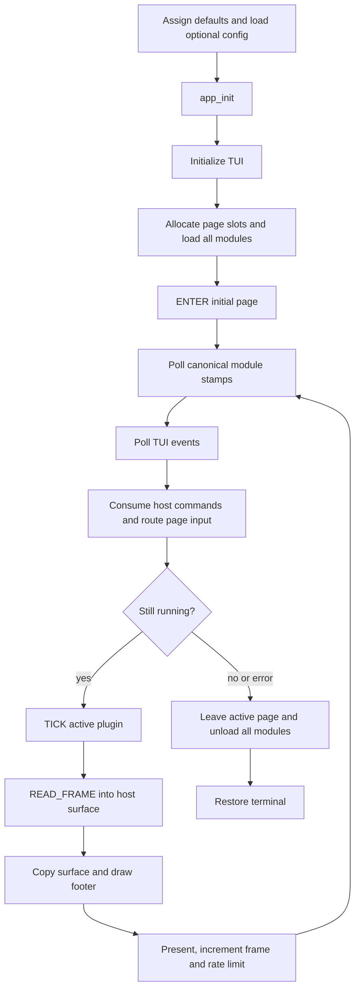
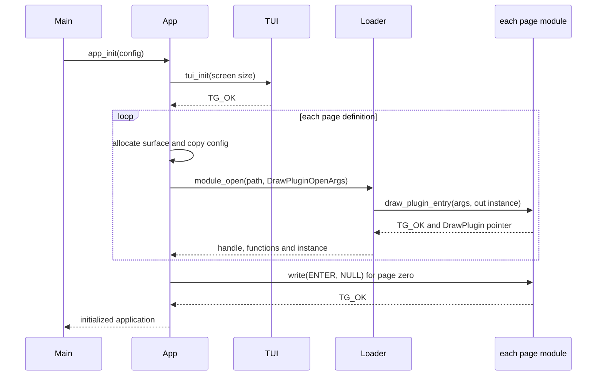
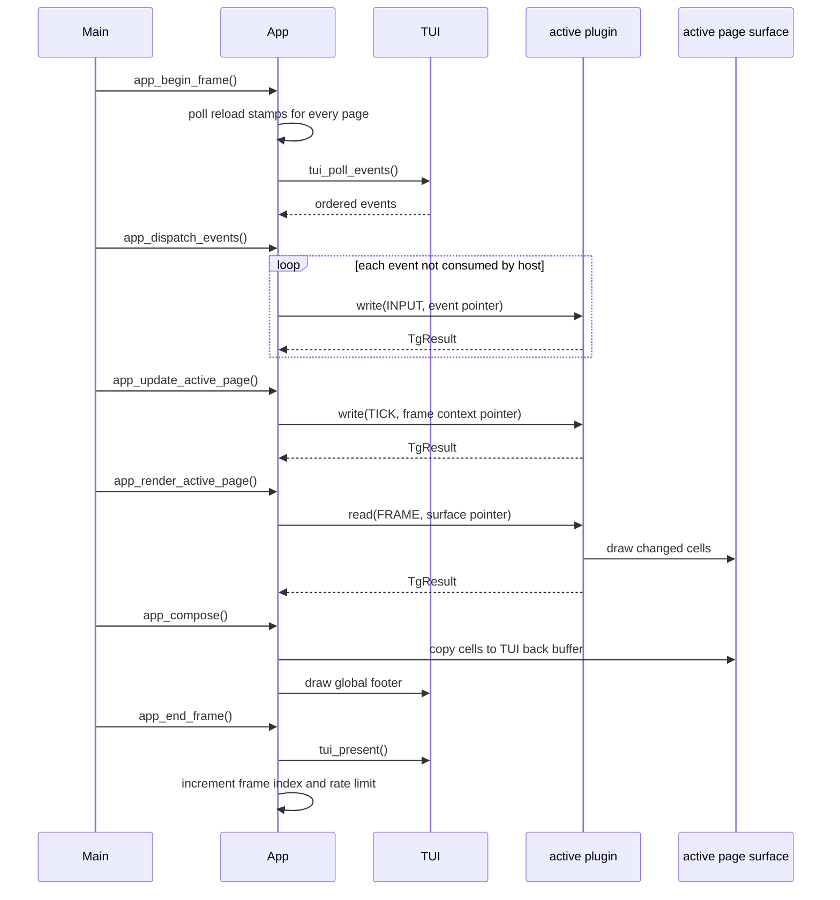
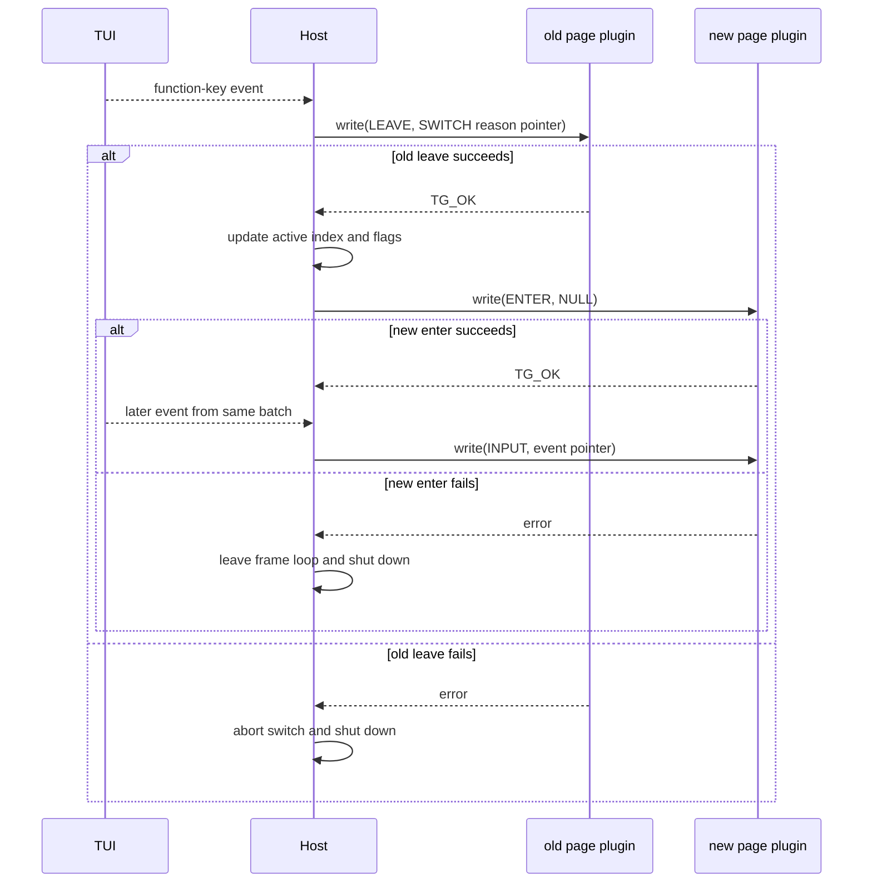
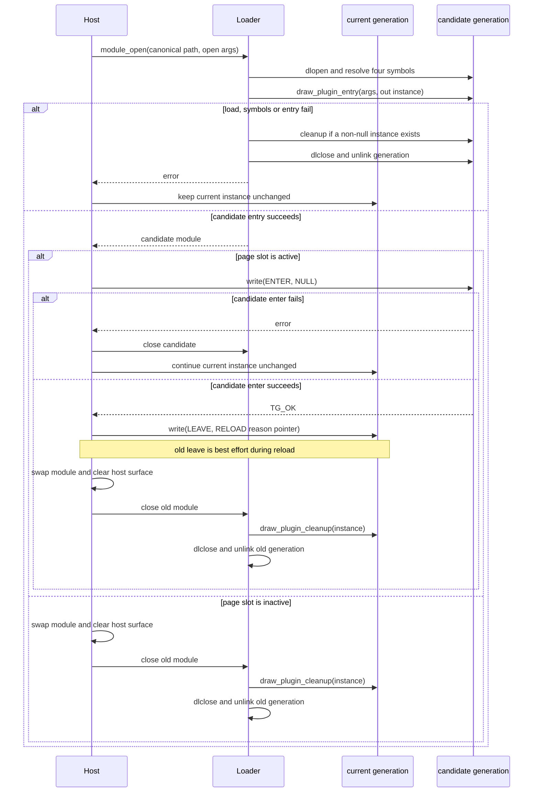
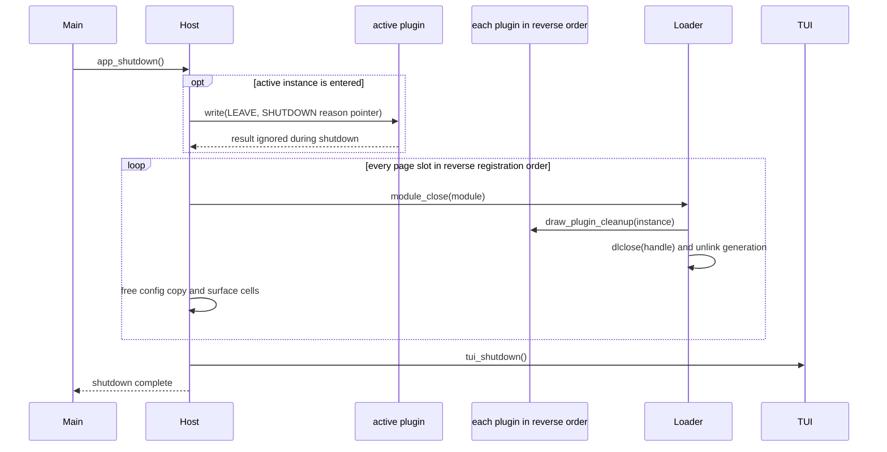

# Application and plugin lifecycle

The `draw_app` executable owns terminal access, timing, page selection,
host-side surfaces and dynamic loading. Every page is a `MODULE` library and
the host interacts with it only through the four functions in
[`plugin.h`](../plugin.h). The exact function, type, ownership and result-code
rules are defined by the [page plugin ABI contract](plugin-abi.md).

## Main loop

All ABI calls are synchronous on the main thread. Only the active page receives
input, tick and frame-read calls. Inactive page instances remain loaded and
preserve state until selected, reloaded or destroyed.

## Page slot ownership

Each host-owned `Page` contains:

| Field group | Owner | Purpose |
| --- | --- | --- |
| title, shortcut, module path | host | Footer and routing metadata |
| config storage | host | Stable copy passed as borrowed `TgBytes` during entry |
| `DrawPluginModule` | host/loader | `dlopen` handle, opaque instance, four resolved functions and generation path |
| `DrawPluginSurface` | host | Persistent page-sized `TuiCell` allocation |
| generation and file stamps | host | Automatic reload observation and retry suppression |
| active and entered flags | host | Selection and lifecycle bookkeeping |

The plugin owns only the concrete object behind `DrawPlugin *` and any
resources reachable from it. It never receives `App *` or `Page *`.

## Initialization and module entry

`app_init` initializes TUI first, then `app_register_default_pages` creates all
nine page slots. F2 loads `canvas_page.so`; F1 and F3-F9 each load a separate
instance of `example_page.so`. Reusing one canonical module does not share
plugin state because every slot gets its own generation copy and entry call.

Entry creates an instance but does not activate it. The initial page receives
enter only after all registrations succeed. If any allocation, load, symbol
resolution or entry fails, `app_init` takes the common shutdown path and
cleans up every previously created slot.

## One active frame

`main.c` invokes the application stages in a fixed order. The host polls for
module changes before polling input, so a successful automatic reload is in
place before that frame's events are dispatched.

Any error returned by input, tick, frame read or present breaks the main loop
and proceeds to shutdown. `Ctrl+Q` sets the running flag false and skips tick
and rendering for that frame.

## Ordered input and page switching

The host consumes three classes of global input:

- `Ctrl+Q` stops the application;
- `Ctrl+R` forces reload of the active slot;
- plain F1-F9 selects a page.

All other `TuiInputEvent` values go to the active plugin in original order. A
switch occurs immediately within the event loop, so later events from the same
TUI poll go to the new page.

Page switching is not a snapshot transaction. A new-page enter failure is a
normal frame error and does not re-enter the old page; shutdown follows.

## Reload transaction

Automatic reload compares canonical module modification time and size. A new
stamp must be observed identically twice. Each changed stamp is attempted once
until the canonical file changes again. `Ctrl+R` bypasses the stability wait
for the active page.

The candidate is copied to a unique temporary generation, opened with
`RTLD_NOW | RTLD_LOCAL`, resolved and entered before the old handle is closed.

A successful reload deliberately starts with fresh plugin state. There is no
snapshot or restore ABI. Canvas JSON save files are explicit documents and are
not automatic reload snapshots. A reload candidate failure is logged but does
not stop the application.

## Shutdown

Only the active instance receives `DRAW_PLUGIN_LEAVE_SHUTDOWN`. The host then
destroys every slot in reverse registration order, including instances that
were loaded but never entered. TUI remains alive until all plugin cleanup has
finished.

## Failure and lifetime rules

1. Candidate reload errors retain the current generation; normal ABI-call
   errors end the main loop.
2. Cleanup always precedes `dlclose`, and no resolved function pointer is used
   afterward.
3. A plugin must support cleanup without enter and repeated enter/leave cycles.
4. The host owns every exchanged payload and surface; the plugin borrows them
   only for the current call.
5. Undefined behavior in a plugin remains process-level undefined behavior.
   The loader isolates bad build artifacts, not crashes or memory corruption.
6. No plugin may call global TUI functions; the raw stdin callback is the only
   host service in ABI v1.

The implementation rationale and future hardening list remain in
[`plugin-hot-reload-plan.md`](plugin-hot-reload-plan.md).
