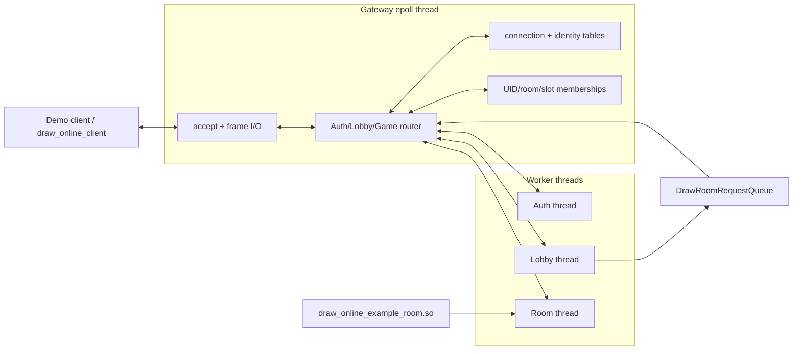
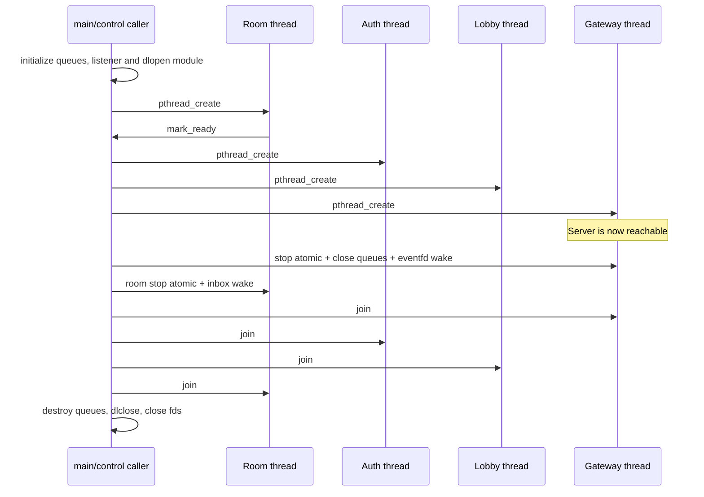
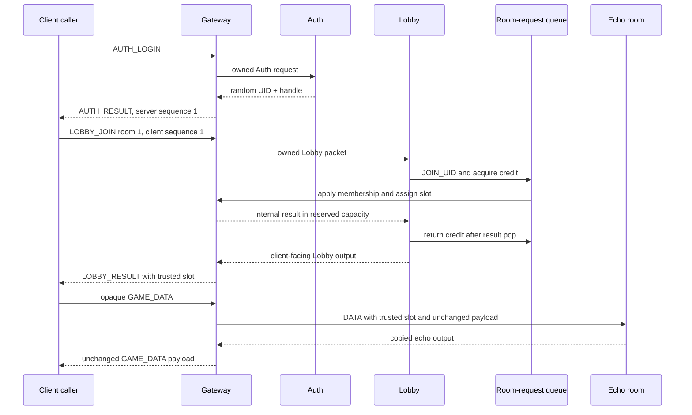

# Online subsystem

The [`online`](../online/) directory is the first executable vertical slice of
the multiplayer architecture. It provides a real loopback TCP path through a
single-threaded Gateway, Auth and Lobby workers, a dynamically loaded room, and
a small client façade.

This document describes the code that exists now. The broader protocol and
reload design remains in the [Chinese architecture baseline](../design_drafts/draw_and_guess_c_s/server_arch_and_proto.md)
and its [English translation](../design_drafts/draw_and_guess_c_s/server_arch_and_proto.en.md).

## Current scope

Implemented:

- a fixed-offset 64-byte, big-endian wire header;
- raw TCP framing with a four-byte length prefix;
- bounded owned queues with record and byte limits;
- reserved queue capacity for control messages;
- one-lock MPSC room-request queue with per-origin in-flight credits;
- one nonblocking `epoll` thread owning sockets, identities, memberships, and
  routing;
- in-process Auth and Lobby threads;
- one room thread loaded from a `.so` through a single-entry ABI;
- random UID and 128-bit identity handle generation;
- independent client-to-server and server-to-client sequences;
- login, join of the fixed demo room, and opaque game-data echo;
- unit, MPSC stress, and real loopback integration tests.

Not implemented yet:

- resume, logout, disconnect grace, or duplicate-UID recovery;
- Lobby list, create, or leave operations;
- multiple live room instances or room templates;
- immediate/drain module reload;
- TLS or HMAC;
- the final caller-driven nonblocking Client SDK.

Several enums already reserve names for later operations. Their presence in a
header does not mean the server currently accepts them. The active server path
accepts `AUTH_LOGIN`, `LOBBY_JOIN`, and `GAME_DATA` only.

## Runtime architecture



Ownership is intentionally strict:

| Owner | Mutable state |
| --- | --- |
| Gateway thread | listener, epoll, client fds, frame buffers, outbound frames, identities, sequences, memberships and room routing |
| Auth thread | one dequeued Auth request and its generated result |
| Lobby thread | Lobby packet processing and room-request submission |
| Room thread | room module entry, current borrowed input and game-private state |
| Client caller | the complete `DrawOnlineClient` object and returned events |

Auth, Lobby, and room code never receive a client fd or a pointer to Gateway's
identity/membership tables. Cross-thread data is moved through owned queues.

## Build targets and source map

[`online/CMakeLists.txt`](../online/CMakeLists.txt) defines:

| Target | Kind | Purpose |
| --- | --- | --- |
| `draw_online_wire` | static library | Fixed header and integer codec |
| `draw_online_queue` | static library | Owned queue and room-request credit queue |
| `draw_online_client` | static library | Current synchronous client façade |
| `draw_online_server` | static library | Gateway, workers, dynamic room host and ordered shutdown |
| `draw_online_example_room` | module | Minimal one-entry echo room |
| `draw_online_demo_server` | executable | Starts the server and prints its selected port |
| `draw_online_demo_client` | executable | Login, join, send one message and print the echo |
| `draw_online_tests` | custom target | Builds the three online test executables |

Important files:

- [`wire.h`](../online/include/draw_online/wire.h) and
  [`wire.c`](../online/src/wire.c): public wire constants, host-order header,
  fixed-offset encode/decode and frame-size validation;
- [`owned_queue.h`](../online/include/draw_online/owned_queue.h) and
  [`owned_queue.c`](../online/src/owned_queue.c): synchronized bounded queue;
- [`room_request.h`](../online/include/draw_online/room_request.h) and
  [`room_request.c`](../online/src/room_request.c): MPSC request and in-flight
  credit contract;
- [`room_plugin.h`](../online/include/draw_online/room_plugin.h): complete
  cross-`.so` room ABI;
- [`server.h`](../online/include/draw_online/server.h) and
  [`server.c`](../online/src/server.c): opaque server API and runtime;
- [`client.h`](../online/include/draw_online/client.h) and
  [`client.c`](../online/src/client.c): opaque current client API;
- [`example_room.c`](../online/plugins/example_room.c): minimal room template;
- [`test_integration.c`](../online/tests/test_integration.c): complete TCP path.

Every online target uses C11. The runtime currently targets Linux/POSIX because
the server uses `epoll`, `eventfd`, `getrandom`, pthreads, and `dlopen`.

## Public wire format

TCP frames are encoded as:

```text
u32_be frame_length
64-byte DrawWireHeader
payload[header.payload_length]
```

`frame_length` excludes the four-byte prefix and must equal
`64 + payload_length`. Payload is limited to `DRAW_WIRE_MAX_PAYLOAD` (65,536
bytes). A C `DrawWireHeader` is a host-order value and is never written to the
network with a structure copy.

| Offset | Size | Field |
| ---: | ---: | --- |
| 0 | 4 | magic `DG01` |
| 4 | 2 | version, currently 1 |
| 6 | 2 | flags |
| 8 | 2 | route |
| 10 | 2 | kind |
| 12 | 4 | payload length |
| 16 | 8 | UID |
| 24 | 16 | identity handle bytes |
| 40 | 8 | room ID |
| 48 | 8 | directional sequence |
| 56 | 4 | trusted player slot |
| 60 | 4 | result code |

All integers are big-endian. The handle is an opaque 16-byte array and is not
integer-converted. Decode validates magic, version, route, nonzero kind, and
payload limit; route-specific validation remains in Gateway.

### Identity and sequence checks

Login is the only pre-authenticated request. It must have zero UID, handle,
sequence, room, player slot, flags, code, and payload.

On success:

- Auth obtains a nonzero random UID and 128-bit handle through `getrandom`;
- Gateway installs the identity and binds it to `{connection slot,
  connection generation}`;
- `AUTH_RESULT` is server sequence 1;
- the first authenticated client packet is client sequence 1;
- the next server response is server sequence 2.

Every later client packet must match the connection's UID, handle, generation,
and exact expected sequence. A mismatch closes the connection. The server
increments the expected client sequence before routing. A server sequence is
consumed only after its frame is successfully added to the connection's
bounded outbound list.

The demo uses raw TCP and a bearer handle. It is suitable for localhost or an
isolated development network, not an untrusted network.

## Owned queue contract

`DrawOwnedRecord` contains an owned pointer, its accounted byte size, and a
control flag. Queue capacity is checked in both records and bytes.

### Ownership transfer

| Operation | Success | Failure |
| --- | --- | --- |
| `draw_owned_queue_try_push` / `push_wait` | Queue takes `record.item` and clears the caller's record | Caller retains the unchanged item |
| `draw_owned_queue_try_pop` / `pop_wait` | Consumer receives item ownership | Output remains unused |
| `draw_owned_queue_destroy` | Remaining items are passed to the supplied destructor | Not applicable |

Ordinary records cannot consume `reserved_control_records` or
`reserved_control_bytes`; records marked `control` may use the full queue.
This lets lifecycle and internal result traffic progress when data traffic has
filled its ordinary share.

`push_wait` and `pop_wait` use a predicate loop and can observe a stop atomic.
A nonnegative timeout uses a `CLOCK_MONOTONIC` condition deadline; `-1` waits
without a deadline. Closing a queue wakes both producer and consumer waiters.

## Unified room-request queue

`DrawRoomRequestQueue` embeds one `DrawOwnedQueue` and one fixed credit table.
Lobby and main/control are the intended producers; Gateway is the only
consumer. Its single queue mutex protects:

- ring metadata and byte accounting;
- Lobby and main in-flight counts;
- the fixed `{origin, request_id}` credit table.

Submit rejects duplicate in-flight request IDs within the same origin. A
successful pop does **not** return credit. The origin consumer must first pop
the final result from its reply queue, release that reply-queue mutex, and then
call:

```c
draw_room_request_complete_after_result_pop(queue, origin, request_id);
```

Keeping credit until result consumption is what makes reserved reply capacity
a real upper bound. Unknown or duplicate completion returns
`DRAW_QUEUE_INVALID`.

The current server applies only `DRAW_ROOM_REQUEST_JOIN_UID`. Other request
kinds reserve the API shape for the subsequent room lifecycle implementation.

## Room plugin ABI

The room module exports one symbol:

```c
DRAW_ROOM_EXPORT int server_room_entry(DrawRoomContext *context);
```

The host resolves `DRAW_ROOM_ENTRY_SYMBOL` with
`dlopen(RTLD_NOW | RTLD_LOCAL)` and verifies
`context->abi_version == DRAW_ROOM_ABI_VERSION` in the module. Entry owns the
complete room lifetime: initialize, call `mark_ready`, wait/read input, write
output, observe stop, clean up, and return.

### Host callbacks

| Callback | Contract |
| --- | --- |
| `wait(userdata, timeout_ms)` | Wait for input, stop, or timeout; `-1` has no deadline |
| `read(userdata, out_input)` | Borrow the returned payload until the next read |
| `write(userdata, output)` | Copy payload before return; never retain module memory |
| `stop_requested(userdata)` | Read the cooperative room-stop atomic |
| `mark_ready(userdata)` | Succeed exactly once before the room begins serving traffic |
| `monotonic_now_ns(userdata)` | Return host monotonic time |

`DrawRoomInput.player_slot` is assigned by Gateway, not trusted from a client.
The current output contract supports one player or all room members. A room
does not see UID, identity handle, connection generation, or fd.

The example room ignores lifecycle records and echoes each DATA payload back to
the corresponding trusted slot. It is intended as an ABI template rather than
game logic.

## Server API and lifecycle

```c
int draw_online_server_start(
    DrawOnlineServer **out_server,
    const DrawOnlineServerOptions *options);

uint16_t draw_online_server_port(const DrawOnlineServer *server);
void draw_online_server_stop(DrawOnlineServer *server);
void draw_online_server_destroy(DrawOnlineServer *server);
```

`DrawOnlineServer` is opaque. Options mean:

| Option | Behavior |
| --- | --- |
| `bind_host` | IPv4 numeric address; null defaults to `127.0.0.1` |
| `port` | Listener port; zero requests an ephemeral port |
| `room_module_path` | Required path to the room `.so` |
| `queue_records` | Zero selects the current default of 64 |
| `queue_bytes` | Zero selects the current default of 256 KiB |

Custom capacities must leave room for the fixed control reserves; values that
cannot satisfy initialization are rejected.

Startup initializes queues, listener/epoll/eventfd, lifecycle synchronization,
and the module; starts the room and waits up to three seconds for `mark_ready`;
then starts Auth, Lobby, and Gateway.



`draw_online_server_stop` is idempotent and joins started threads.
`draw_online_server_destroy` calls stop if necessary and then releases all
resources. The module is unloaded only after its room thread has returned.

The current demo has one live route: room ID 1. A membership is indexed both by
UID/room and by room/player slot. Joining the same UID to room 1 again returns
the existing slot rather than creating a duplicate membership.

## Client API

The current client is an opaque, single-caller, synchronous façade:

```c
draw_online_client_connect(...);
draw_online_client_login(...);
draw_online_client_join(...);
draw_online_client_send_game(...);
draw_online_client_receive(...);
draw_online_client_event_release(...);
draw_online_client_close(...);
```

The socket itself is nonblocking, but each public operation internally polls
until it completes or the supplied timeout expires. This is convenient for the
demo and tests; it is not the final event-loop-oriented SDK described in the
architecture baseline.

`draw_online_client_receive` validates UID, handle, and exact server sequence.
On success it returns an owned payload in `DrawOnlineClientEvent`. The caller
must pass every successfully returned event to
`draw_online_client_event_release`, including zero-payload events.

The expected minimal exchange is:



## Build, demo, and tests

Configure and build:

```sh
cmake -S . -B build -DCMAKE_BUILD_TYPE=Debug -DBUILD_TESTING=ON
cmake --build build --parallel --target \
  draw_online_demo_server draw_online_demo_client draw_online_tests
```

Start the server with an ephemeral loopback port:

```sh
./build/online/draw_online_demo_server \
  ./build/online/draw_online_example_room.so 0
```

After it prints `READY <port>`, run:

```sh
./build/online/draw_online_demo_client 127.0.0.1 <port> hello
```

Expected shape:

```text
UID=<random> SLOT=1 ECHO=hello
```

Run online tests:

```sh
ctest --test-dir build --output-on-failure -R '^draw_online_'
```

| Test | Coverage |
| --- | --- |
| `draw_online_wire_test` | Header offsets, endian round trip, bad magic/version and payload limit |
| `draw_online_queue_test` | Ownership transfer, control reserve, credit lifetime, invalid completion and concurrent MPSC producers |
| `draw_online_integration_test` | Two loopback clients, random identities, rejected/duplicate joins, distinct slots, binary echo and cooperative shutdown |

The integration test requires permission to create IPv4 loopback sockets.
Address/UndefinedBehaviorSanitizer and ThreadSanitizer builds are appropriate
for this test because it crosses every ownership boundary in the current slice.
