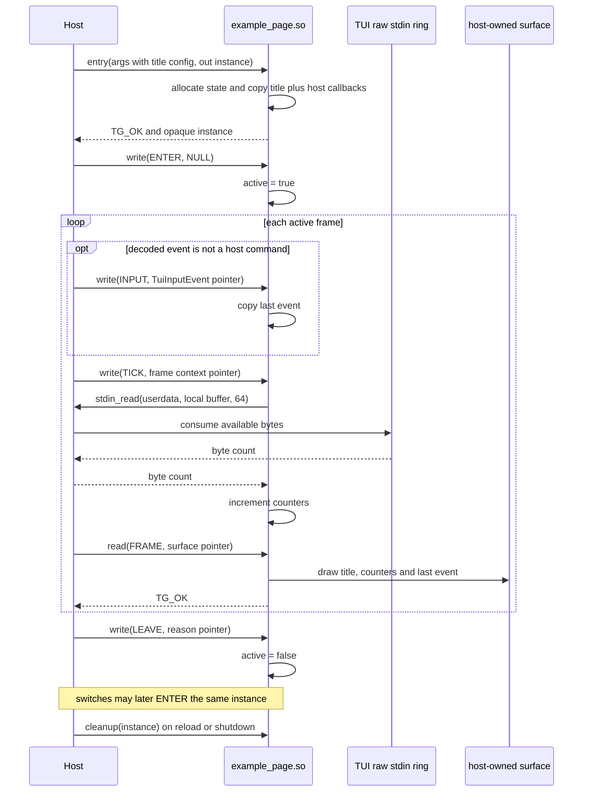

# Minimal example page plugin

[`example_page.c`](../../examples/minimal_page_plugin/example_page.c) is the
smallest complete page used by the running application. For a copy-and-rename
starting point, use the dedicated
[`example/plugin_templete`](../../example/plugin_templete/) directory, which
also documents every ABI structure and operation. The runtime example depends
on [`plugin.h`](../../plugin.h) and the shared
[`plugin_frame.h`](../../plugin_frame.h) helpers, but deliberately does not
include `app.h` or call global TUI functions.

The normative types and lifetime rules are in the
[page plugin ABI contract](../plugin-abi.md).

## Where the example is used

The host registers F1 and F3-F9 with the same canonical
`example_page.so`. Each page slot still has an independent state object:

1. the host copies that slot's title bytes into `TgBytes config`;
2. the loader creates a unique generation copy of `example_page.so`;
3. `draw_plugin_entry` allocates a new `ExamplePage`;
4. the instance copies its own title and host callback table.

There is no shared mutable state between the eight example-backed slots.

## Private state

```c
typedef struct ExamplePage {
    DrawPluginHost host;
    TgSizei frame_size;
    TuiInputEvent last_event;
    uint64_t tick_count;
    uint64_t raw_byte_count;
    char title[64];
    bool active;
    bool has_event;
} ExamplePage;
```

| Field | Demonstrates |
| --- | --- |
| `host` | Copying the borrowed callback table during entry |
| `frame_size` | Observing initial size and later tick resize values |
| `last_event` | Copying a borrowed input value rather than retaining its address |
| `tick_count` | Frame-local state mutation |
| `raw_byte_count` | Consuming the optional raw stdin channel |
| `title` | Copying non-NUL-terminated plugin config bytes |
| `active` | Repeated enter/leave lifecycle |

## ABI function mapping

### Entry

`draw_plugin_entry`:

- nulls the output pointer first;
- rejects the wrong ABI version;
- validates frame size and config pointer/length consistency;
- allocates a zeroed `ExamplePage`;
- copies `DrawPluginHost`, frame size and at most 63 title bytes;
- uses `"Example"` when config is empty;
- returns the concrete state as opaque `DrawPlugin *`.

The title config is raw `TgBytes`; it is not required to contain a trailing
NUL. `example_copy_title` adds one in plugin-owned storage.

### Write operations

| Operation | Example behavior |
| --- | --- |
| `ENTER` | Require null payload and set `active = true` |
| `LEAVE` | Validate the reason enum and set `active = false` |
| `INPUT` | Copy the complete `TuiInputEvent` and mark it present |
| `TICK` | Validate/update frame size, increment ticks and read raw stdin once |

On each active tick, `example_read_raw_stdin` supplies a 64-byte local buffer
to `host.stdin_read`. It adds the returned count with saturation at
`UINT64_MAX`. The callback may return zero and may be null in a test host.

### Frame read

`READ_FRAME` validates the borrowed surface and redraws it completely using
`plugin_frame_fill`, `plugin_frame_box` and `plugin_frame_text`. The displayed
values make the data flow visible:

- active/inactive state;
- tick count;
- consumed raw stdin byte count;
- type, key and character fields from the last decoded event.

Unlike Canvas, the example has no dirty-frame optimization; every read writes
the complete presentation again.

### Cleanup

`draw_plugin_cleanup` frees the private state. It is safe for a null pointer
because the implementation delegates to `free`. As required by the ABI, it
also works for an instance that was created but never entered, or for an
inactive instance replaced by hot reload.

## Example call sequence



## Using it as a template

1. Copy `example/plugin_templete` to a page-specific directory.
2. Rename the CMake target and `OUTPUT_NAME` so it produces a distinct `.so`.
3. Replace `ExamplePage` with the page's private state.
4. Define the config byte layout and validate it in entry.
5. Keep the four exported functions and operation payload types unchanged.
6. Implement `ENTER`, `LEAVE`, `INPUT`, `TICK` and `FRAME` even when some are
   intentional no-ops; still validate their payloads.
7. Use `plugin_frame_*` for ordinary cell drawing or write bounded `TuiCell`
   values directly.
8. Add the canonical module path, title, shortcut and config bytes to the host
   registration table in [`pages.c`](../../pages.c).
9. Add loader tests that instantiate the module without initializing a real
   terminal.

The module must be PIC and hidden by default. Its dynamic symbol table should
contain only `draw_plugin_entry`, `draw_plugin_cleanup`, `draw_plugin_write`
and `draw_plugin_read`.

## Build

The top-level build emits `build/plugins/example_page.so`. The template also
builds independently:

```sh
cmake -S examples/minimal_page_plugin -B build-example
cmake --build build-example
```

The standalone CMake file compiles a private PIC copy of `plugin_frame.c` and
uses the root project plus pinned corestack include directories for the shared
ABI types.
