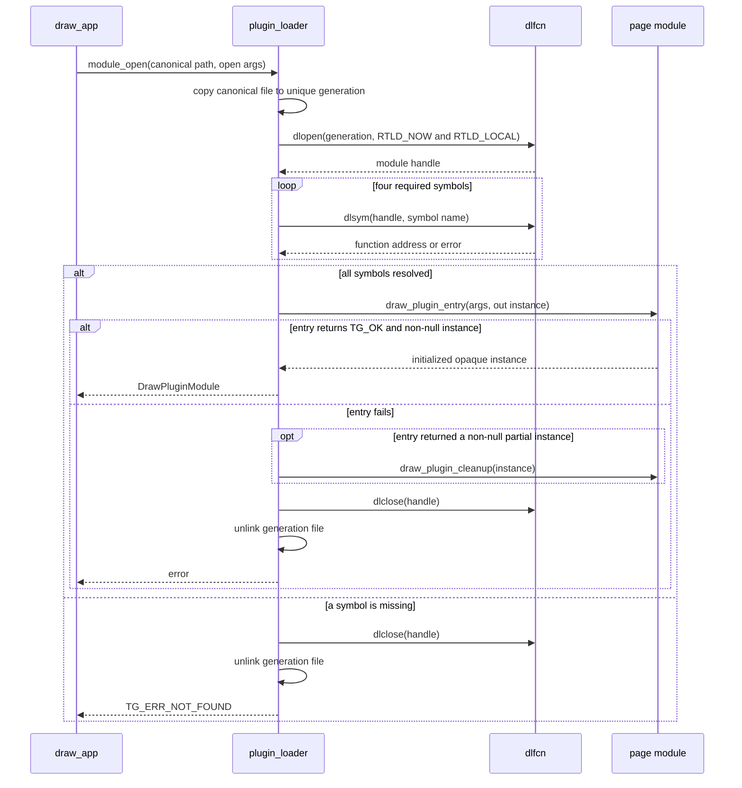
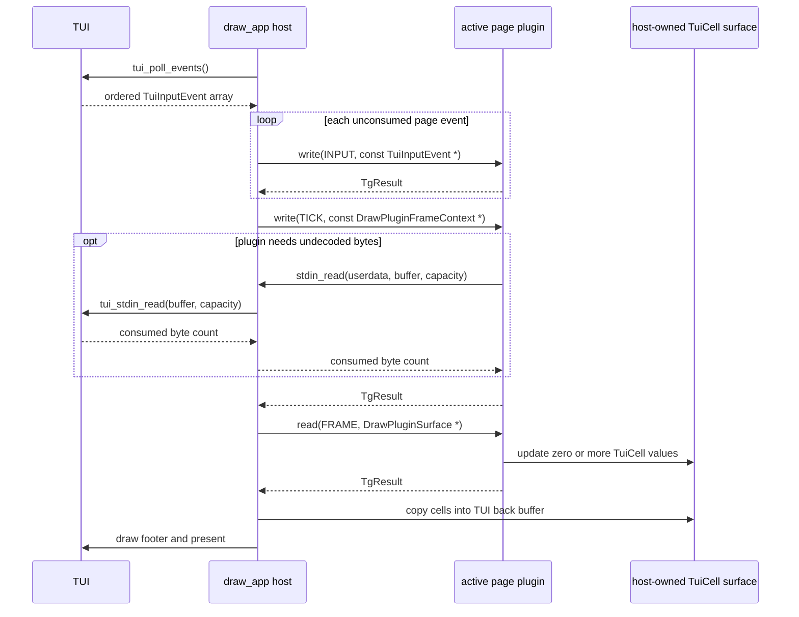

# Page plugin ABI contract

This document is the normative description of the current page ABI declared
by [`plugin.h`](../plugin.h). The ABI version is
`DRAW_PLUGIN_ABI_VERSION == 1` and every page module exports exactly four C
symbols:

```c
TgResult draw_plugin_entry(
    const DrawPluginOpenArgs *args,
    DrawPlugin **out_plugin);

void draw_plugin_cleanup(DrawPlugin *plugin);

TgResult draw_plugin_write(
    DrawPlugin *plugin,
    DrawPluginWriteKind kind,
    const void *data);

TgResult draw_plugin_read(
    DrawPlugin *plugin,
    DrawPluginReadKind kind,
    void *data);
```

`entry` and `cleanup` delimit instance ownership. `write` carries lifecycle,
decoded input and tick values from the host into the instance. `read` asks the
instance to produce output in host-owned storage. These names describe the
direction from the host's point of view:

```text
host --write--> plugin instance
host <--read--- plugin-produced frame in host storage
```

There is no descriptor function, snapshot format, restore call or public
function table.

## Compatibility boundary

This is an in-process, same-repository ABI, not a stable third-party wire
protocol. Host and plugin exchange the project types `TgResult`, `TgSizei`,
`TgBytes`, `TuiInputEvent` and `TuiCell` directly. They must therefore use:

- the same [`plugin.h`](../plugin.h);
- the same pinned `tui.h`;
- compatible compiler, architecture, enum and structure-layout conventions;
- the same `DRAW_PLUGIN_ABI_VERSION`.

Changing the layout or meaning of an exchanged structure or enum requires an
ABI-version bump and a rebuild of the host and every plugin. There is no
cross-version structure-size negotiation in ABI v1.

Modules are built with hidden visibility. `DRAW_PLUGIN_EXPORT` makes only the
four ABI symbols visible; Canvas internals and shared frame helpers do not
become part of the dynamic interface.

### Shared TUI payload types

`TgSizei` contains signed 32-bit `w` and `h` fields. Every frame or output size
accepted by the current host/plugins must be positive. `TgBytes` is a pointer
plus byte count; it does not imply text, alignment or a trailing NUL.

For `WRITE_INPUT`, `TuiInputEvent.type` determines which fields are meaningful:

| Event type | Meaningful values |
| --- | --- |
| `TUI_INPUT_KEY` | `modifiers`, plus `key` for named keys or `ch` for control letters |
| `TUI_INPUT_TEXT` | printable byte in `ch` |
| `TUI_INPUT_MOUSE` | `modifiers` and `mouse` action, zero-based position, button and wheel deltas |

`TuiMouseEvent.action` distinguishes move, press, release, drag and wheel
events. Plugins copy the event value if it is needed after the write call.

For `READ_FRAME`, every destination `TuiCell` has this shared layout:

| Field | Meaning |
| --- | --- |
| `ch[8]` | Up to seven UTF-8 bytes plus terminator |
| `width` | Display width; ordinary plugin helpers emit single-width cells |
| `fg`, `bg` | RGB value or `TUI_COLOR_DEFAULT` |
| `style` | Bitset of `TUI_STYLE_*` values |

ABI v1 intentionally exchanges these structs directly so a plugin can render
without conversion. That convenience is why host/plugin header and toolchain
compatibility is mandatory.

## Exchanged values and ownership

### Opaque instance

`DrawPlugin` is an incomplete type. A plugin allocates a private concrete
structure, casts it to `DrawPlugin *`, and returns it from entry. The host
stores the pointer without inspecting it and passes it back on every later
call.

The plugin owns this object until `draw_plugin_cleanup`. The host guarantees
that cleanup happens before `dlclose` and never calls a plugin function after
the module has been unloaded.

### Entry arguments

```c
typedef struct DrawPluginOpenArgs {
    unsigned abi_version;
    TgSizei frame_size;
    TgBytes config;
    DrawPluginHost host;
} DrawPluginOpenArgs;
```

| Field | Direction | Contract |
| --- | --- | --- |
| `abi_version` | host to plugin | Must equal `DRAW_PLUGIN_ABI_VERSION` |
| `frame_size` | host to plugin | Initial page surface size, excluding the global footer |
| `config` | host to plugin | Plugin-specific borrowed bytes; not necessarily text or NUL-terminated |
| `host` | host to plugin | Host callbacks and their opaque userdata |

`DrawPluginOpenArgs` and `config.data` are guaranteed only for the duration of
entry. A plugin that needs them later copies their values or contents. The
current host keeps its config allocation longer, but plugins must not depend
on that implementation detail.

### Frame context

```c
typedef struct DrawPluginFrameContext {
    uint64_t frame_index;
    double delta_time;
    TgSizei frame_size;
} DrawPluginFrameContext;
```

The host borrows this value to one `WRITE_TICK` call. `frame_index` counts
successfully presented frames, `delta_time` is monotonic elapsed time in
seconds, and `frame_size` is the current page size. A resize is conveyed by a
changed frame size; ABI v1 has no separate resize operation.

### Host-owned surface

```c
typedef struct DrawPluginSurface {
    TgSizei size;
    TuiCell *cells;
} DrawPluginSurface;
```

The host allocates and retains `size.w * size.h` cells for each page slot. The
surface passed to `READ_FRAME` is mutable but borrowed:

- the plugin may update cells during that call;
- the plugin must stay within the declared dimensions;
- the plugin must not free, resize or retain `cells`;
- the allocation persists between frames, so a clean plugin may return
  `TG_OK` without redrawing unchanged cells.

The host copies the active surface into the TUI back buffer and draws the
global footer afterward. [`plugin_frame.h`](../plugin_frame.h) provides shared
bounds-checked drawing helpers.

### Raw stdin callback

```c
typedef size_t (*DrawPluginStdinReadFn)(
    void *userdata,
    void *destination,
    size_t capacity);
```

The current host supplies a wrapper around `tui_stdin_read`. Calling it copies
up to `capacity` bytes from the TUI raw-input ring into plugin-owned
`destination`, consumes those bytes from that ring, and returns the number
copied. A zero return means no bytes are currently available.

The callback is an additional low-level channel; it does not replace ordered
`TuiInputEvent` delivery. The raw ring is a separate copy, so consuming it does
not remove or alter already decoded events. A plugin may call it only from the
main thread while
the host is inside that active instance's `INPUT`, `TICK` or `READ_FRAME`
operation. It must not call back during entry, enter, leave or cleanup, or from
a background thread. Plugins should tolerate a null callback so they remain
easy to unit test. In the current host the copied callback table remains valid
until plugin cleanup.

## Function contracts

### `draw_plugin_entry`

Entry creates one independent plugin instance.

Required behavior:

1. validate `out_plugin` and set `*out_plugin = NULL` before fallible work;
2. reject a null argument block with `TG_ERR_INVALID`;
3. reject a different ABI version with `TG_ERR_UNSUPPORTED`;
4. validate the positive frame dimensions and plugin-specific config bytes;
5. copy any borrowed host/config values needed after return;
6. allocate and initialize private state;
7. return `TG_OK` with a non-null opaque instance only after complete success.

On failure, the plugin should release partial state and leave the output null.
The loader defensively calls cleanup if a broken entry implementation returns
both an error and a non-null instance, but plugins must not rely on that
fallback.

Entry does not mean that the page is active. Every page slot is instantiated
during application initialization, while only the selected page later
receives `WRITE_ENTER`.

### `draw_plugin_cleanup`

Cleanup releases the complete private instance. It is deliberately infallible
and returns `void`. It must stop plugin-owned work, release resources and make
no later host callback.

A successfully created instance receives cleanup exactly once. Cleanup may
occur without a preceding enter when a page was never activated, when an
inactive module is reloaded, or when candidate enter fails. It must therefore
not assume that the instance is active.

### `draw_plugin_write`

`write` is a tagged input operation. The `kind` value fixes the exact type and
nullability of `data`:

| `kind` | `data` | Meaning |
| --- | --- | --- |
| `DRAW_PLUGIN_WRITE_ENTER` | must be `NULL` | Activate the instance and invalidate transient layout/render state as needed |
| `DRAW_PLUGIN_WRITE_LEAVE` | `const DrawPluginLeaveReason *` | Deactivate or finalize transient work |
| `DRAW_PLUGIN_WRITE_INPUT` | `const TuiInputEvent *` | Consume one ordered decoded TUI event |
| `DRAW_PLUGIN_WRITE_TICK` | `const DrawPluginFrameContext *` | Advance one active frame and observe size/timing |

All non-null payloads are borrowed for the duration of the call. A plugin may
copy their values but must not retain their addresses.

`DrawPluginLeaveReason` distinguishes the caller's intent:

| Reason | When sent |
| --- | --- |
| `DRAW_PLUGIN_LEAVE_SWITCH` | The user selects another page |
| `DRAW_PLUGIN_LEAVE_RELOAD` | An active instance is being replaced |
| `DRAW_PLUGIN_LEAVE_SHUTDOWN` | The application is terminating |

An instance can receive multiple enter/leave cycles as the user changes
pages. Inactive instances keep their state but receive no input, tick or frame
read calls.

The host consumes `Ctrl+Q`, `Ctrl+R` and plain page-selection function keys.
Other events, including Canvas commands such as `Ctrl+S`, are forwarded to the
active plugin in original order.

### `draw_plugin_read`

`read` is a tagged output request. ABI v1 defines one operation:

| `kind` | `data` | Meaning |
| --- | --- | --- |
| `DRAW_PLUGIN_READ_FRAME` | `DrawPluginSurface *` | Draw the current page into the mutable host surface |

The plugin validates the instance, operation, surface pointer, cell pointer
and positive dimensions. Unknown operations or malformed payloads return
`TG_ERR_INVALID`.

## Result codes

The ABI reuses `TgResult`; it does not define a second error family:

| Result | Typical ABI meaning |
| --- | --- |
| `TG_OK` | Operation completed |
| `TG_ERR_INVALID` | Null instance, malformed payload, invalid dimensions/config, or unknown tag |
| `TG_ERR_NOMEM` | Plugin state allocation failed |
| `TG_ERR_NOT_FOUND` | Loader could not find a module or required symbol |
| `TG_ERR_UNSUPPORTED` | ABI version or platform function-pointer representation is unsupported |
| `TG_ERR` | Other loader, I/O or plugin failure |

Errors from normal input/tick/read calls stop the application through the
common shutdown path. Reload candidate failures are different: the host logs
them, cleans up the candidate, and retains the working old generation.

## Module creation sequence

The loader never opens the compiler output directly. It copies the canonical
module to a unique file under `$TMPDIR` (falling back to `/tmp`) to avoid
`dlopen` caching and replacement of a mapped image.



## Active-frame data flow

All calls are synchronous and currently run on the main thread.



## Plugin-author checklist

- Include `plugin.h`, not `app.h`.
- Export the four declared functions with exactly their declared signatures.
- Keep all other module symbols hidden.
- Treat `config`, operation payloads and frame surfaces as borrowed.
- Copy the host callback table if it will be used after entry.
- Accept repeated enter/leave cycles and cleanup without enter.
- Do not retain `TuiCell *`, call global TUI functions, or create a second
  terminal owner.
- Keep all ABI calls on the main thread unless a later ABI version explicitly
  adds a threading contract.
- Use PIC for all static libraries linked into the module.
- Return `TG_ERR_INVALID` for unknown tags and malformed payloads.

## Current conformance coverage

[`tests/test_plugin_loader.c`](../tests/test_plugin_loader.c) exercises the ABI
without opening a real terminal. It verifies:

- wrong-version rejection;
- creation of distinct generation copies from one canonical example module;
- hidden non-ABI helper symbols;
- invalid enter/read tags and payloads;
- decoded event copying, tick delivery and zero/nonzero fake stdin reads;
- drawing into a host-allocated surface;
- leave, cleanup, `dlclose` and generation-file removal;
- loading, entering, ticking, rendering, leaving and unloading Canvas through
  the same four functions.

The Canvas JSON/state tests remain separate because those APIs are private
module logic rather than host/plugin ABI.

See the [copy-and-rename starter](../example/plugin_templete/README.md) for a
buildable skeleton with a field-by-field reference, the
[minimal example plugin](pages/example.md) for the page used by the running
application, and the [Canvas page](pages/canvas.md) for a stateful
implementation.
