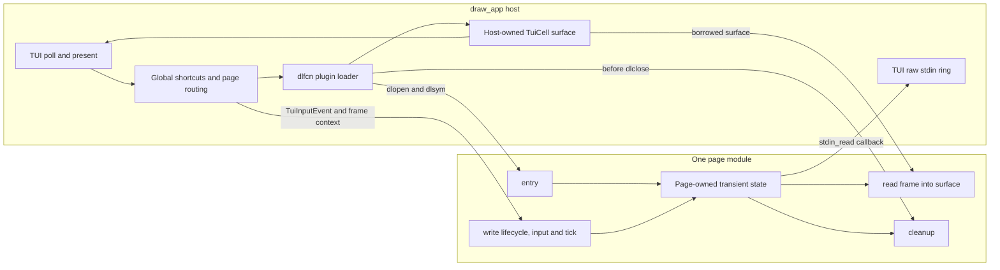
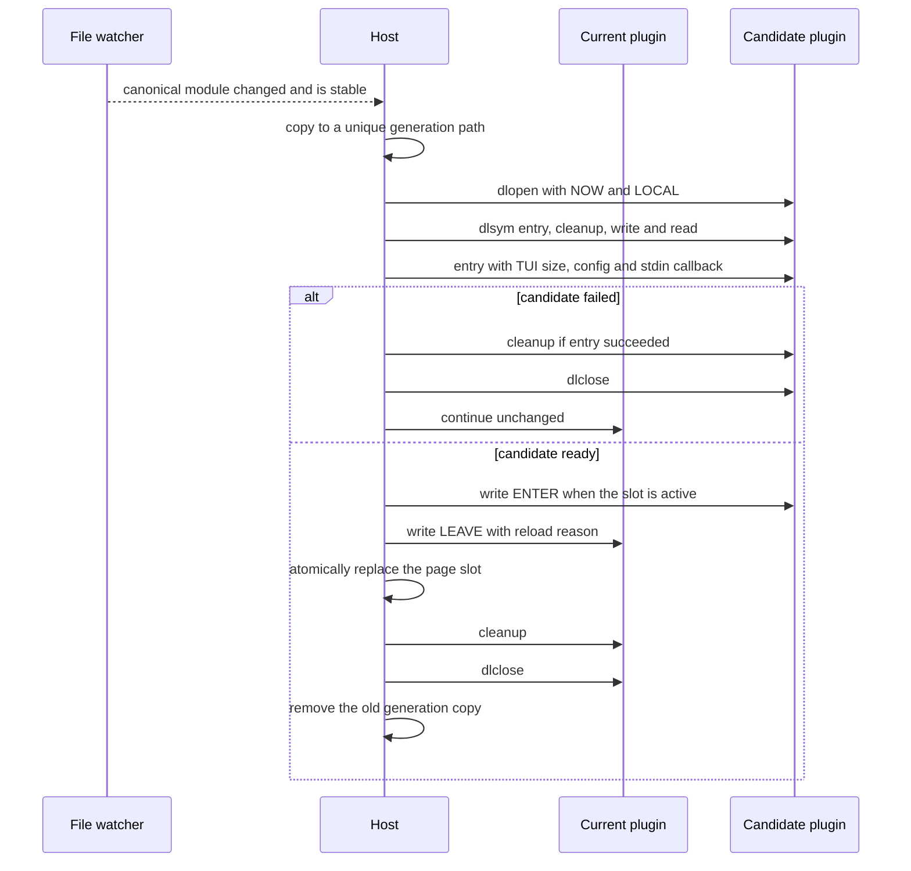

# `dlfcn` page plugin and hot-reload plan

Status: first implementation complete. The application now loads every page
through this ABI; the remaining work is broader failure-injection coverage and
any policy refinements learned from using hot reload in development.

The current normative function and type contract is maintained in
[`plugin-abi.md`](plugin-abi.md). This document retains the architectural
rationale, implementation shape and hardening backlog.

## Decisions

- Use the POSIX `dlfcn.h` API directly. Do not add `cr.h` or another loader
  backend.
- Build every page above the TUI host boundary as a loadable `MODULE` target.
- Require four plugin symbols: entry, cleanup, write and read.
- Share the project `tui.h` types across the ABI. In particular, use
  `TuiInputEvent`, `TuiCell`, `TgSizei`, `TgBytes` and `TgResult` directly
  instead of reproducing them as plugin-only wire structures.
- Give a plugin one host callback for consuming the TUI raw-stdin ring. Do not
  introduce a larger host-services table until a real use case needs it.
- Do not migrate in-memory state across a successful reload. The replacement
  page starts from its normal initial state.
- Load and initialize a candidate before replacing the current module. A bad
  build leaves the current page running, so no snapshot or rollback format is
  required.
- Keep Canvas document persistence separate from hot reload. `canvas.json` is
  an explicit save file, not an automatic reload snapshot.
- Keep one module handle and one plugin instance per page slot initially. With
  nine pages, this is simpler than shared-handle lifetime bookkeeping.

This is deliberately a same-repository, same-toolchain ABI rather than a
general third-party plugin SDK. Host and modules must build against the same
`plugin.h`, the same pinned `tui.h` and compatible compiler ABI options. Bump
`DRAW_PLUGIN_ABI_VERSION` and rebuild every module whenever an exchanged TUI
type or the plugin contract changes.

## Boundary



The host owns terminal access, global shortcuts, page selection, timing,
module paths, page surfaces and footer composition. A plugin owns its business
state, input semantics and rendering. It may include `plugin.h` and `tui.h`,
but not `app.h`; it must not call global TUI functions directly.

## Minimal `plugin.h` ABI

Every page module exports these exact C symbols. There is no public function
table and no plugin-specific function called by the host.

```c
#ifndef DRAW_APP_PLUGIN_H
#define DRAW_APP_PLUGIN_H

#include "tui.h"

#include <stddef.h>
#include <stdint.h>

#define DRAW_PLUGIN_ABI_VERSION 1u

#if defined(__GNUC__) || defined(__clang__)
#define DRAW_PLUGIN_EXPORT \
    __attribute__((visibility("default")))
#else
#define DRAW_PLUGIN_EXPORT
#endif

#if defined(__cplusplus)
extern "C" {
#endif

typedef struct DrawPlugin DrawPlugin;

typedef size_t (*DrawPluginStdinReadFn)(
    void *userdata,
    void *destination,
    size_t capacity);

typedef struct DrawPluginHost {
    void *userdata;
    DrawPluginStdinReadFn stdin_read;
} DrawPluginHost;

typedef struct DrawPluginOpenArgs {
    unsigned abi_version;
    TgSizei frame_size;
    TgBytes config;
    DrawPluginHost host;
} DrawPluginOpenArgs;

typedef struct DrawPluginFrameContext {
    uint64_t frame_index;
    double delta_time;
    TgSizei frame_size;
} DrawPluginFrameContext;

typedef struct DrawPluginSurface {
    TgSizei size;
    TuiCell *cells;
} DrawPluginSurface;

typedef enum DrawPluginLeaveReason {
    DRAW_PLUGIN_LEAVE_SWITCH = 0,
    DRAW_PLUGIN_LEAVE_RELOAD,
    DRAW_PLUGIN_LEAVE_SHUTDOWN
} DrawPluginLeaveReason;

typedef enum DrawPluginWriteKind {
    DRAW_PLUGIN_WRITE_ENTER = 0,
    DRAW_PLUGIN_WRITE_LEAVE,
    DRAW_PLUGIN_WRITE_INPUT,
    DRAW_PLUGIN_WRITE_TICK
} DrawPluginWriteKind;

typedef enum DrawPluginReadKind {
    DRAW_PLUGIN_READ_FRAME = 0
} DrawPluginReadKind;

DRAW_PLUGIN_EXPORT TgResult draw_plugin_entry(
    const DrawPluginOpenArgs *args,
    DrawPlugin **out_plugin);

DRAW_PLUGIN_EXPORT void draw_plugin_cleanup(
    DrawPlugin *plugin);

DRAW_PLUGIN_EXPORT TgResult draw_plugin_write(
    DrawPlugin *plugin,
    DrawPluginWriteKind kind,
    const void *data);

DRAW_PLUGIN_EXPORT TgResult draw_plugin_read(
    DrawPlugin *plugin,
    DrawPluginReadKind kind,
    void *data);

#if defined(__cplusplus)
}
#endif

#endif
```

This keeps the only generic parts of read/write to an operation tag and a
borrowed pointer. Each tag has one exact payload type documented below, so the
implementation remains small and assertions/tests can reject null or invalid
payloads.

### Entry and cleanup

`draw_plugin_entry` must:

1. reject a different `abi_version` with `TG_ERR_UNSUPPORTED`;
2. validate the initial frame size and plugin-specific configuration;
3. copy the `DrawPluginHost` value and any configuration it wants to retain;
4. allocate all plugin-owned state;
5. return a non-null opaque instance only on success;
6. release partial allocations and leave `*out_plugin == NULL` on failure.

`DrawPluginOpenArgs`, `config.data` and `config.len` are borrowed for the entry
call only. Page title, F-key, module path and configuration bytes remain host
registration data rather than exported plugin metadata.

The host calls `draw_plugin_cleanup` exactly once for every successful entry
and always before `dlclose`. Cleanup stops plugin-created threads, releases all
plugin resources and makes no later stdin callback. The first implementation
should forbid background plugin threads unless a page actually needs them.

All fallible calls use the existing `TgResult` values. No second result-code
family is introduced:

- ABI mismatch: `TG_ERR_UNSUPPORTED`;
- null, unknown operation or malformed payload: `TG_ERR_INVALID`;
- allocation failure: `TG_ERR_NOMEM`;
- other plugin failure: `TG_ERR`.

## Write and read operations

The payload type is fixed by the operation tag:

| Operation | Direction | `data` payload |
| --- | --- | --- |
| `DRAW_PLUGIN_WRITE_ENTER` | host to plugin | `NULL` |
| `DRAW_PLUGIN_WRITE_LEAVE` | host to plugin | `const DrawPluginLeaveReason *` |
| `DRAW_PLUGIN_WRITE_INPUT` | host to plugin | `const TuiInputEvent *` |
| `DRAW_PLUGIN_WRITE_TICK` | host to plugin | `const DrawPluginFrameContext *` |
| `DRAW_PLUGIN_READ_FRAME` | plugin to host | `DrawPluginSurface *` |

No snapshot, restore, descriptor or generic command channels exist.

### Lifecycle and input

The operation sequence preserves the former `PageOps` behavior:

1. `ENTER` activates a page and invalidates its layout/frame cache;
2. ordered `INPUT` writes deliver the current `TuiInputEvent` values;
3. one `TICK` per active frame performs time-based work;
4. one `READ_FRAME` renders into the page's persistent host surface;
5. `LEAVE` finalizes transient work before a switch, reload or shutdown.

Global `Ctrl+Q`, the reload command and page-selection F-keys are consumed by
the host. A page switch still takes effect in the middle of an ordered TUI
event batch, so later events in that batch go to the newly active plugin.
Inactive plugins preserve their state but receive no input, tick or frame-read
calls.

### Host-owned frame surface

`DrawPluginSurface` is the replacement for the current `AppFrame`; it directly
contains the `TgSizei` and `TuiCell *` types from `tui.h`. The host allocates
and owns `size.w * size.h` cells for each page. For `READ_FRAME` it passes that
surface to the plugin, which draws directly into the cells.

The plugin must not retain or free the surface or its cells. It validates the
size and uses bounds-checked helpers. When nothing is dirty, it may return
`TG_OK` without touching the cells; the persistent host surface continues to
hold the previous frame. A terminal-size change is included in the next tick
and surface, so a separate resize message is unnecessary.

The former `canvas_frame_*` helpers are now page-neutral `plugin_frame_*`
helpers operating on `DrawPluginSurface`. Canvas and later page modules draw
with `TuiCell` directly without a conversion or a second frame copy.

### Raw stdin callback

The host supplies this wrapper during entry:

```c
static size_t app_plugin_stdin_read(
    void *userdata,
    void *destination,
    size_t capacity)
{
    (void)userdata;
    return tui_stdin_read(destination, capacity);
}
```

A plugin copies `DrawPluginHost` during entry and may invoke `stdin_read` only
on the main thread while the host is inside that active plugin's `INPUT`,
`TICK` or `READ_FRAME` call. It must not call it during entry, enter, leave,
cleanup or from a background thread. Reading consumes bytes from the TUI raw
stdin ring; a return value of zero means no bytes are currently available.

This function does not replace decoded events. The usual path remains
`TuiInputEvent`; raw reads are for a page that explicitly needs undecoded stdin
bytes. Tests can provide a small fake callback without initializing the real
terminal.

## Loading and reload transaction

The loader uses `dlopen(path, RTLD_NOW | RTLD_LOCAL)`, resolves all four
symbols with `dlsym`, and centralizes `dlerror` handling and conversion from
symbol pointers to C function pointers.

The build writes a canonical module such as `build/plugins/canvas_page.so`.
The loader opens a unique generation copy such as
`$TMPDIR/draw-app-canvas_page.so-a1b2c3`, not the compiler output itself. It
waits until the canonical file's modification time and size are stable before
copying. Unique copies avoid loader caching, work with a read-only canonical
module directory, and prevent a compiler from overwriting a mapped image.



Replacement occurs between frames with no plugin call in progress. Candidate
validation happens while the old module remains usable, so a missing symbol,
unresolved dependency, ABI mismatch, entry failure or enter failure leaves the
old instance running.

A successful replacement intentionally discards old in-memory state. The new
page behaves like a fresh application start. `LEAVE` is a best-effort
notification and cannot veto an already validated replacement.

No signal handler or crash recovery is installed. Undefined behavior in a
plugin remains a process failure, keeping debugger and sanitizer behavior
predictable. Hot reload protects against bad build artifacts, not arbitrary
memory corruption.

## Host-side `draw_app` shape

The resolved functions are stored in a host-private structure; this is not a
second public ABI:

```c
typedef struct DrawPluginFunctions {
    TgResult (*entry)(
        const DrawPluginOpenArgs *args,
        DrawPlugin **out_plugin);
    void (*cleanup)(DrawPlugin *plugin);
    TgResult (*write)(
        DrawPlugin *plugin,
        DrawPluginWriteKind kind,
        const void *data);
    TgResult (*read)(
        DrawPlugin *plugin,
        DrawPluginReadKind kind,
        void *data);
} DrawPluginFunctions;

typedef struct Page {
    const char *title;
    TuiKey shortcut;
    const char *module_path;
    TgBytes config;

    DrawPluginModule module;
    DrawPluginSurface frame;

    uint64_t generation;
    DrawPluginFileStamp loaded_stamp;
    DrawPluginFileStamp pending_stamp;
    DrawPluginFileStamp attempted_stamp;
    bool active;
    bool entered;
} Page;
```

The former `AppFrame`, `AppFrameContext`, `PageOps` and opaque `userdata`
layers are gone. The application owns and allocates one persistent
`DrawPluginSurface` per page.

### Page registration and entry

The page-definition table selects a module path and config bytes:

```c
static const struct {
    const char *title;
    TuiKey shortcut;
    bool canvas;
} definitions[] = {
    {
        .title = "Page 1",
        .shortcut = TUI_KEY_F1,
        .canvas = false,
    },
    {
        .title = "Canvas",
        .shortcut = TUI_KEY_F2,
        .canvas = true,
    },
    /* F3 through F9 */
};
```

Canvas entry receives the configured output `TgSizei` as binary config bytes.
The example plugin receives the page title bytes and supplies the placeholder
UI for F1 and F3-F9.

For each definition, `app_add_page` allocates the cell surface, asks the loader
to open a generation copy and invokes entry:

```c
DrawPluginOpenArgs args = {
    .abi_version = DRAW_PLUGIN_ABI_VERSION,
    .frame_size = app->content_size,
    .config = page->config,
    .host = {
        .userdata = app,
        .stdin_read = app_plugin_stdin_read,
    },
};

result = draw_plugin_module_open(
    page->module_path,
    &args,
    &page->module);
```

### Page switching

Page switching maps the former `on_leave`/`on_enter` calls to writes:

```c
DrawPluginLeaveReason reason = DRAW_PLUGIN_LEAVE_SWITCH;
result = old_page->functions.write(
    old_page->instance,
    DRAW_PLUGIN_WRITE_LEAVE,
    &reason);

if (tg_result_ok(result)) {
    result = new_page->functions.write(
        new_page->instance,
        DRAW_PLUGIN_WRITE_ENTER,
        NULL);
}
```

The host retains `active` and `entered`; the plugin only receives lifecycle
notifications.

### Input, update and rendering

The application frame functions are thin dispatchers:

```c
/* app_dispatch_events */
result = page->functions.write(
    page->instance,
    DRAW_PLUGIN_WRITE_INPUT,
    event);

/* app_update_active_page */
DrawPluginFrameContext context = {
    .frame_index = app->frame_index,
    .delta_time = app->delta_time,
    .frame_size = app->content_size,
};
result = page->functions.write(
    page->instance,
    DRAW_PLUGIN_WRITE_TICK,
    &context);

/* app_render_active_page */
result = page->functions.read(
    page->instance,
    DRAW_PLUGIN_READ_FRAME,
    &page->frame);
```

`app_compose` then copies `page->frame.cells` to `tui_get_buffer()` and draws
the footer exactly as it does now. There is no plugin-cell translation and no
variable-length frame read protocol.

### Shutdown

Shutdown sends `LEAVE_SHUTDOWN` to the active plugin, then walks all pages in
reverse order:

```c
page->functions.cleanup(page->instance);
page->instance = NULL;
dlclose(page->dl_handle);
page->dl_handle = NULL;
free(page->frame.cells);
```

No plugin function pointer, TUI pointer, callback or page-state pointer may be
used after `dlclose`.

## Build layout

| Target | Type | Contents |
| --- | --- | --- |
| `draw_plugin_abi` | `INTERFACE` | `plugin.h` and the `tui.h` include path |
| `draw_plugin_frame` | `STATIC`, PIC | Bounds-checked helpers over `DrawPluginSurface` and `TuiCell` |
| `draw_canvas_core` | `STATIC`, PIC | Canvas document, state and JSON implementations |
| `draw_page_canvas` | `MODULE` | Canvas entry, cleanup, write and read adapter |
| `draw_page_example` | `MODULE` | Minimal ABI example and placeholder page |
| `draw_app` | executable | TUI, routing, loader, composition and configuration |

Page modules include the TUI types through `draw_plugin_abi` but do not link or
call the TUI implementation. Only the host links `corestack::tui`; plugins use
the raw-stdin callback when needed. Static cJSON, Jansson, Canvas core and frame
support linked into a module must be position-independent.

The executable links `${CMAKE_DL_LIBS}` and does not link Canvas implementation
objects. Page modules use hidden visibility and export only the four ABI
functions. CMake places canonical modules under `build/plugins` and does not
add them to the executable's link dependencies.

## Implemented first pass

1. `plugin.h` is the shared ABI and declares the only four exported symbols.
2. `plugin_loader.c/.h` resolves the symbols through `dlfcn`, loads a unique
   generation copy, and removes that copy after cleanup and `dlclose`.
3. `app.c` routes enter, leave, input, tick and frame reads through the ABI.
4. `plugin_frame.c/.h` provides the page-neutral cell drawing helpers.
5. `plugins/canvas` owns the Canvas sources and local CMake targets; its core
   is PIC and `draw_page_canvas` builds `canvas_page.so`.
6. `examples/minimal_page_plugin` builds `example_page.so`, serves the other
   page slots, and is a standalone template.
7. `Ctrl+R` reloads the active page immediately. Per-frame polling reloads a
   canonical module after two identical file observations; a failed candidate
   leaves the old instance and handle in place.
8. `draw_app` has no link-time dependency on Canvas implementation symbols.
9. Loader integration tests exercise both example and Canvas modules, ABI
   rejection, raw stdin injection, rendering, unload and generation cleanup.

Useful next hardening work is to add deliberately malformed test modules for
each missing symbol and entry/enter failure, plus an application-level reload
fixture that asserts active/inactive lifecycle ordering.

## Test contract

- Every module exposes the four required symbols and rejects the wrong ABI.
- Host and test modules compile against the same `plugin.h` and `tui.h`.
- Every write/read kind validates its required null or typed payload.
- Ordered `TuiInputEvent` delivery and mid-batch page switching match current
  behavior.
- A plugin writes only within the borrowed surface bounds and never retains or
  frees `TuiCell *`.
- A fake stdin callback verifies consumption, zero-length reads and the rule
  that raw reads do not replace decoded events.
- A valid candidate reload replaces the page and resets its state.
- An invalid candidate or failed enter leaves the old instance unchanged.
- Active and inactive pages reload correctly, including lifecycle ordering.
- Cleanup runs exactly once before every `dlclose`.
- Repeated reloads leave no stale calls, handles or generation files.
- The host executable has no link-time dependency on Canvas page symbols.
- Existing Canvas document/JSON equality tests remain unchanged because file
  persistence is independent of hot reload.

Run loader tests under ASan and UBSan as well as the normal test build. A debug
option may retain generation files for symbol inspection, but it must never
retain callable function pointers after `dlclose`.
