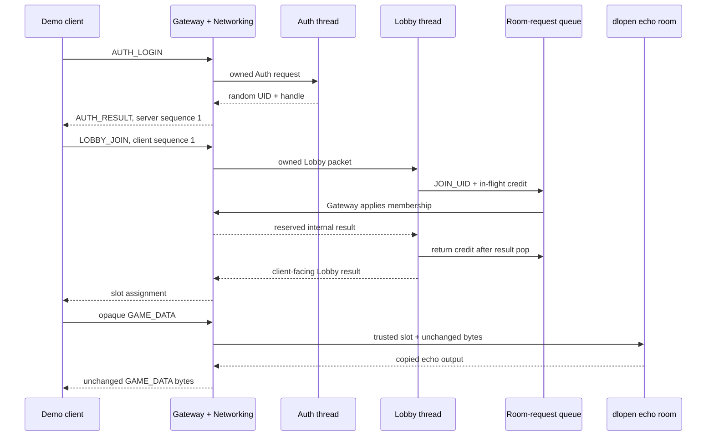

# Minimal online demo

This directory is the first executable slice of the server/client plan in
[`server_arch_and_proto.en.md`](../design_drafts/draw_and_guess_c_s/server_arch_and_proto.en.md).
It deliberately implements one complete path before the remaining reload and
recovery state machines.

## Implemented slice

- fixed-offset 64-byte, big-endian wire codec;
- bounded owned queues with record/byte limits and protected control reserve;
- one-lock `DrawRoomRequestQueue` with per-origin in-flight credits;
- one nonblocking `epoll` thread owning Networking, Gateway mappings, fds, and
  room routing;
- in-process Auth and Lobby threads;
- random UID/128-bit identity handle plus independent directional sequences;
- Lobby join through the unified room-request queue;
- one room thread loaded from a `.so` through the one-entry room ABI;
- an example room that echoes opaque binary payload to its trusted player slot;
- a small synchronous client façade used by the demo and integration test.

The synchronous façade is not the final Phase 4 event-loop SDK. Resume/logout,
duplicate-UID recovery, list/create/leave, multiple live room instances,
generation reload/drain, and TLS remain later phases. The server data path and
public wire/room ABI are structured so those features can be added without
moving fd or membership ownership out of Gateway.

## End-to-end flow



## Build and run

```sh
cmake -S . -B build -DCMAKE_BUILD_TYPE=Debug -DBUILD_TESTING=ON
cmake --build build --parallel --target \
  draw_online_demo_server draw_online_demo_client draw_online_tests
```

Start the server. Port `0` asks the OS for an available loopback port:

```sh
./build/online/draw_online_demo_server \
  ./build/online/draw_online_example_room.so 0
```

The server prints `READY <port>`. In another terminal:

```sh
./build/online/draw_online_demo_client 127.0.0.1 <port> hello
```

Expected output has the assigned identity, trusted room slot, and echo:

```text
UID=<random> SLOT=1 ECHO=hello
```

## Tests

```sh
ctest --test-dir build --output-on-failure -R '^draw_online_'
```

The test project contains:

- `draw_online_wire_test`: golden offsets, endian round trip, bounds failures;
- `draw_online_queue_test`: ownership, control reserve, credit lifetime, and
  duplicate/unknown completion;
- `draw_online_integration_test`: two real loopback TCP clients, Auth, Lobby,
  unified membership requests, distinct slots, binary echo through the dynamic
  room, and cooperative shutdown.

Some sandboxes prohibit `socket(AF_INET, ...)`; in that environment the two
unit tests still run normally, while the loopback integration test must run
with permission to create local sockets.
